# Agora System - Visual Reference Guide

## Quick Reference Cards for Whiteboard Sessions

This companion document provides simplified reference cards and detailed Mermaid diagrams for explaining the Agora/Deliberation system architecture.

---

## Table of Contents

1. [Quick Reference Cards](#1-quick-reference-cards)
2. [Mermaid Diagrams](#2-mermaid-diagrams)
3. [Subsystem Deep Dives](#3-subsystem-deep-dives)
4. [Component Interaction Maps](#4-component-interaction-maps)
5. [Cheat Sheets](#5-cheat-sheets)

---

# 1. Quick Reference Cards

## Card 1: The "30-Second Pitch"

```
┌─────────────────────────────────────────────────────────────────┐
│                    MESH AGORA - 30 SECOND PITCH                 │
├─────────────────────────────────────────────────────────────────┤
│                                                                 │
│  "A formal argumentation platform that combines:"               │
│                                                                 │
│   🎯 PROTOCOL   - Rules for how debates work (who can say what) │
│   📐 GEOMETRY   - Structure of arguments (game theory)          │
│   📚 CONTENT    - What arguments actually say (schemes)         │
│                                                                 │
│  Built on academic foundations:                                 │
│   • AIF (Argument Interchange Format) - W3C-adjacent standard   │
│   • ASPIC+ - Formal logic framework                             │
│   • Ludics - Game semantics from proof theory                   │
│   • Walton Schemes - 60+ argumentation patterns                 │
│                                                                 │
│  Main Entry Point: DeepDivePanelV2                              │
│                                                                 │
└─────────────────────────────────────────────────────────────────┘
```

---

## Card 2: DeepDivePanelV2 Overview

```
┌─────────────────────────────────────────────────────────────────┐
│                     DeepDivePanelV2                             │
│                  (The Main UI Container)                        │
├─────────────────────────────────────────────────────────────────┤
│                                                                 │
│  FLOATING SHEETS (Slide-out panels):                            │
│  ┌──────────┐  ┌──────────┐  ┌──────────┐                      │
│  │📊 LEFT   │  │⚡ RIGHT  │  │📖 TERMS  │                      │
│  │ Explorer │  │ Actions  │  │ Glossary │                      │
│  │          │  │          │  │          │                      │
│  │• Graph   │  │• Moves   │  │• Define  │                      │
│  │• Claims  │  │• Diagram │  │• Terms   │                      │
│  │• Commits │  │• Commands│  │          │                      │
│  └──────────┘  └──────────┘  └──────────┘                      │
│                                                                 │
│  MAIN TABS:                                                     │
│  ┌────────┬────────┬────────┬────────┬────────┬────────┐       │
│  │ Debate │  Args  │ Chains │ Ludics │ Admin  │  ...   │       │
│  └────────┴────────┴────────┴────────┴────────┴────────┘       │
│     ↓                                                           │
│  [Nested sub-tabs within each main tab]                         │
│                                                                 │
│  KEY PROPS:                                                     │
│  • deliberationId (required) - Which debate                     │
│  • selectedClaimId - Currently focused claim                    │
│  • hostName - Display title                                     │
│                                                                 │
└─────────────────────────────────────────────────────────────────┘
```

---

## Card 3: Move Types Cheat Sheet

```
┌─────────────────────────────────────────────────────────────────┐
│                   DIALOGUE MOVES CHEAT SHEET                    │
├─────────────────────────────────────────────────────────────────┤
│                                                                 │
│  ⚪ NEUTRAL MOVES (don't change branch state)                   │
│  ┌─────────────────────────────────────────────────────────┐   │
│  │ ASSERT    │ "I claim X"           │ Adds to commitments │   │
│  │ THEREFORE │ "So, Y follows"       │ Derives conclusion  │   │
│  │ SUPPOSE   │ "Let's assume Z"      │ Hypothetical        │   │
│  └─────────────────────────────────────────────────────────┘   │
│                                                                 │
│  🔴 ATTACK MOVES (challenge opponent)                           │
│  ┌─────────────────────────────────────────────────────────┐   │
│  │ WHY       │ "Why do you say X?"   │ Demands justification│   │
│  │ GROUNDS   │ "Because P1, P2..."   │ Provides argument    │   │
│  └─────────────────────────────────────────────────────────┘   │
│                                                                 │
│  🟢 SURRENDER MOVES (concede/withdraw)                          │
│  ┌─────────────────────────────────────────────────────────┐   │
│  │ RETRACT   │ "I take back X"       │ Withdraws claim     │   │
│  │ CONCEDE   │ "I accept your X"     │ Accepts opponent    │   │
│  │ CLOSE     │ "Branch done (†)"     │ Ends discussion     │   │
│  └─────────────────────────────────────────────────────────┘   │
│                                                                 │
│  💡 KEY RULE: Can't attack surrendered/closed branches!         │
│                                                                 │
└─────────────────────────────────────────────────────────────────┘
```

---

## Card 4: AIF Node Types

```
┌─────────────────────────────────────────────────────────────────┐
│                    AIF NODE TYPES                               │
│            (Argument Interchange Format)                        │
├─────────────────────────────────────────────────────────────────┤
│                                                                 │
│  INFORMATION NODES (I-nodes) - The "content"                    │
│  ┌─────────────────────────────────────────────────────────┐   │
│  │  [I]  Claims, propositions, data, evidence              │   │
│  │       "The earth is round" / "Study shows X"            │   │
│  └─────────────────────────────────────────────────────────┘   │
│                                                                 │
│  SCHEME NODES (S-nodes) - The "relationships"                   │
│  ┌─────────────────────────────────────────────────────────┐   │
│  │  [RA] Rule Application    │ Inference (premise→concl)   │   │
│  │  [CA] Conflict Application│ Attack relationship         │   │
│  │  [PA] Preference App      │ "A beats B because..."      │   │
│  │  [TA] Transition App      │ Dialogue move marker        │   │
│  └─────────────────────────────────────────────────────────┘   │
│                                                                 │
│  EDGE TYPES:                                                    │
│  ┌─────────────────────────────────────────────────────────┐   │
│  │  premise → RA        │ "This supports..."               │   │
│  │  RA → conclusion     │ "...therefore this"              │   │
│  │  attacker → CA       │ "This attacks..."                │   │
│  │  CA → target         │ "...this claim"                  │   │
│  └─────────────────────────────────────────────────────────┘   │
│                                                                 │
└─────────────────────────────────────────────────────────────────┘
```

---

## Card 5: Claim Status Labels

```
┌─────────────────────────────────────────────────────────────────┐
│                  CLAIM STATUS LABELS                            │
│              (Grounded Semantics)                               │
├─────────────────────────────────────────────────────────────────┤
│                                                                 │
│  ┌──────────────────────────────────────────────────────────┐  │
│  │  🟢 IN     │ Accepted    │ No successful attacks         │  │
│  │           │ (defended)  │ All attackers are OUT          │  │
│  ├───────────┼─────────────┼─────────────────────────────────│  │
│  │  🔴 OUT   │ Rejected    │ Successfully attacked          │  │
│  │           │ (defeated)  │ By at least one IN claim       │  │
│  ├───────────┼─────────────┼─────────────────────────────────│  │
│  │  ⚪ UNDEC │ Undecided   │ Circular attacks or            │  │
│  │           │ (contested) │ insufficient info              │  │
│  └──────────────────────────────────────────────────────────┘  │
│                                                                 │
│  VISUAL EXAMPLE:                                                │
│                                                                 │
│      [A]─attacks─→[B]─attacks─→[C]                             │
│       │                         │                               │
│      IN          OUT           IN                               │
│   (no attacker)  (A is IN)  (B is OUT)                         │
│                                                                 │
└─────────────────────────────────────────────────────────────────┘
```

---

## Card 6: Tab Navigation Map

```
┌─────────────────────────────────────────────────────────────────┐
│                    TAB NAVIGATION MAP                           │
├─────────────────────────────────────────────────────────────────┤
│                                                                 │
│  DEBATE ──┬── Discussion (threaded view)                        │
│           ├── Propositions (create/list)                        │
│           ├── Claims (minimap, inspector)                       │
│           └── Sheet View (confidence matrix)                    │
│                                                                 │
│  ARGUMENTS ─┬── All Arguments (AIFArgumentsListPro)             │
│             ├── Create (scheme composer)                        │
│             ├── Schemes (browse detected)                       │
│             ├── Networks (multi-scheme)                         │
│             ├── Nets (network analysis)                         │
│             └── ASPIC (formal theory)                           │
│                                                                 │
│  CHAINS ────┬── List View                                       │
│             ├── Thread View                                     │
│             ├── Canvas (graph)                                  │
│             ├── Prose (narrative)                               │
│             └── Essay (full export)                             │
│                                                                 │
│  LUDICS ────── LociTree, Trace, Judge, Behaviours               │
│                                                                 │
│  ADMIN ─────── Dashboard, Issues, CQ Review, Assumptions        │
│                                                                 │
│  SOURCES ───── Evidence List                                    │
│                                                                 │
│  THESIS ────── Thesis Composer/Viewer                           │
│                                                                 │
│  ANALYTICS ─── Analytics Dashboard                              │
│                                                                 │
└─────────────────────────────────────────────────────────────────┘
```

---

# 2. Mermaid Diagrams

## 2.1 System Architecture Overview

```mermaid
flowchart TB
    subgraph UI["🖥️ Presentation Layer"]
        DDP[DeepDivePanelV2]
        LS[Left Sheet<br/>Explorer]
        RS[Right Sheet<br/>Actions]
        TS[Terms Sheet<br/>Glossary]
        
        subgraph Tabs["Main Tabs"]
            DT[Debate Tab]
            AT[Arguments Tab]
            CT[Chains Tab]
            LT[Ludics Tab]
            ADT[Admin Tab]
        end
    end
    
    subgraph State["📦 State Management"]
        DS[useDeliberationState]
        SP[useSheetPersistence]
        SWR[SWR Cache]
    end
    
    subgraph API["🔌 API Layer"]
        DA[/api/dialogue]
        CA[/api/claims]
        AA[/api/arguments]
        AIF[/api/aif]
        LA[/api/ludics]
    end
    
    subgraph DB["💾 Data Layer"]
        Prisma[(PostgreSQL<br/>via Prisma)]
    end
    
    DDP --> LS & RS & TS
    DDP --> Tabs
    Tabs --> State
    State --> API
    API --> DB
```

## 2.2 Dialogue Move Flow

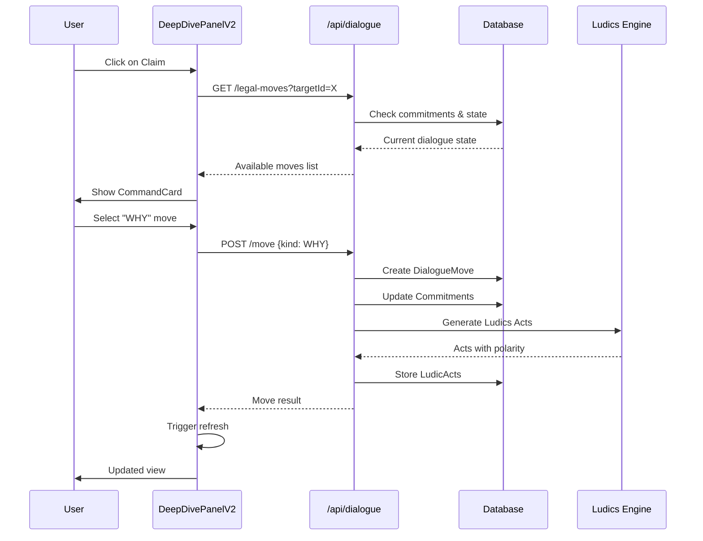

## 2.3 AIF Argument Structure

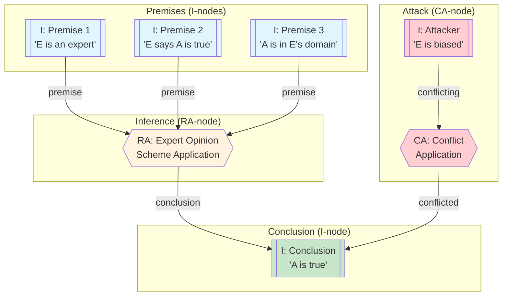

## 2.4 Claim Status Flow (Grounded Semantics)

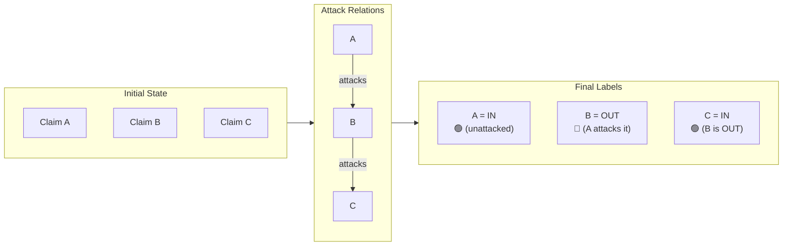

## 2.5 Component Hierarchy

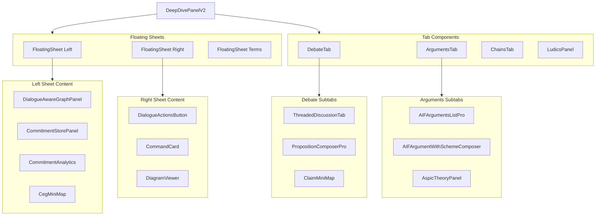

## 2.6 Ludics Interaction Model

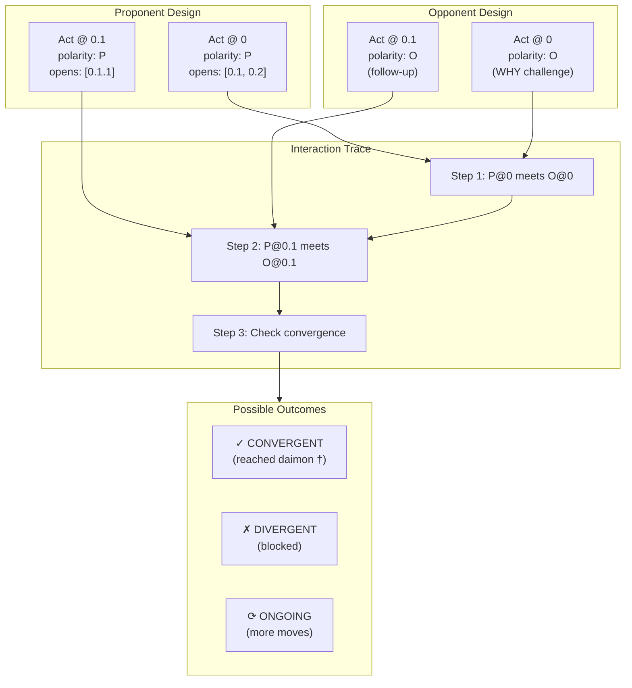

## 2.7 Attack Types in ASPIC+

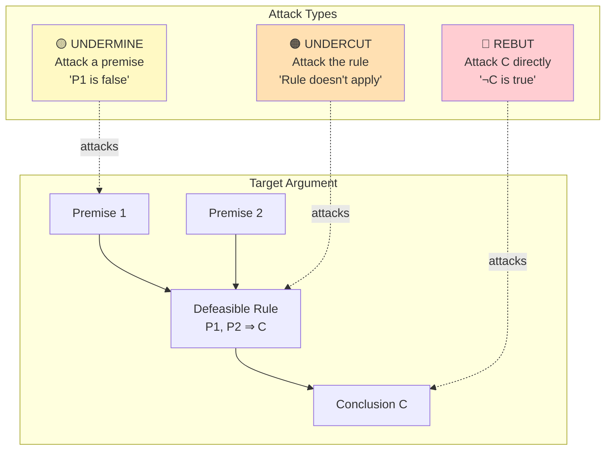

## 2.8 Critical Questions Flow

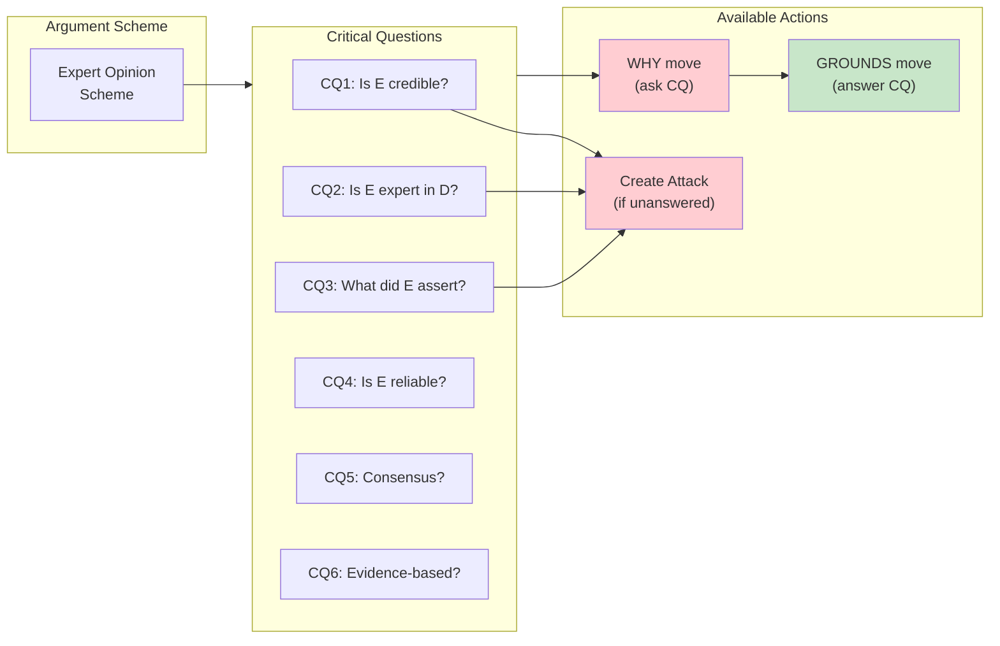

## 2.9 Data Model Relationships

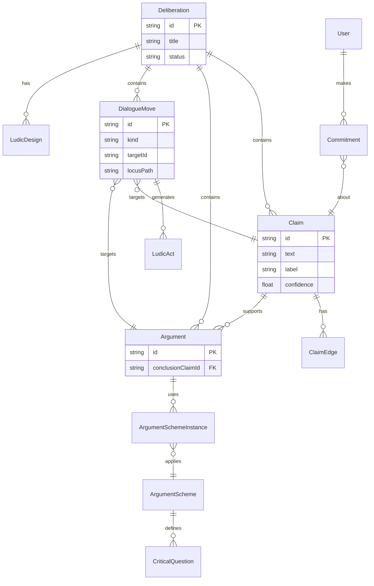

## 2.10 State Management Flow

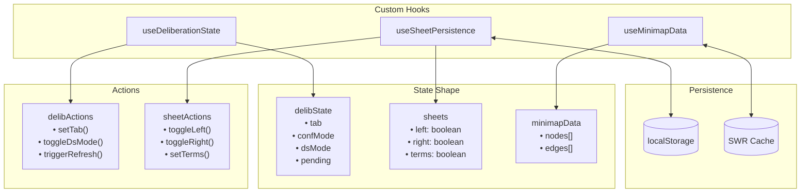

---

# 3. Subsystem Deep Dives

## 3.1 Dialogue Subsystem Deep Dive

### Purpose
The dialogue subsystem implements the **PPD (Protocol for Persuasion Dialogues)** - a formal system for structured argumentation with explicit rules about what moves are legal at any point.

### Key Concepts

| Concept | Description |
|---------|-------------|
| **Move** | A single action in the dialogue (ASSERT, WHY, GROUNDS, etc.) |
| **Force** | Classification of a move's effect (ATTACK, SURRENDER, NEUTRAL) |
| **Commitment Store** | Record of what each participant has committed to |
| **Locus** | Address in the dialogue tree (e.g., "0.1.2") |
| **Branch** | A thread of moves stemming from an initial assertion |

### Component Breakdown

```
dialogue/
├── DialogueActionsButton.tsx    # Main action trigger button
├── DialogueActionsModal.tsx     # Full move selection modal
├── command-card/
│   ├── CommandCard.tsx          # Grid of available moves
│   ├── types.ts                 # CommandCardAction interface
│   └── CQContextPanel.tsx       # CQ-specific context
├── DialogueInspector.tsx        # Move history viewer
├── LegalMoveChips.tsx           # Pill indicators for moves
└── useLegalMoves.ts             # Hook for fetching legal moves
```

### API Integration

```typescript
// Fetch available moves
GET /api/dialogue/legal-moves?deliberationId=X&targetType=claim&targetId=Y

// Execute a move
POST /api/dialogue/move
{
  "deliberationId": "...",
  "kind": "WHY",
  "targetId": "claim-123",
  "locusPath": "0.1",
  "payload": { "expression": "Why do you believe this?" }
}

// Get commitment stores
GET /api/dialogue/commitments?deliberationId=X
```

### State Transitions

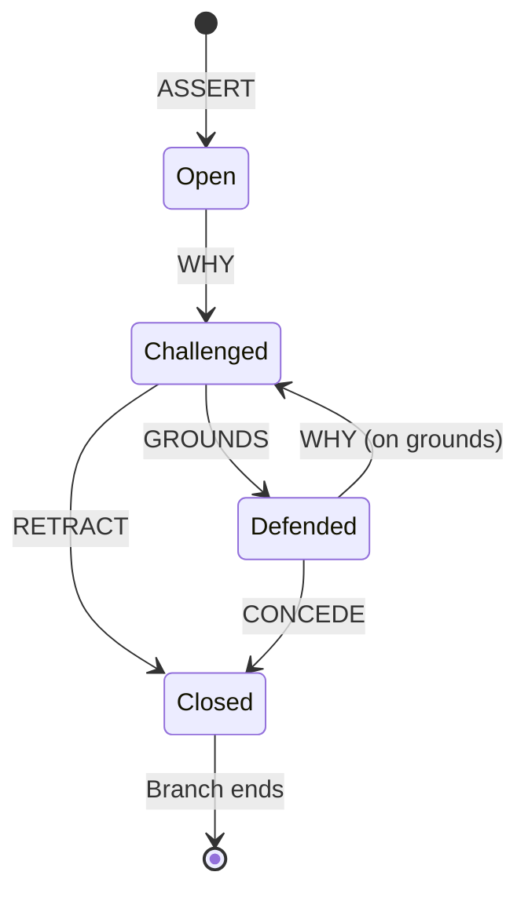

---

## 3.2 AIF/Arguments Subsystem Deep Dive

### Purpose
Implements the **Argument Interchange Format (AIF)** - a standardized way to represent arguments as graphs with typed nodes and edges.

### Node Type Reference

| Node | Full Name | Purpose | Color Code |
|------|-----------|---------|------------|
| I | Information | Claims, propositions, data | Blue |
| RA | Rule Application | Inference relationship | Orange |
| CA | Conflict Application | Attack relationship | Red |
| PA | Preference Application | Ordering relationship | Purple |
| TA | Transition Application | Dialogue marker | Gray |

### Component Breakdown

```
arguments/
├── AIFArgumentsListPro.tsx      # Main argument list (virtualized)
├── AIFArgumentWithSchemeComposer.tsx  # Create arguments with schemes
├── ArgumentCardV2.tsx           # Individual argument display
├── ArgumentActionsSheet.tsx     # Actions for selected argument
├── SchemeBreakdown.tsx          # Visual scheme structure
├── SchemeSelector.tsx           # Scheme picker dropdown
└── ArgumentCriticalQuestionsModal.tsx  # CQ interface

map/
├── Aifdiagramviewerdagre.tsx    # Main AIF graph renderer
├── AifDiagramView.tsx           # Basic diagram component
└── aif-examples.ts              # Example graphs for testing
```

### Graph Construction Example

```typescript
// Creating an argument with scheme
const argument = {
  schemeKey: "expert_opinion",
  premises: [
    { text: "Dr. Smith is a medical expert", role: "expert" },
    { text: "Dr. Smith says vaccine X is safe", role: "assertion" },
  ],
  conclusion: { text: "Vaccine X is safe" }
};

// AIF representation generated:
{
  nodes: [
    { id: "i1", kind: "I", label: "Dr. Smith is a medical expert" },
    { id: "i2", kind: "I", label: "Dr. Smith says vaccine X is safe" },
    { id: "ra1", kind: "RA", schemeKey: "expert_opinion" },
    { id: "i3", kind: "I", label: "Vaccine X is safe" }
  ],
  edges: [
    { from: "i1", to: "ra1", role: "premise" },
    { from: "i2", to: "ra1", role: "premise" },
    { from: "ra1", to: "i3", role: "conclusion" }
  ]
}
```

---

## 3.3 Ludics Subsystem Deep Dive

### Purpose
Implements **Ludics** (from Jean-Yves Girard's proof theory) - a game-semantic approach to dialogue that treats arguments as strategies in a game.

### Key Concepts

| Concept | Description |
|---------|-------------|
| **Locus** | A position/address in the game tree (e.g., "0.1.2") |
| **Polarity** | P (Proponent/positive) or O (Opponent/negative) |
| **Design** | A set of moves/strategies a player can make |
| **Act** | A single move with polarity at a locus |
| **Daimon (†)** | Special termination marker indicating agreement |
| **Chronicle** | A complete play sequence in the game |

### Component Breakdown

```
ludics/
├── LociTreeWithControls.tsx     # Locus tree visualization
├── LudicsForest.tsx             # Multiple trees view
├── BehaviourInspectorCard.tsx   # Strategy analysis
├── StrategyInspector.tsx        # Detailed strategy view
├── TraceRibbon.tsx              # Interaction sequence display
├── ChronicleViewer.tsx          # Complete play viewer
├── CorrespondenceViewer.tsx     # Curry-Howard correspondence
└── game/                        # Game-theoretic components

packages/ludics-core/
├── types.ts                     # Core type definitions
├── paths.ts                     # Locus path operations
├── ve.ts                        # View/expression functions
└── dds/                         # Design data structures

packages/ludics-react/
├── LociTree.tsx                 # React locus tree
├── TraceRibbon.tsx              # React trace display
├── JudgeConsole.tsx             # Referee/judge interface
└── CommitmentsPanel.tsx         # Commitment tracking
```

### Interaction Example

```typescript
// Proponent Design
const proDesign: LudicDesign = {
  acts: [
    { polarity: 'P', locus: '0', ramification: ['0.1', '0.2'] },
    { polarity: 'P', locus: '0.1', ramification: [] }
  ]
};

// Opponent Design  
const oppDesign: LudicDesign = {
  acts: [
    { polarity: 'O', locus: '0', ramification: ['0.1'] },
    { kind: 'DAIMON', locus: '0.1' }  // Concedes at 0.1
  ]
};

// Interaction Result
{
  status: 'CONVERGENT',  // Reached daimon
  pairs: [
    { posActId: 'p0', negActId: 'o0', locusPath: '0' },
    { posActId: 'p1', negActId: 'daimon', locusPath: '0.1' }
  ],
  daimonAt: '0.1'
}
```

---

# 4. Component Interaction Maps

## 4.1 Claim Selection Flow

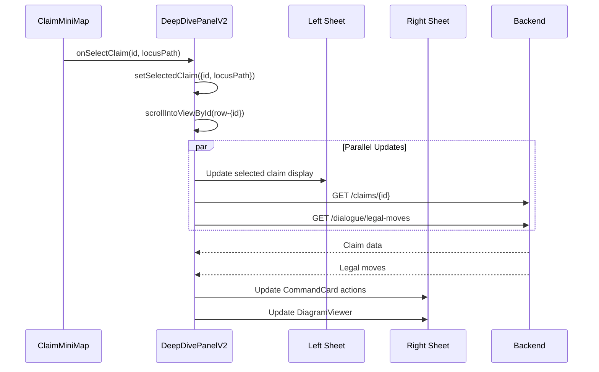

## 4.2 Argument Creation Flow

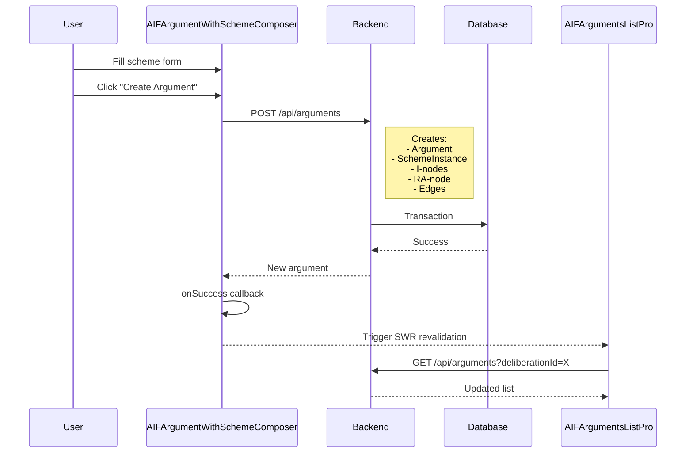

## 4.3 Floating Sheet Interaction

```mermaid
flowchart TB
    subgraph Triggers["Toggle Triggers"]
        LB[Left Button<br/>📊 Explorer]
        RB[Right Button<br/>⚡ Actions]
        TB[Terms Button<br/>📖 Dictionary]
    end
    
    subgraph State["Sheet State"]
        SP["useSheetPersistence<br/>{left: bool, right: bool, terms: bool}"]
    end
    
    subgraph Sheets["FloatingSheet Components"]
        LS["Left Sheet<br/>width: 1000px"]
        RS["Right Sheet<br/>width: 650px"]
        TS["Terms Sheet<br/>width: 1000px"]
    end
    
    subgraph Storage["Persistence"]
        LST[(localStorage<br/>dd:sheets:{delibId})]
    end
    
    LB -->|toggleLeft| SP
    RB -->|toggleRight| SP
    TB -->|toggleTerms| SP
    
    SP -->|open state| LS & RS & TS
    SP <-->|persist| LST
```

---

# 5. Cheat Sheets

## 5.1 File Location Cheat Sheet

```
MAIN ENTRY POINT:
components/deepdive/DeepDivePanelV2.tsx

TABS:
components/deepdive/v3/tabs/DebateTab.tsx
components/deepdive/v3/tabs/ArgumentsTab.tsx
components/deepdive/v3/tabs/ChainsTab.tsx
components/deepdive/v3/tabs/AnalyticsTab.tsx

HOOKS:
components/deepdive/v3/hooks/useDeliberationState.ts
components/deepdive/v3/hooks/useSheetPersistence.ts

DIALOGUE:
components/dialogue/DialogueActionsButton.tsx
components/dialogue/command-card/CommandCard.tsx
lib/dialogue/legalMoves.ts

ARGUMENTS:
components/arguments/AIFArgumentsListPro.tsx
components/arguments/AIFArgumentWithSchemeComposer.tsx
components/map/Aifdiagramviewerdagre.tsx

CLAIMS:
components/claims/ClaimMiniMap.tsx
components/claims/CriticalQuestionsV3.tsx

LUDICS:
components/deepdive/LudicsPanel.tsx
packages/ludics-core/types.ts
packages/ludics-react/LociTree.tsx

ASPIC:
components/aspic/AspicTheoryPanel.tsx

API ROUTES:
app/api/dialogue/legal-moves/route.ts
app/api/dialogue/move/route.ts
app/api/claims/[id]/route.ts
app/api/arguments/[id]/route.ts
app/api/aif/schemes/route.ts
```

## 5.2 Type Definitions Cheat Sheet

```typescript
// Move Types (lib/dialogue/types.ts)
type MoveKind = "ASSERT" | "WHY" | "GROUNDS" | "RETRACT" | "CONCEDE" | "CLOSE" | "THEREFORE" | "SUPPOSE" | "DISCHARGE";
type MoveForce = 'ATTACK' | 'SURRENDER' | 'NEUTRAL';

// AIF Node Types (lib/arguments/diagram.ts)
type AIFNodeKind = 'I' | 'RA' | 'CA' | 'PA' | 'TA';
type AIFEdgeRole = 'premise' | 'conclusion' | 'conflictingElement' | 'conflictedElement' | 'preferredElement';

// Claim Labels
type ClaimLabel = 'IN' | 'OUT' | 'UNDEC';

// Ludics (packages/ludics-core/types.ts)
type Polarity = 'P' | 'O' | 'pos' | 'neg' | 'daimon';
type TravelStatus = 'ONGOING' | 'CONVERGENT' | 'DIVERGENT' | 'STUCK';

// Deliberation State
interface DeliberationState {
  tab: 'debate' | 'arguments' | 'chains' | 'ludics' | 'admin' | 'sources' | 'thesis' | 'analytics';
  confMode: 'product' | 'min';
  rule: 'utilitarian' | 'harmonic' | 'maxcov';
  dsMode: boolean;
  pending: boolean;
  refreshCounter: number;
}
```

## 5.3 API Endpoints Cheat Sheet

```
DIALOGUE:
GET  /api/dialogue/legal-moves?deliberationId=X&targetType=claim&targetId=Y
POST /api/dialogue/move          {kind, targetId, locusPath, payload}
GET  /api/dialogue/commitments   ?deliberationId=X
GET  /api/dialogue/open-cqs      ?deliberationId=X

CLAIMS:
GET    /api/claims/[id]
PATCH  /api/claims/[id]          {text, label}
GET    /api/claims/[id]/top-argument
POST   /api/claims/[id]/label    (recompute status)
GET    /api/claims/[id]/edges

ARGUMENTS:
GET    /api/arguments/[id]
GET    /api/arguments/[id]?view=diagram
POST   /api/arguments            {schemeKey, premises[], conclusionClaimId}
GET    /api/arguments?deliberationId=X

AIF:
GET    /api/aif/schemes
GET    /api/aif/graph-with-dialogue?deliberationId=X
POST   /api/aif/validate         {graph}
POST   /api/aif/import           {aifJson}
GET    /api/aif/export?deliberationId=X

LUDICS:
POST   /api/ludics/compile       {deliberationId}
POST   /api/ludics/interact      {proDesignId, oppDesignId}
GET    /api/ludics/trace?interactionId=X
```

## 5.4 Event System Cheat Sheet

```typescript
// Global Events (window.dispatchEvent / addEventListener)

// Refresh dialogue data
window.dispatchEvent(new CustomEvent('mesh:dialogue:refresh'));

// Select a node in the graph
window.dispatchEvent(new CustomEvent('mesh:select-node', { 
  detail: { id: 'claim-123', locusPath: '0.1' } 
}));

// Focus the composer
window.dispatchEvent(new CustomEvent('mesh:composer:focus', { 
  detail: { deliberationId: 'delib-456' } 
}));

// Refresh issues list
window.dispatchEvent(new CustomEvent('issues:refresh', { 
  detail: { deliberationId: 'delib-456' } 
}));

// Dialogue moves refresh
window.dispatchEvent(new CustomEvent('dialogue:moves:refresh', { 
  detail: { deliberationId: 'delib-456' } 
}));
```

---

## Quick Visual Summary for Whiteboard

### The "One Diagram to Rule Them All"

```
┌──────────────────────────────────────────────────────────────────────────────┐
│                                                                              │
│                              MESH DIGITAL AGORA                              │
│                                                                              │
│  ┌─────────────────────────────────────────────────────────────────────────┐│
│  │                         DeepDivePanelV2                                  ││
│  │  ┌───────────┐  ┌─────────────────────────────────┐  ┌───────────────┐  ││
│  │  │  EXPLORE  │  │            MAIN TABS            │  │    ACTIONS    │  ││
│  │  │  (Graph)  │  │  Debate │ Args │ Chains │ ...  │  │   (Commands)  │  ││
│  │  └───────────┘  └─────────────────────────────────┘  └───────────────┘  ││
│  └─────────────────────────────────────────────────────────────────────────┘│
│         │                        │                              │            │
│         ▼                        ▼                              ▼            │
│  ┌─────────────┐         ┌─────────────┐                ┌─────────────┐     │
│  │ AIF Graph   │         │ Discussion  │                │ Legal Moves │     │
│  │ CEG Map     │         │ Propositions│                │ CommandCard │     │
│  │ Commitments │         │ Claims List │                │ Diagrams    │     │
│  └─────────────┘         └─────────────┘                └─────────────┘     │
│         │                        │                              │            │
│         └────────────────────────┼──────────────────────────────┘            │
│                                  │                                           │
│                                  ▼                                           │
│  ┌──────────────────────────────────────────────────────────────────────────┤
│  │                           API LAYER                                      │
│  │   /dialogue    /claims    /arguments    /aif    /ludics    /chains      │
│  └──────────────────────────────────────────────────────────────────────────┤
│                                  │                                           │
│                                  ▼                                           │
│  ┌──────────────────────────────────────────────────────────────────────────┤
│  │                        DATABASE (Prisma)                                 │
│  │  Deliberation │ Claim │ Argument │ Scheme │ DialogueMove │ LudicDesign  │
│  └──────────────────────────────────────────────────────────────────────────┤
│                                                                              │
│  ═══════════════════════════════════════════════════════════════════════════│
│                          THEORETICAL FOUNDATIONS                             │
│  ┌────────────────┐  ┌────────────────┐  ┌────────────────┐                 │
│  │ PROTOCOL (PPD) │  │ GEOMETRY       │  │ CONTENT        │                 │
│  │ • Move legality│  │ (Ludics)       │  │ (AIF/Walton)   │                 │
│  │ • Attack/Surr  │  │ • Loci         │  │ • Schemes      │                 │
│  │ • Commitments  │  │ • Polarity     │  │ • CQs          │                 │
│  │                │  │ • Convergence  │  │ • ASPIC+       │                 │
│  └────────────────┘  └────────────────┘  └────────────────┘                 │
│                                                                              │
└──────────────────────────────────────────────────────────────────────────────┘
```

---

*Companion Document to AGORA_DELIBERATION_SYSTEM_ARCHITECTURE.md*
*Generated: December 10, 2025*
*Version: 1.0*
