# Agora Subsystems Architecture Guide

## Extended Reference for Specialized Subsystems

This companion document provides detailed architecture diagrams and explanations for specialized Agora subsystems including Debate Sheets, Plexus, Discussions, Schemes, Thesis, KB Wikis, Discourse Dashboard, and the Evidence/Sources system.

---

## Table of Contents

1. [Agora / Debate Sheets](#1-agora--debate-sheets)
2. [Plexus Network System](#2-plexus-network-system)
3. [Discussions System](#3-discussions-system)
4. [Argument Schemes System](#4-argument-schemes-system)
5. [Thesis System](#5-thesis-system)
6. [KB Wikis System](#6-kb-wikis-system)
7. [Discourse Dashboard](#7-discourse-dashboard)
8. [Evidence / Sources / Citations](#8-evidence--sources--citations)
9. [Stacks & Libraries](#9-stacks--libraries)
10. [Deliberate Button Flow](#10-deliberate-button-flow)

---

# 1. Agora / Debate Sheets

## Overview

Debate Sheets provide a **spreadsheet-like view** of arguments in a deliberation, showing confidence scores, support values, and argument networks in a scannable format.

## Architecture Diagram

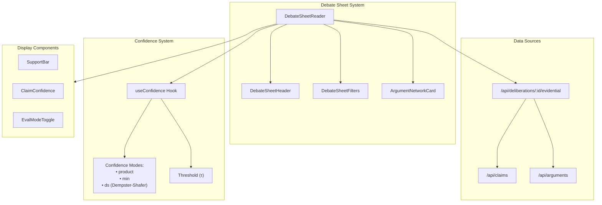

## Quick Reference Card

```
┌─────────────────────────────────────────────────────────────────┐
│                    DEBATE SHEETS                                │
├─────────────────────────────────────────────────────────────────┤
│                                                                 │
│  PURPOSE: Spreadsheet view of argument confidence & support     │
│                                                                 │
│  KEY COMPONENTS:                                                │
│  ┌───────────────────────────────────────────────────────────┐ │
│  │ DebateSheetReader    │ Main container                     │ │
│  │ DebateSheetHeader    │ Title, controls, mode toggle       │ │
│  │ DebateSheetFilters   │ Search, sort, filter options       │ │
│  │ ArgumentNetworkCard  │ Individual argument display        │ │
│  │ SupportBar           │ Visual confidence indicator        │ │
│  └───────────────────────────────────────────────────────────┘ │
│                                                                 │
│  CONFIDENCE MODES:                                              │
│  • product: Multiply path probabilities                        │
│  • min: Take minimum confidence                                │
│  • ds: Dempster-Shafer intervals [bel, pl]                     │
│                                                                 │
│  FILE LOCATIONS:                                                │
│  • components/agora/DebateSheetReader.tsx                      │
│  • components/deepdive/v3/debate-sheet/*                       │
│  • components/evidence/SupportBar.tsx                          │
│                                                                 │
└─────────────────────────────────────────────────────────────────┘
```

## Component Breakdown

```
agora/
├── DebateSheetReader.tsx      # Main debate sheet container (533 lines)
│   ├── ClaimsPane             # List of claims with scores
│   └── ArgumentNetworkCard    # Argument display with network preview
│
├── useConfidence.tsx          # Context provider for confidence settings
│   ├── mode: 'product'|'min'|'ds'
│   └── tau: number (threshold)
│
deepdive/v3/debate-sheet/
├── DebateSheetHeader.tsx      # Header with title and controls
├── DebateSheetFilters.tsx     # Filtering and sorting UI
└── ArgumentNetworkCard.tsx    # Individual argument card
```

---

# 2. Plexus Network System

## Overview

Plexus is a **meta-level network visualization** showing connections between different deliberation rooms/debates. It visualizes cross-references, shared arguments, and argument transport between deliberations.

## Architecture Diagram

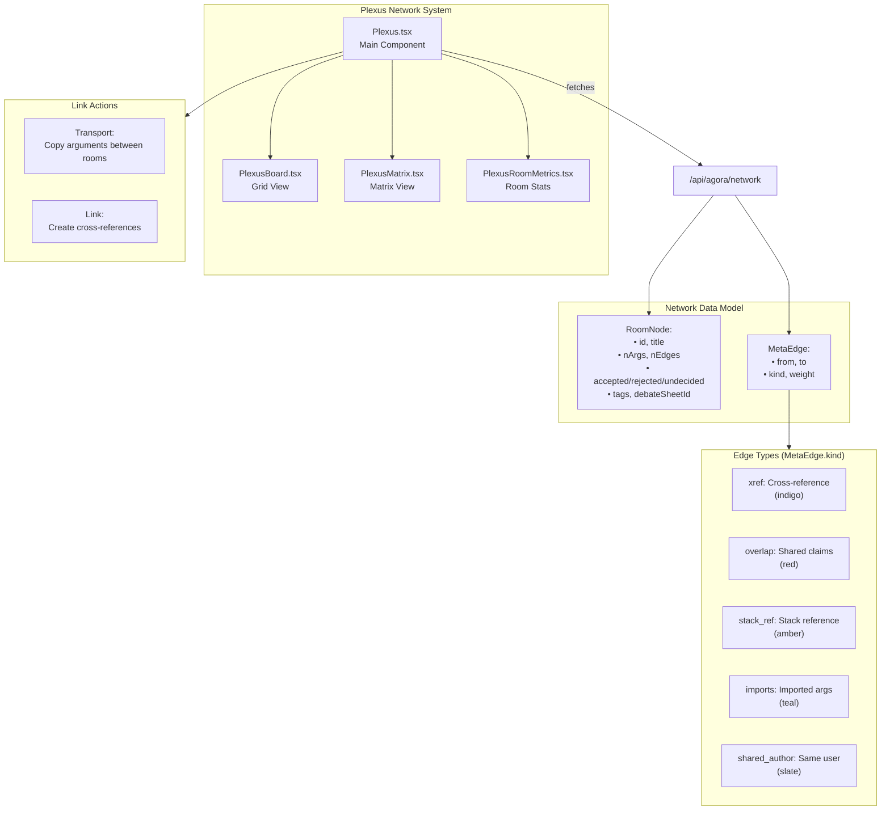

## Quick Reference Card

```
┌─────────────────────────────────────────────────────────────────┐
│                    PLEXUS NETWORK                               │
├─────────────────────────────────────────────────────────────────┤
│                                                                 │
│  PURPOSE: Meta-network of deliberation rooms & their links      │
│                                                                 │
│  EDGE TYPES (color-coded):                                      │
│  ┌───────────────────────────────────────────────────────────┐ │
│  │ 🟣 xref         │ Cross-reference between rooms           │ │
│  │ 🔴 overlap      │ Shared claims/arguments                 │ │
│  │ 🟠 stack_ref    │ Referenced in same stack               │ │
│  │ 🟢 imports      │ Arguments imported from another room   │ │
│  │ ⚫ shared_author│ Same author participates               │ │
│  └───────────────────────────────────────────────────────────┘ │
│                                                                 │
│  VIEW MODES:                                                    │
│  • Plexus.tsx: Interactive graph with nodes & edges            │
│  • PlexusBoard.tsx: Grid/card layout                           │
│  • PlexusMatrix.tsx: Adjacency matrix view                     │
│                                                                 │
│  ACTIONS:                                                       │
│  • Transport: Copy arguments to another room                   │
│  • Link: Create explicit cross-reference                       │
│  • Select: Open room in DeepDivePanel                          │
│                                                                 │
│  FILE LOCATIONS:                                                │
│  • components/agora/Plexus.tsx (~1010 lines)                   │
│  • components/agora/PlexusBoard.tsx                            │
│  • components/agora/PlexusMatrix.tsx                           │
│  • components/agora/PlexusRoomMetrics.tsx                      │
│                                                                 │
└─────────────────────────────────────────────────────────────────┘
```

## Data Model

```typescript
// Room/Deliberation Node
type RoomNode = {
  id: string;
  title?: string | null;
  nArgs: number;        // Total arguments
  nEdges: number;       // Total edges
  accepted: number;     // IN claims count
  rejected: number;     // OUT claims count
  undecided: number;    // UNDEC claims count
  tags?: string[];
  updatedAt?: string | null;
  debateSheetId?: string | null;
};

// Edge between rooms
type MetaEdge = {
  from: string;   // Source room ID
  to: string;     // Target room ID
  kind: EdgeKind; // Type of connection
  weight: number; // Strength of connection
};

type EdgeKind = 'xref' | 'overlap' | 'stack_ref' | 'imports' | 'shared_author';
```

## Network Visualization

```
┌─────────────────────────────────────────────────────────────────┐
│                                                                 │
│                      PLEXUS NETWORK VIEW                        │
│                                                                 │
│     ┌─────────┐                      ┌─────────┐               │
│     │ Room A  │───── xref ──────────│ Room C  │               │
│     │ 12 args │                      │ 8 args  │               │
│     │ 🟢5 🔴3 │                      │ 🟢6 🔴1 │               │
│     └────┬────┘                      └────┬────┘               │
│          │                                │                     │
│       overlap                          imports                  │
│          │                                │                     │
│     ┌────▼────┐                      ┌────▼────┐               │
│     │ Room B  │───shared_author─────│ Room D  │               │
│     │ 20 args │                      │ 15 args │               │
│     │ 🟢10🔴5 │                      │ 🟢8 🔴4 │               │
│     └─────────┘                      └─────────┘               │
│                                                                 │
│  Legend: 🟢=IN 🔴=OUT ⚪=UNDEC                                   │
│                                                                 │
└─────────────────────────────────────────────────────────────────┘
```

---

# 3. Discussions System

## Overview

The Discussions system provides a **casual forum/chat hybrid** for preliminary conversation before formal deliberation. Discussions can spawn deliberations via the "Deliberate" button.

## Architecture Diagram

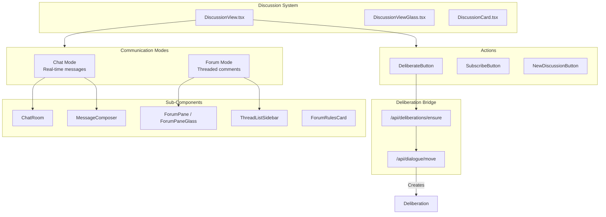

## Quick Reference Card

```
┌─────────────────────────────────────────────────────────────────┐
│                    DISCUSSIONS SYSTEM                           │
├─────────────────────────────────────────────────────────────────┤
│                                                                 │
│  PURPOSE: Casual discussion before formal deliberation          │
│                                                                 │
│  TWO MODES:                                                     │
│  ┌───────────────────────────────────────────────────────────┐ │
│  │ 💬 CHAT   │ Real-time messaging, quick exchanges          │ │
│  │ 📋 FORUM  │ Threaded comments, structured discussion      │ │
│  └───────────────────────────────────────────────────────────┘ │
│                                                                 │
│  KEY COMPONENTS:                                                │
│  • DiscussionView.tsx - Main container with mode toggle        │
│  • ForumPane.tsx - Forum thread display                        │
│  • ChatRoom.tsx - Real-time chat interface                     │
│  • DeliberateButton.tsx - Bridge to formal deliberation        │
│                                                                 │
│  DELIBERATE FLOW:                                               │
│  Discussion → [Deliberate] → /api/deliberations/ensure          │
│            → Creates Deliberation → Opens DeepDivePanelV2       │
│                                                                 │
│  FILE LOCATIONS:                                                │
│  • components/discussion/DiscussionView.tsx                    │
│  • components/discussion/ForumPane.tsx                         │
│  • components/common/DeliberationButton.tsx                    │
│                                                                 │
└─────────────────────────────────────────────────────────────────┘
```

## Discussion → Deliberation Flow

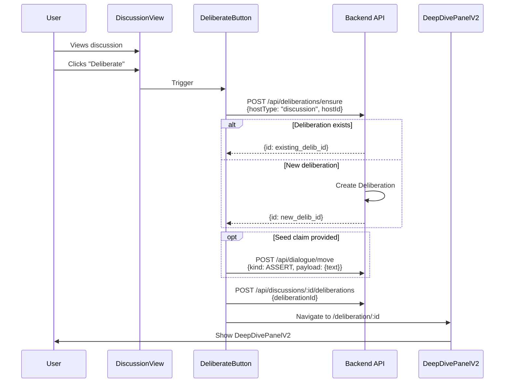

---

# 4. Argument Schemes System

## Overview

The Argument Schemes system implements **Walton-style argumentation schemes** with critical questions. It provides a library of 60+ formal argument patterns that can be applied to arguments.

## Architecture Diagram

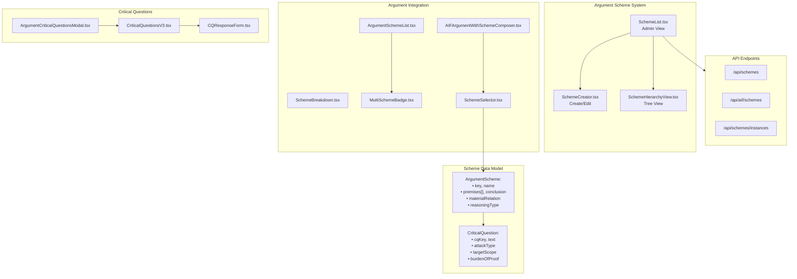

## Quick Reference Card

```
┌─────────────────────────────────────────────────────────────────┐
│                  ARGUMENT SCHEMES SYSTEM                        │
├─────────────────────────────────────────────────────────────────┤
│                                                                 │
│  PURPOSE: Formal argument patterns with critical questions      │
│                                                                 │
│  SCHEME STRUCTURE:                                              │
│  ┌───────────────────────────────────────────────────────────┐ │
│  │ Scheme: "Argument from Expert Opinion"                    │ │
│  ├───────────────────────────────────────────────────────────┤ │
│  │ Premises:                                                 │ │
│  │   • E is an expert in domain D                           │ │
│  │   • E asserts A                                          │ │
│  │   • A is in domain D                                     │ │
│  │ Conclusion:                                               │ │
│  │   • A is (presumably) true                               │ │
│  │ Critical Questions:                                       │ │
│  │   CQ1: Is E credible?                                    │ │
│  │   CQ2: Is E expert in D?                                 │ │
│  │   CQ3: What did E actually say?                          │ │
│  └───────────────────────────────────────────────────────────┘ │
│                                                                 │
│  ATTACK TYPES (via CQs):                                        │
│  • REBUTS: Attacks conclusion                                  │
│  • UNDERCUTS: Attacks inference                                │
│  • UNDERMINES: Attacks premise                                 │
│                                                                 │
│  SCHEME CATEGORIES:                                             │
│  • Source-based (expert, witness, authority)                   │
│  • Causal (cause-effect, sign, correlation)                    │
│  • Analogy (comparison, precedent)                             │
│  • Practical (goals, consequences, values)                     │
│                                                                 │
│  KEY FILES:                                                     │
│  • components/admin/SchemeList.tsx                             │
│  • components/admin/SchemeCreator.tsx                          │
│  • components/arguments/ArgumentSchemeList.tsx                 │
│  • components/arguments/SchemeBreakdown.tsx                    │
│                                                                 │
└─────────────────────────────────────────────────────────────────┘
```

## Scheme Data Model

```typescript
type ArgumentScheme = {
  id: string;
  key: string;          // e.g., "expert_opinion"
  name: string;         // "Argument from Expert Opinion"
  summary: string;
  description?: string;
  
  // Classification
  materialRelation?: string;  // "source-based", "causal", etc.
  reasoningType?: string;     // "presumptive", "deductive"
  clusterTag?: string;        // Grouping tag
  
  // Structure
  premises?: PremiseTemplate[];
  conclusion?: ConclusionTemplate;
  ruleForm?: string;    // Logical form
  
  // Hierarchy
  parentSchemeId?: string;
  inheritCQs?: boolean;
  
  // Critical Questions
  cqs: CriticalQuestion[];
};

type CriticalQuestion = {
  cqKey: string;        // e.g., "CQ1"
  text: string;         // "Is E credible as an expert?"
  attackType: 'REBUTS' | 'UNDERCUTS' | 'UNDERMINES';
  targetScope: 'conclusion' | 'inference' | 'premise';
  burdenOfProof?: 'proponent' | 'challenger';
  requiresEvidence?: boolean;
};
```

## Scheme Hierarchy Visualization

```
┌─────────────────────────────────────────────────────────────────┐
│                    SCHEME HIERARCHY                             │
├─────────────────────────────────────────────────────────────────┤
│                                                                 │
│  📁 Source-Based Arguments                                      │
│  ├── 📄 Argument from Expert Opinion                           │
│  │   ├── 📄 Argument from Expert Consensus                     │
│  │   └── 📄 Argument from Specialized Expert                   │
│  ├── 📄 Argument from Witness Testimony                        │
│  └── 📄 Argument from Authority                                │
│                                                                 │
│  📁 Causal Arguments                                            │
│  ├── 📄 Argument from Cause to Effect                          │
│  ├── 📄 Argument from Effect to Cause                          │
│  ├── 📄 Argument from Sign                                     │
│  └── 📄 Argument from Correlation to Cause                     │
│                                                                 │
│  📁 Practical Arguments                                         │
│  ├── 📄 Argument from Consequences                             │
│  ├── 📄 Argument from Goals                                    │
│  └── 📄 Argument from Values                                   │
│                                                                 │
│  📁 Analogical Arguments                                        │
│  ├── 📄 Argument from Analogy                                  │
│  └── 📄 Argument from Precedent                                │
│                                                                 │
└─────────────────────────────────────────────────────────────────┘
```

---

# 5. Thesis System

## Overview

The Thesis system allows users to compose **structured legal-style documents** that aggregate claims and arguments into cohesive, publishable theses with prongs, sections, and citations.

## Architecture Diagram

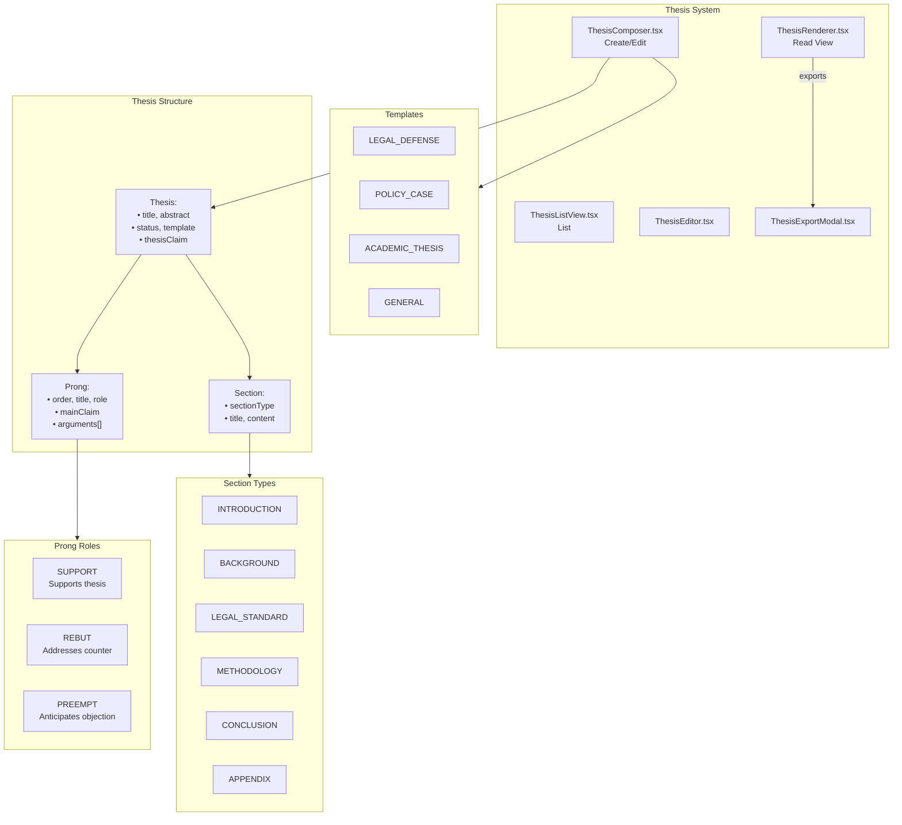

## Quick Reference Card

```
┌─────────────────────────────────────────────────────────────────┐
│                      THESIS SYSTEM                              │
├─────────────────────────────────────────────────────────────────┤
│                                                                 │
│  PURPOSE: Structured legal-style argument documents             │
│                                                                 │
│  THESIS STRUCTURE:                                              │
│  ┌───────────────────────────────────────────────────────────┐ │
│  │ THESIS                                                    │ │
│  │ ├── Title & Abstract                                      │ │
│  │ ├── Thesis Claim (main assertion)                         │ │
│  │ ├── SECTIONS (intro, background, methodology...)          │ │
│  │ └── PRONGS (supporting argument groups)                   │ │
│  │     ├── SUPPORT prong (positive case)                     │ │
│  │     ├── REBUT prong (counter arguments)                   │ │
│  │     └── PREEMPT prong (anticipate objections)             │ │
│  └───────────────────────────────────────────────────────────┘ │
│                                                                 │
│  TEMPLATES:                                                     │
│  • LEGAL_DEFENSE: Court brief style                            │
│  • POLICY_CASE: Policy proposal format                         │
│  • ACADEMIC_THESIS: Research paper structure                   │
│  • GENERAL: Flexible format                                    │
│                                                                 │
│  STATUS WORKFLOW:                                               │
│  DRAFT → SUBMITTED → PUBLISHED → ARCHIVED                       │
│                                                                 │
│  KEY FILES:                                                     │
│  • components/thesis/ThesisComposer.tsx (~923 lines)           │
│  • components/thesis/ThesisRenderer.tsx                        │
│  • components/thesis/ProngEditor.tsx                           │
│  • components/thesis/ThesisSectionEditor.tsx                   │
│                                                                 │
└─────────────────────────────────────────────────────────────────┘
```

## Thesis Structure Diagram

```
┌─────────────────────────────────────────────────────────────────┐
│                    THESIS DOCUMENT                              │
├─────────────────────────────────────────────────────────────────┤
│                                                                 │
│  ╔═══════════════════════════════════════════════════════════╗ │
│  ║ TITLE: "Analysis of Climate Policy Effectiveness"         ║ │
│  ║ STATUS: 📝 DRAFT                                           ║ │
│  ║ TEMPLATE: POLICY_CASE                                      ║ │
│  ╚═══════════════════════════════════════════════════════════╝ │
│                                                                 │
│  ┌─────────────────────────────────────────────────────────┐   │
│  │ 📝 ABSTRACT                                              │   │
│  │ "This thesis argues that carbon taxation..."             │   │
│  └─────────────────────────────────────────────────────────┘   │
│                                                                 │
│  ┌─────────────────────────────────────────────────────────┐   │
│  │ 🎯 THESIS CLAIM                                          │   │
│  │ "Carbon taxation is the most effective policy tool..."   │   │
│  └─────────────────────────────────────────────────────────┘   │
│                                                                 │
│  ═══════════════════ SECTIONS ════════════════════════════     │
│                                                                 │
│  ┌─────────────────────────────────────────────────────────┐   │
│  │ 📖 INTRODUCTION                                          │   │
│  │ Background context and motivation...                     │   │
│  └─────────────────────────────────────────────────────────┘   │
│                                                                 │
│  ┌─────────────────────────────────────────────────────────┐   │
│  │ 📚 BACKGROUND                                            │   │
│  │ Historical context and prior work...                     │   │
│  └─────────────────────────────────────────────────────────┘   │
│                                                                 │
│  ═══════════════════ PRONGS ══════════════════════════════     │
│                                                                 │
│  ┌─────────────────────────────────────────────────────────┐   │
│  │ ✅ PRONG 1: SUPPORT                                      │   │
│  │ "Economic Effectiveness"                                 │   │
│  │ Main Claim: Carbon taxes reduce emissions cost-effectively│   │
│  │ Arguments:                                               │   │
│  │   [1] From Expert Consensus                             │   │
│  │   [2] From Statistical Evidence                         │   │
│  └─────────────────────────────────────────────────────────┘   │
│                                                                 │
│  ┌─────────────────────────────────────────────────────────┐   │
│  │ ⚔️ PRONG 2: REBUT                                        │   │
│  │ "Addressing Economic Concerns"                           │   │
│  │ Main Claim: Economic harms are overstated               │   │
│  │ Arguments:                                               │   │
│  │   [1] Against regressive impact claim                   │   │
│  └─────────────────────────────────────────────────────────┘   │
│                                                                 │
└─────────────────────────────────────────────────────────────────┘
```

---

# 6. KB Wikis System

## Overview

KB (Knowledge Base) Wikis provide a **block-based document system** for creating wiki pages that can embed arguments, claims, room summaries, and transports from the deliberation system.

## Architecture Diagram

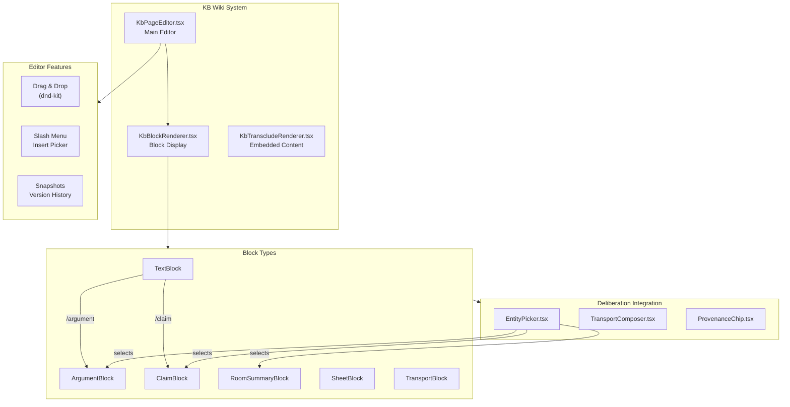

## Quick Reference Card

```
┌─────────────────────────────────────────────────────────────────┐
│                      KB WIKI SYSTEM                             │
├─────────────────────────────────────────────────────────────────┤
│                                                                 │
│  PURPOSE: Block-based wiki with embedded deliberation content   │
│                                                                 │
│  BLOCK TYPES:                                                   │
│  ┌───────────────────────────────────────────────────────────┐ │
│  │ 📝 TextBlock      │ Rich text content                     │ │
│  │ 💬 ArgumentBlock  │ Embedded argument from deliberation   │ │
│  │ 📌 ClaimBlock     │ Embedded claim with status            │ │
│  │ 🏠 RoomSummaryBlock│ Deliberation room summary            │ │
│  │ 📊 SheetBlock     │ Embedded debate sheet                 │ │
│  │ 🚀 TransportBlock │ Cross-room argument transport         │ │
│  └───────────────────────────────────────────────────────────┘ │
│                                                                 │
│  EDITOR FEATURES:                                               │
│  • Drag & drop reordering (dnd-kit)                            │
│  • Slash commands (/argument, /claim, etc.)                    │
│  • Snapshot versioning                                         │
│  • Live/Draft block status                                     │
│                                                                 │
│  TRANSCLUSION:                                                  │
│  • Arguments render with full AIF structure                    │
│  • Claims show current status (IN/OUT/UNDEC)                   │
│  • Provenance chips show source deliberation                   │
│                                                                 │
│  KEY FILES:                                                     │
│  • components/kb/KbPageEditor.tsx                              │
│  • components/kb/KbBlockRenderer.tsx                           │
│  • components/kb/blocks/*.tsx                                  │
│  • components/kb/editor/plugins/SlashMenu.ts                   │
│                                                                 │
└─────────────────────────────────────────────────────────────────┘
```

## Block Structure

```typescript
type KbBlock = {
  id: string;
  type: BlockType;
  order: number;
  live: boolean;      // Published or draft
  data: BlockData;    // Type-specific data
};

type BlockType = 
  | 'text'           // Rich text
  | 'argument'       // ArgumentBlock
  | 'claim'          // ClaimBlock
  | 'room_summary'   // RoomSummaryBlock
  | 'sheet'          // SheetBlock
  | 'transport';     // TransportBlock

// Example ArgumentBlock data
type ArgumentBlockData = {
  argumentId: string;
  deliberationId: string;
  showCQs?: boolean;
  showDiagram?: boolean;
};
```

---

# 7. Discourse Dashboard

## Overview

The Discourse Dashboard is a **personal activity tracker** showing users their contributions, engagements, and actions taken on their work across deliberations.

## Architecture Diagram

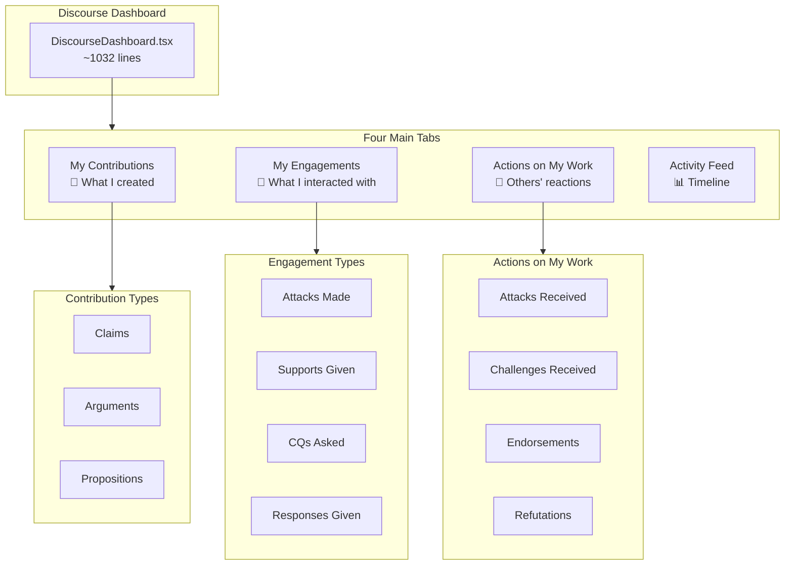

## Quick Reference Card

```
┌─────────────────────────────────────────────────────────────────┐
│                   DISCOURSE DASHBOARD                           │
├─────────────────────────────────────────────────────────────────┤
│                                                                 │
│  PURPOSE: Track personal participation and engagement           │
│                                                                 │
│  TABS:                                                          │
│  ┌───────────────────────────────────────────────────────────┐ │
│  │ 📝 MY CONTRIBUTIONS                                       │ │
│  │    • Claims I've asserted                                 │ │
│  │    • Arguments I've constructed                           │ │
│  │    • Propositions I've submitted                          │ │
│  ├───────────────────────────────────────────────────────────┤ │
│  │ 💬 MY ENGAGEMENTS                                         │ │
│  │    • Attacks I've made                                    │ │
│  │    • Supports I've provided                               │ │
│  │    • Critical questions I've asked                        │ │
│  │    • Responses I've given                                 │ │
│  ├───────────────────────────────────────────────────────────┤ │
│  │ 🎯 ACTIONS ON MY WORK                                     │ │
│  │    • Attacks received on my claims                        │ │
│  │    • Challenges to my arguments                           │ │
│  │    • Endorsements received                                │ │
│  │    • Needs attention (pending responses)                  │ │
│  ├───────────────────────────────────────────────────────────┤ │
│  │ 📊 ACTIVITY FEED                                          │ │
│  │    • Chronological timeline                               │ │
│  │    • All interactions in one view                         │ │
│  └───────────────────────────────────────────────────────────┘ │
│                                                                 │
│  ACTIONS:                                                       │
│  • Click to view detail                                        │
│  • Respond to attacks directly                                 │
│  • Track notification badges                                   │
│                                                                 │
│  FILE: components/discourse/DiscourseDashboard.tsx             │
│                                                                 │
└─────────────────────────────────────────────────────────────────┘
```

## Dashboard Visualization

```
┌─────────────────────────────────────────────────────────────────┐
│                   DISCOURSE DASHBOARD                           │
├─────────────────────────────────────────────────────────────────┤
│                                                                 │
│  [My Contributions] [My Engagements] [Actions on Me] [Feed]     │
│       ═══════                                                    │
│                                                                 │
│  ┌─────────────────────────────────────────────────────────┐   │
│  │ SUB-TABS: [All] [Claims] [Arguments] [Propositions]     │   │
│  └─────────────────────────────────────────────────────────┘   │
│                                                                 │
│  📊 Summary: 12 Claims | 5 Arguments | 3 Propositions          │
│                                                                 │
│  ┌─────────────────────────────────────────────────────────┐   │
│  │ 📌 Claim: "Carbon taxes reduce emissions"               │   │
│  │    Status: 🟢 IN | Supports: 3 | Attacks: 1              │   │
│  │    Created: 2 days ago                                   │   │
│  │    [View] [Respond to Attack]                           │   │
│  ├─────────────────────────────────────────────────────────┤   │
│  │ 💬 Argument: "From Expert Consensus"                    │   │
│  │    Scheme: expert_opinion | CQs Answered: 2/6           │   │
│  │    Status: Active                                        │   │
│  │    [View] [Add Response]                                │   │
│  ├─────────────────────────────────────────────────────────┤   │
│  │ 📝 Proposition: "We should implement carbon tax"        │   │
│  │    Votes: 12 | Comments: 5                              │   │
│  │    [View Discussion]                                    │   │
│  └─────────────────────────────────────────────────────────┘   │
│                                                                 │
└─────────────────────────────────────────────────────────────────┘
```

---

# 8. Evidence / Sources / Citations

## Overview

The Evidence system tracks **sources and citations** used across arguments and claims, with community quality ratings and usage metrics.

## Architecture Diagram

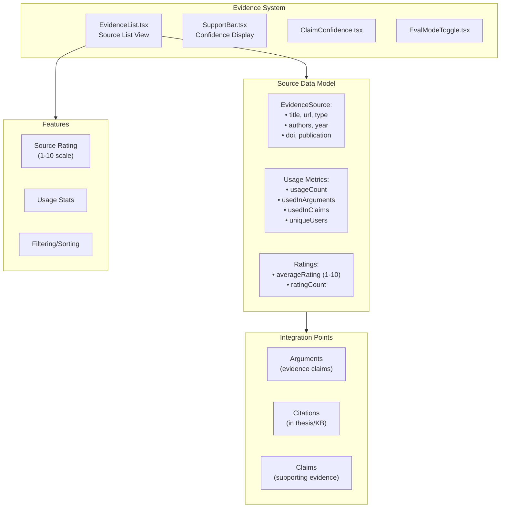

## Quick Reference Card

```
┌─────────────────────────────────────────────────────────────────┐
│                  EVIDENCE / SOURCES SYSTEM                      │
├─────────────────────────────────────────────────────────────────┤
│                                                                 │
│  PURPOSE: Track citations and rate source quality               │
│                                                                 │
│  SOURCE DATA:                                                   │
│  ┌───────────────────────────────────────────────────────────┐ │
│  │ • title: "Study on Carbon Tax Effectiveness"             │ │
│  │ • url: https://journal.org/article/123                   │ │
│  │ • type: academic_paper | news | report | book            │ │
│  │ • authors: [{family: "Smith", given: "J"}]               │ │
│  │ • year: 2023                                             │ │
│  │ • doi: 10.1234/example                                   │ │
│  │ • publication: "Climate Policy Journal"                  │ │
│  └───────────────────────────────────────────────────────────┘ │
│                                                                 │
│  METRICS:                                                       │
│  • Usage count: Times cited                                    │
│  • Used in: X arguments, Y claims                              │
│  • Unique users: Z different people cited this                 │
│  • Average rating: 8.5/10 (N ratings)                          │
│                                                                 │
│  RATING SYSTEM:                                                 │
│  • Community rates 1-10 scale                                  │
│  • Higher = more reliable/trustworthy                          │
│  • Ratings inform confidence calculations                      │
│                                                                 │
│  KEY FILES:                                                     │
│  • components/evidence/EvidenceList.tsx                        │
│  • components/evidence/SupportBar.tsx                          │
│  • app/api/deliberations/[id]/sources/route.ts                 │
│  • app/api/sources/[id]/rate/route.ts                          │
│                                                                 │
└─────────────────────────────────────────────────────────────────┘
```

## Source Data Model

```typescript
type EvidenceSource = {
  sourceId: string;
  title: string;
  url: string;
  type: string;          // academic_paper, news, report, etc.
  authorsJson: any;      // Parsed author data
  year: number | null;
  publicationTitle: string | null;
  doi: string | null;
  
  // Usage metrics
  usageCount: number;
  usedInArguments: number;
  usedInClaims: number;
  uniqueUsers: number;
  firstUsed: string;     // ISO date
  lastUsed: string;      // ISO date
  
  // Community rating
  averageRating: number | null;  // 1-10 scale
  ratingCount: number;
};
```

---

# 9. Stacks & Libraries

## Overview

Stacks are **curated collections** of references, arguments, or resources that users can organize, share, and use across deliberations.

## Architecture Diagram

```mermaid
flowchart TB
    subgraph StacksSystem["Stacks System"]
        SD[StacksDashboard.tsx<br/>User's Stacks]
        SP["Stack Page<br/>/stacks/[slugOrId]"]
    end
    
    subgraph StackData["Stack Data Model"]
        ST["Stack:<br/>• id, name, slug<br/>• is_public<br/>• description"]
        SI["Stack Items:<br/>• References<br/>• Arguments<br/>• Claims"]
    end
    
    subgraph Features["Features"]
        CR[Create Stack]
        ED[Edit/Rename]
        SH[Share (public/private)]
        CP[Copy Link]
        DL[Delete]
    end
    
    subgraph Integration["Integration"]
        DL2["Deliberations<br/>(stack_ref edges)"]
        PX["Plexus Network<br/>(cross-stack links)"]
        KB["KB Wikis<br/>(embed stacks)"]
    end
    
    SD --> StackData
    SD --> Features
    StackData --> Integration
```

## Quick Reference Card

```
┌─────────────────────────────────────────────────────────────────┐
│                    STACKS & LIBRARIES                           │
├─────────────────────────────────────────────────────────────────┤
│                                                                 │
│  PURPOSE: Curated collections of resources and arguments        │
│                                                                 │
│  STACK PROPERTIES:                                              │
│  ┌───────────────────────────────────────────────────────────┐ │
│  │ • name: "Climate Policy Resources"                        │ │
│  │ • slug: climate-policy-resources                          │ │
│  │ • is_public: true/false                                   │ │
│  │ • description: "Collection of key papers..."              │ │
│  └───────────────────────────────────────────────────────────┘ │
│                                                                 │
│  FEATURES:                                                      │
│  • Create new stacks                                           │
│  • Add items (refs, arguments, claims)                         │
│  • Public/private visibility                                   │
│  • Share via slug URL                                          │
│  • Search and filter                                           │
│                                                                 │
│  INTEGRATION:                                                   │
│  • Plexus: stack_ref edge type                                 │
│  • KB Wikis: Embed stack blocks                                │
│  • Deliberations: Reference stack items                        │
│                                                                 │
│  KEY FILES:                                                     │
│  • app/(root)/(standard)/profile/stacks/ui/StacksDashboard.tsx │
│  • app/stacks/[slugOrId]/page.tsx                              │
│  • app/api/stacks/route.ts                                     │
│                                                                 │
└─────────────────────────────────────────────────────────────────┘
```

---

# 10. Deliberate Button Flow

## Overview

The **Deliberate Button** is the bridge that transforms casual discussions into formal deliberations. It appears in discussions and creates/opens the corresponding deliberation.

## Architecture Diagram

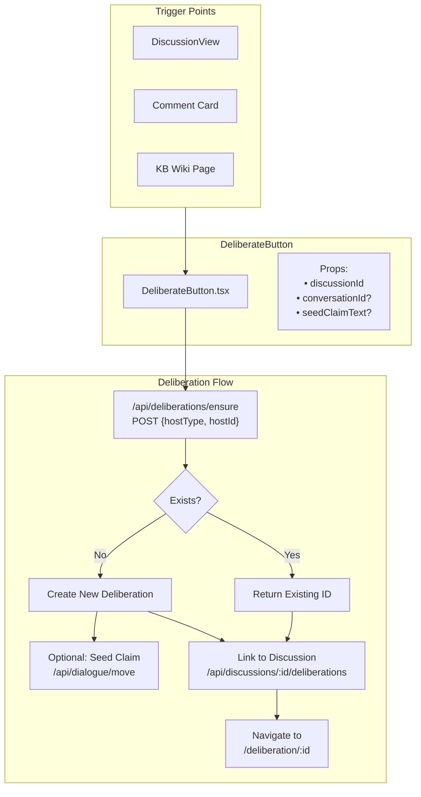

## Quick Reference Card

```
┌─────────────────────────────────────────────────────────────────┐
│                   DELIBERATE BUTTON                             │
├─────────────────────────────────────────────────────────────────┤
│                                                                 │
│  PURPOSE: Bridge from casual discussion to formal deliberation  │
│                                                                 │
│  PROPS:                                                         │
│  ┌───────────────────────────────────────────────────────────┐ │
│  │ discussionId   │ Required │ Source discussion ID          │ │
│  │ conversationId │ Optional │ Chat thread ID                │ │
│  │ seedClaimText  │ Optional │ Initial claim to assert       │ │
│  └───────────────────────────────────────────────────────────┘ │
│                                                                 │
│  FLOW:                                                          │
│  1. User clicks "Deliberate" button                            │
│  2. POST /api/deliberations/ensure                             │
│     • hostType: "discussion" | "inbox_thread"                  │
│     • hostId: discussionId or conversationId                   │
│  3. If new, creates deliberation                               │
│  4. If seedClaimText, creates initial ASSERT move              │
│  5. Links deliberation back to discussion                      │
│  6. Redirects to /deliberation/:id                             │
│                                                                 │
│  HOST TYPES:                                                    │
│  • discussion: Forum discussion                                │
│  • inbox_thread: Chat conversation                             │
│  • article: Article/post                                       │
│  • kb_page: KB wiki page                                       │
│                                                                 │
│  KEY FILES:                                                     │
│  • components/common/DeliberationButton.tsx                    │
│  • components/discussion/DeliberateButton.tsx                  │
│  • app/api/deliberations/ensure/route.ts                       │
│                                                                 │
└─────────────────────────────────────────────────────────────────┘
```

## Complete Flow Sequence

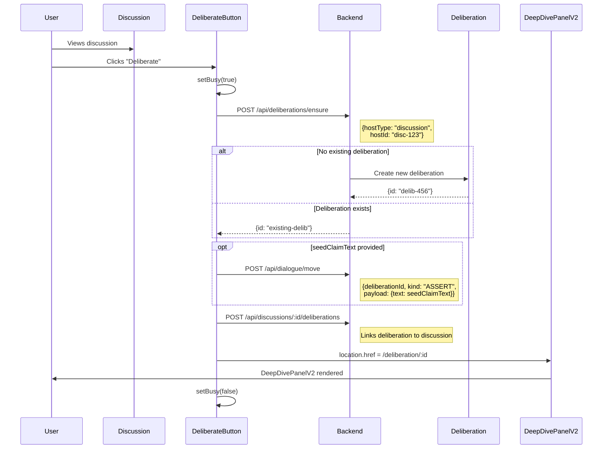

---

# Master System Integration Diagram

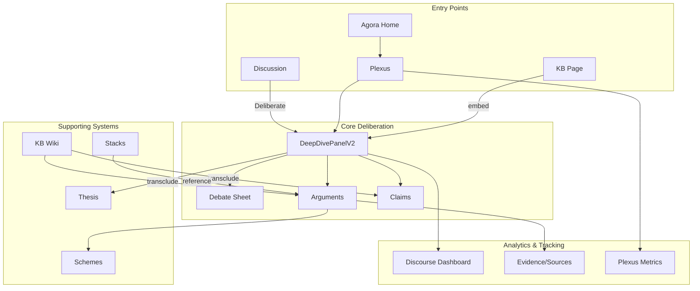

---

## File Location Quick Reference

```
DEBATE SHEETS:
├── components/agora/DebateSheetReader.tsx
├── components/deepdive/v3/debate-sheet/*
└── components/evidence/SupportBar.tsx

PLEXUS:
├── components/agora/Plexus.tsx
├── components/agora/PlexusBoard.tsx
├── components/agora/PlexusMatrix.tsx
└── components/agora/PlexusRoomMetrics.tsx

DISCUSSIONS:
├── components/discussion/DiscussionView.tsx
├── components/discussion/ForumPane.tsx
└── components/common/DeliberationButton.tsx

SCHEMES:
├── components/admin/SchemeList.tsx
├── components/admin/SchemeCreator.tsx
├── components/arguments/ArgumentSchemeList.tsx
└── components/arguments/SchemeBreakdown.tsx

THESIS:
├── components/thesis/ThesisComposer.tsx
├── components/thesis/ThesisRenderer.tsx
├── components/thesis/ProngEditor.tsx
└── components/thesis/ThesisSectionEditor.tsx

KB WIKIS:
├── components/kb/KbPageEditor.tsx
├── components/kb/KbBlockRenderer.tsx
├── components/kb/blocks/*.tsx
└── components/kb/editor/plugins/SlashMenu.ts

DISCOURSE DASHBOARD:
└── components/discourse/DiscourseDashboard.tsx

EVIDENCE:
├── components/evidence/EvidenceList.tsx
├── components/evidence/SupportBar.tsx
└── app/api/deliberations/[id]/sources/route.ts

STACKS:
├── app/(root)/(standard)/profile/stacks/ui/StacksDashboard.tsx
├── app/stacks/[slugOrId]/page.tsx
└── app/api/stacks/route.ts
```

---

# 11. Glossary / Dictionary System

## Overview

The Glossary System enables **collaborative term definition** within deliberations to reduce semantic confusion. Participants can propose terms, provide competing definitions, vote on definitions, and track usage across arguments.

## Architecture Diagram

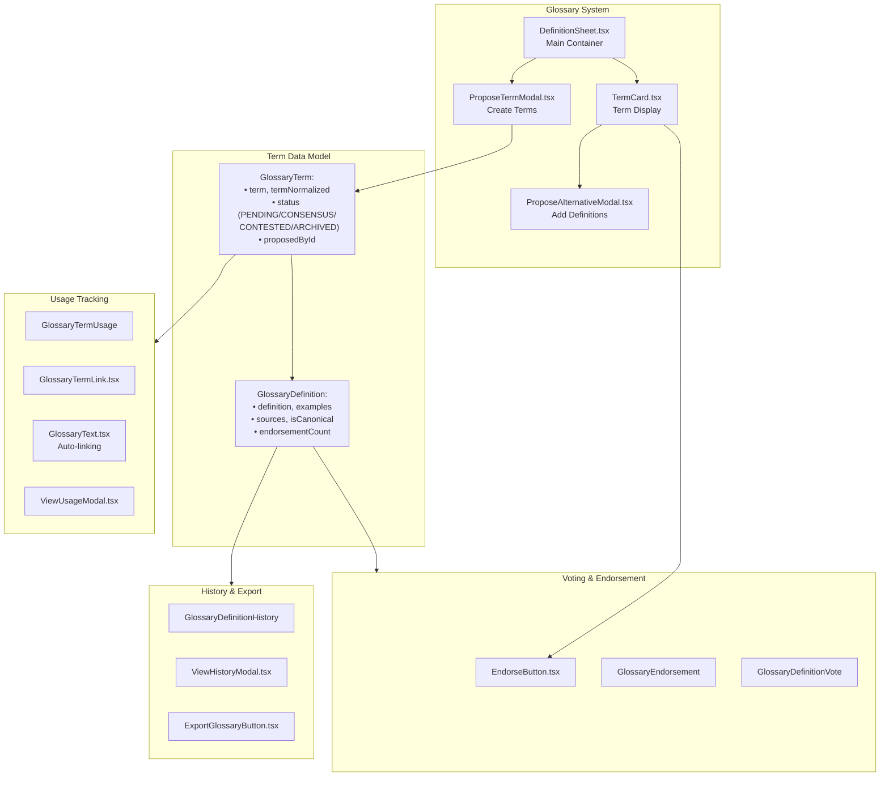

## Quick Reference Card

```
┌─────────────────────────────────────────────────────────────────┐
│                   GLOSSARY / DICTIONARY                         │
├─────────────────────────────────────────────────────────────────┤
│                                                                 │
│  PURPOSE: Collaborative term definitions for shared vocabulary  │
│                                                                 │
│  TERM STATUS LIFECYCLE:                                         │
│  ┌───────────────────────────────────────────────────────────┐ │
│  │ ⏳ PENDING    │ Awaiting endorsements                     │ │
│  │ ✅ CONSENSUS  │ One definition has sufficient support     │ │
│  │ ⚡ CONTESTED  │ Multiple competing definitions            │ │
│  │ 📦 ARCHIVED   │ No longer active                          │ │
│  └───────────────────────────────────────────────────────────┘ │
│                                                                 │
│  FEATURES:                                                      │
│  • Propose new terms with definitions                          │
│  • Propose alternative definitions (competing views)           │
│  • Endorse definitions (community voting)                      │
│  • Track term usage across arguments                           │
│  • View definition history/audit trail                         │
│  • Export glossary to file                                     │
│  • Auto-link terms in text (GlossaryText component)            │
│                                                                 │
│  SORTING/FILTERING:                                             │
│  • Sort by: Most Used, Alphabetical, Recent                    │
│  • Filter by: Status (All/Consensus/Contested/Pending)         │
│                                                                 │
│  FILE LOCATIONS:                                                │
│  • components/glossary/DefinitionSheet.tsx (main container)    │
│  • components/glossary/TermCard.tsx (term display)             │
│  • components/glossary/ProposeTermModal.tsx (create terms)     │
│  • components/glossary/EndorseButton.tsx (voting)              │
│  • lib/glossary/parseGlossaryLinks.tsx (auto-linking)          │
│                                                                 │
└─────────────────────────────────────────────────────────────────┘
```

## Data Model

```typescript
// Term Status
enum GlossaryTermStatus {
  PENDING    // Awaiting endorsements
  CONSENSUS  // Sufficient endorsements for one definition
  CONTESTED  // Multiple competing definitions
  ARCHIVED   // No longer active
}

// Core Term Model
type GlossaryTerm = {
  id: string;
  deliberationId: string;
  term: string;              // "Justice"
  termNormalized: string;    // "justice" (for matching)
  status: GlossaryTermStatus;
  proposedById: string;
  definitions: GlossaryDefinition[];
  usages: GlossaryTermUsage[];
};

// Definition with voting
type GlossaryDefinition = {
  id: string;
  termId: string;
  definition: string;        // The actual text
  examples?: string;         // Usage examples
  sources?: any;             // Citations/references
  authorId: string;
  isCanonical: boolean;      // Consensus or moderator-endorsed
  endorsementCount: number;  // Cached vote count
  endorsements: GlossaryEndorsement[];
  votes: GlossaryDefinitionVote[];
  history: GlossaryDefinitionHistory[];
};

// Voting records
type GlossaryEndorsement = {
  definitionId: string;
  userId: string;
};

type GlossaryDefinitionVote = {
  definitionId: string;
  userId: string;
  value: number;  // +1 upvote, -1 downvote, 0 neutral
};
```

## UI Flow Diagram

```
┌─────────────────────────────────────────────────────────────────┐
│                    DEFINITION SHEET                             │
├─────────────────────────────────────────────────────────────────┤
│                                                                 │
│  ┌──────────────────────────────────────────────────────────┐  │
│  │  Glossary • 12 terms            [Export] [+ Define Term] │  │
│  └──────────────────────────────────────────────────────────┘  │
│                                                                 │
│  [🔍 Search...]  [Sort: Most Used ▼]  [Filter: All ▼]          │
│                                                                 │
│  ┌──────────────────────────────────────────────────────────┐  │
│  │ 📗 "Justice"                              ✅ CONSENSUS    │  │
│  │ ✨ Used 8 times in arguments                             │  │
│  │                                                           │  │
│  │ CANONICAL DEFINITION:                                    │  │
│  │ "The fair and equitable treatment of all parties..."     │  │
│  │ — proposed by @user1                                     │  │
│  │                                                           │  │
│  │ [👍 12 Endorse] [📜 History] [➕ Alternative] [👁️ Usage] │  │
│  │                                                           │  │
│  │ ▼ 2 COMPETING DEFINITIONS                                │  │
│  │   • "Justice means retribution..." [👍 3]                │  │
│  │   • "Justice is restorative..." [👍 5]                   │  │
│  └──────────────────────────────────────────────────────────┘  │
│                                                                 │
│  ┌──────────────────────────────────────────────────────────┐  │
│  │ 📙 "Liberty"                               ⚡ CONTESTED   │  │
│  │ ✨ Used 3 times in arguments                             │  │
│  │ (3 competing definitions, no consensus yet)              │  │
│  └──────────────────────────────────────────────────────────┘  │
│                                                                 │
└─────────────────────────────────────────────────────────────────┘
```

---

# 12. Issues System

## Overview

The Issues System provides a **structured tracking mechanism** for questions, clarifications, reviews, and action items within deliberations. It supports the "Request Clarification" button flow and community defense (NCM) reviews.

## Architecture Diagram

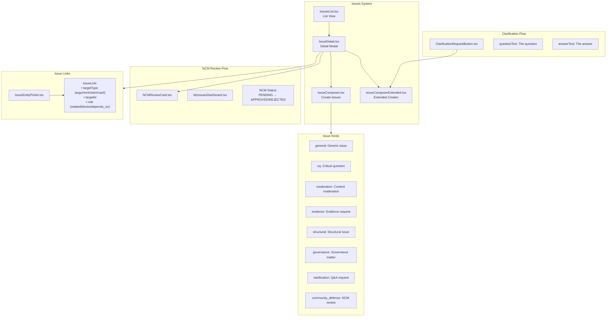

## Quick Reference Card

```
┌─────────────────────────────────────────────────────────────────┐
│                      ISSUES SYSTEM                              │
├─────────────────────────────────────────────────────────────────┤
│                                                                 │
│  PURPOSE: Track questions, reviews, and action items            │
│                                                                 │
│  ISSUE KINDS:                                                   │
│  ┌───────────────────────────────────────────────────────────┐ │
│  │ 📝 general          │ Generic issue                       │ │
│  │ ❓ cq               │ Critical question tracking          │ │
│  │ 🛡️ moderation       │ Content moderation                  │ │
│  │ 📊 evidence         │ Evidence request                    │ │
│  │ 🏗️ structural       │ Structural argument issue           │ │
│  │ ⚖️ governance       │ Governance/policy matter            │ │
│  │ 💬 clarification    │ Request clarification (Q&A)         │ │
│  │ 🛡️ community_defense│ NCM (non-canonical move) review     │ │
│  └───────────────────────────────────────────────────────────┘ │
│                                                                 │
│  ISSUE STATES:                                                  │
│  • open: Active, needs attention                               │
│  • pending: Assigned, being worked on                          │
│  • closed: Resolved                                            │
│                                                                 │
│  CLARIFICATION FLOW:                                            │
│  1. User clicks "Request Clarification" on argument/claim      │
│  2. Issue created with kind=clarification                      │
│  3. Author sees in "My Issues" dashboard                       │
│  4. Author provides answerText                                 │
│  5. Issue closes with answer displayed                         │
│                                                                 │
│  NCM REVIEW FLOW:                                               │
│  1. Community member submits defense for argument              │
│  2. Issue created with kind=community_defense                  │
│  3. Author reviews via NCMReviewCard                           │
│  4. Author approves/rejects with notes                         │
│  5. If approved, NCM content integrated                        │
│                                                                 │
│  FILE LOCATIONS:                                                │
│  • components/issues/IssuesList.tsx                            │
│  • components/issues/IssueDetail.tsx                           │
│  • components/issues/ClarificationRequestButton.tsx            │
│  • components/issues/NCMReviewCard.tsx                         │
│  • components/issues/MyIssuesDashboard.tsx                     │
│                                                                 │
└─────────────────────────────────────────────────────────────────┘
```

## Data Model

```typescript
// Issue States
enum IssueState {
  open     // Active, needs attention
  pending  // Assigned, being worked on
  closed   // Resolved
}

// Issue Kinds (categories)
enum IssueKind {
  general           // Generic
  cq                // Critical question
  moderation        // Content moderation
  evidence          // Evidence request
  structural        // Structural issue
  governance        // Governance matter
  clarification     // Q&A request (Request Clarification button)
  community_defense // NCM review
}

// Link Target Types
enum IssueLinkTargetType {
  argument
  claim
  card
  inference
}

// Link Roles
enum IssueLinkRole {
  related     // General relation
  blocks      // This issue blocks the target
  depends_on  // Issue depends on target resolution
  warrant     // Related to warrant/inference
  evidence    // Related to evidence
}

// Core Issue Model
type Issue = {
  id: string;
  deliberationId: string;
  label: string;
  description?: string;
  state: IssueState;
  kind: IssueKind;
  
  // Creator/Assignment
  createdById: string;
  assigneeId?: string;
  
  // Clarification-specific fields
  questionText?: string;   // The actual question
  answerText?: string;     // Author's answer
  answeredAt?: Date;
  answeredById?: string;
  
  // NCM Review fields
  ncmId?: string;          // Link to NonCanonicalMove
  ncmStatus?: NCMStatus;   // PENDING/APPROVED/REJECTED/EXECUTED
  reviewedAt?: Date;
  reviewNotes?: string;    // Author's review notes
  
  // Relations
  links: IssueLink[];
};

// Issue Links (polymorphic targets)
type IssueLink = {
  id: string;
  issueId: string;
  targetType: IssueLinkTargetType;
  targetId: string;
  role?: IssueLinkRole;
};
```

## Clarification Request Flow

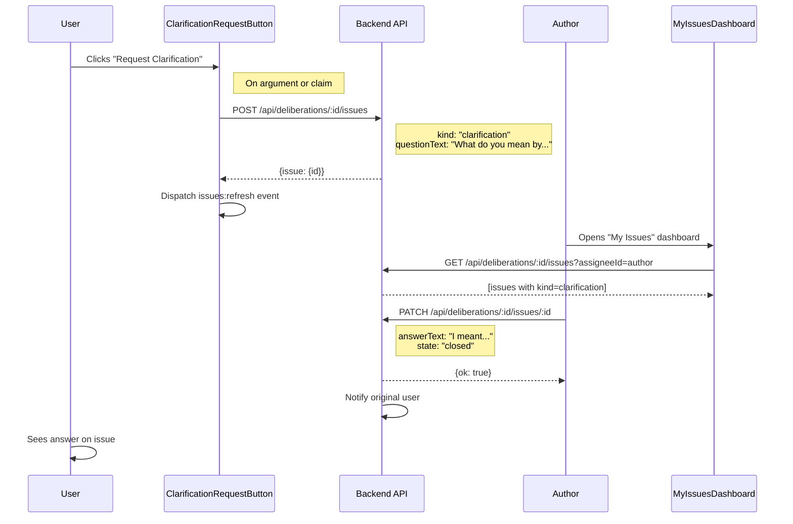

## NCM Community Defense Flow

```
┌─────────────────────────────────────────────────────────────────┐
│                  NCM REVIEW FLOW                                │
├─────────────────────────────────────────────────────────────────┤
│                                                                 │
│  1. COMMUNITY MEMBER SUBMITS DEFENSE                           │
│     ┌─────────────────────────────────────────────────────┐    │
│     │ 🛡️ NonCanonicalMove                                 │    │
│     │ targetType: argument                                │    │
│     │ moveType: GROUNDS_RESPONSE                          │    │
│     │ content: { expression: "Supporting evidence..." }   │    │
│     │ status: PENDING                                     │    │
│     └─────────────────────────────────────────────────────┘    │
│                           ↓                                     │
│  2. ISSUE CREATED AUTOMATICALLY                                 │
│     ┌─────────────────────────────────────────────────────┐    │
│     │ 📋 Issue                                            │    │
│     │ kind: community_defense                             │    │
│     │ ncmId: [link to NCM]                                │    │
│     │ assigned to: argument author                        │    │
│     └─────────────────────────────────────────────────────┘    │
│                           ↓                                     │
│  3. AUTHOR REVIEWS                                              │
│     ┌─────────────────────────────────────────────────────┐    │
│     │ NCMReviewCard                                       │    │
│     │ Shows: contributor, moveType, content               │    │
│     │ Actions: [✅ Approve] [❌ Reject]                    │    │
│     └─────────────────────────────────────────────────────┘    │
│                           ↓                                     │
│  4. OUTCOME                                                     │
│     ┌──────────────────┐   ┌────────────────────────────┐      │
│     │ ✅ APPROVED      │   │ ❌ REJECTED                │      │
│     │ NCM → EXECUTED   │   │ NCM → REJECTED             │      │
│     │ Content merged   │   │ Notes provided to contrib  │      │
│     └──────────────────┘   └────────────────────────────┘      │
│                                                                 │
└─────────────────────────────────────────────────────────────────┘
```

---

# 13. Scheme Admin System

## Overview

The Scheme Admin system provides a **comprehensive interface** for managing argumentation schemes, including creation, editing, taxonomy classification, critical question management, and scheme hierarchy visualization.

## Architecture Diagram

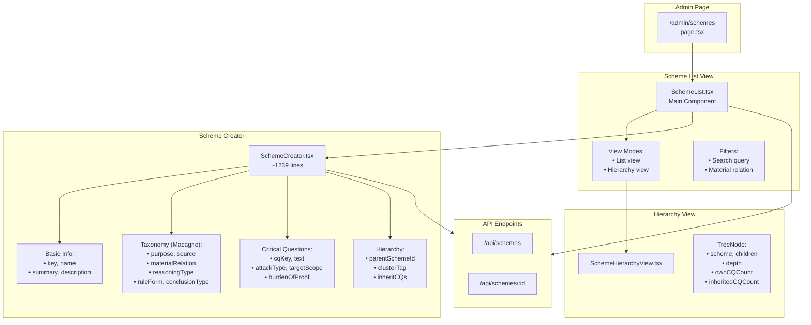

## Quick Reference Card

```
┌─────────────────────────────────────────────────────────────────┐
│                   SCHEME ADMIN SYSTEM                           │
├─────────────────────────────────────────────────────────────────┤
│                                                                 │
│  PURPOSE: Manage argumentation scheme library                   │
│                                                                 │
│  ENTRY POINT: /admin/schemes                                    │
│                                                                 │
│  VIEW MODES:                                                    │
│  ┌───────────────────────────────────────────────────────────┐ │
│  │ 📋 LIST VIEW                                              │ │
│  │    • Filterable/searchable cards                          │ │
│  │    • Expandable details per scheme                        │ │
│  │    • Edit/Delete actions                                  │ │
│  ├───────────────────────────────────────────────────────────┤ │
│  │ 🌳 HIERARCHY VIEW                                         │ │
│  │    • Tree visualization of parent/child schemes          │ │
│  │    • Cluster grouping by clusterTag                       │ │
│  │    • CQ inheritance visualization                         │ │
│  └───────────────────────────────────────────────────────────┘ │
│                                                                 │
│  SCHEME CREATOR SECTIONS:                                       │
│  1. Basic Information (key*, name*, summary*, description)     │
│  2. Macagno Taxonomy (purpose, source, materialRelation...)   │
│  3. Critical Questions (with attack types, burden of proof)   │
│  4. Hierarchy Settings (parent scheme, cluster tag)           │
│                                                                 │
│  AUTO-GENERATION:                                               │
│  • CQs can be auto-generated from taxonomy fields              │
│  • Uses generateCQsFromTaxonomy() function                     │
│                                                                 │
│  FILE LOCATIONS:                                                │
│  • app/admin/schemes/page.tsx (entry point)                    │
│  • components/admin/SchemeList.tsx (~529 lines)                │
│  • components/admin/SchemeCreator.tsx (~1239 lines)            │
│  • components/admin/SchemeHierarchyView.tsx (~425 lines)       │
│  • lib/argumentation/cqGeneration.ts                           │
│                                                                 │
└─────────────────────────────────────────────────────────────────┘
```

## SchemeCreator Form Structure

```typescript
// Complete Scheme Form Data
type SchemeFormData = {
  // BASIC INFO (Required)
  key: string;           // e.g., "expert_opinion" (lowercase_with_underscores)
  name: string;          // e.g., "Argument from Expert Opinion"
  summary: string;       // One-line description
  description?: string;  // Detailed explanation
  
  // MACAGNO TAXONOMY
  purpose?: string;      // What the scheme aims to establish
  source?: string;       // Original source (e.g., "Walton")
  materialRelation?: string;  // cause, definition, analogy, authority, practical, correlation
  reasoningType?: string;     // presumptive, deductive, inductive
  ruleForm?: string;          // Logical structure
  conclusionType?: string;    // Type of conclusion
  epistemicMode?: string;     // FACTUAL, NORMATIVE, etc.
  
  // ENHANCED METADATA
  tags?: string[];            // Categorization tags
  examples?: string[];        // Usage examples
  difficulty?: string;        // beginner, intermediate, advanced
  identificationConditions?: string[];  // When to recognize this scheme
  whenToUse?: string;         // Guidance text
  
  // PREMISES & CONCLUSION
  premises?: Premise[];       // Array of {id, type, text, variables}
  conclusion?: ConclusionTemplate;
  
  // CRITICAL QUESTIONS
  cqs: CriticalQuestion[];    // Required: at least one
  
  // HIERARCHY (Phase 6D)
  parentSchemeId?: string;    // Parent scheme for inheritance
  clusterTag?: string;        // Grouping tag
  inheritCQs?: boolean;       // Inherit parent's CQs
};

// Critical Question with Burden of Proof
type CriticalQuestion = {
  cqKey: string;         // e.g., "CQ1"
  text: string;          // "Is E credible as an expert?"
  attackType: "REBUTS" | "UNDERCUTS" | "UNDERMINES";
  targetScope: "conclusion" | "inference" | "premise";
  burdenOfProof?: "PROPONENT" | "CHALLENGER";
  requiresEvidence?: boolean;
  premiseType?: "ORDINARY" | "ASSUMPTION" | "EXCEPTION" | null;
};
```

## Scheme Admin UI Layout

```
┌─────────────────────────────────────────────────────────────────┐
│  ARGUMENTATION SCHEMES                                          │
│  Manage and create custom argument schemes                      │
│                                                                 │
│  [📋 List] [🌳 Hierarchy]              [➕ Create Scheme]       │
├─────────────────────────────────────────────────────────────────┤
│                                                                 │
│  [🔍 Search schemes...]        [Filter by relation: All ▼]      │
│                                                                 │
│  ┌──────────────────────────────────────────────────────────┐  │
│  │ ▶ Argument from Expert Opinion          expert_opinion   │  │
│  │   Appeals to expert knowledge to support a claim         │  │
│  │   [authority] [presumptive] [source: Walton]             │  │
│  │   6 critical questions                                    │  │
│  │                                          [✏️ Edit] [🗑️]  │  │
│  ├──────────────────────────────────────────────────────────┤  │
│  │ ▼ Argument from Analogy                 analogy          │  │
│  │   Compares two cases to transfer a property              │  │
│  │   [analogy] [presumptive] [source: Walton]               │  │
│  │   4 critical questions                                    │  │
│  │                                          [✏️ Edit] [🗑️]  │  │
│  │                                                           │  │
│  │   EXPANDED DETAILS:                                      │  │
│  │   ┌───────────────────────────────────────────────────┐  │  │
│  │   │ Description: The argument from analogy...        │  │  │
│  │   │                                                   │  │  │
│  │   │ Taxonomy (Macagno & Walton):                     │  │  │
│  │   │ • Purpose: establish similarity                  │  │  │
│  │   │ • Material Relation: analogy                     │  │  │
│  │   │ • Reasoning Type: presumptive                    │  │  │
│  │   │                                                   │  │  │
│  │   │ Critical Questions:                              │  │  │
│  │   │ CQ1: Are the two cases truly analogous? [UNDERCUTS] │
│  │   │ CQ2: Are there relevant differences? [UNDERMINES]│  │  │
│  │   │ CQ3: Does the property actually transfer? [REBUTS]│  │  │
│  │   └───────────────────────────────────────────────────┘  │  │
│  └──────────────────────────────────────────────────────────┘  │
│                                                                 │
└─────────────────────────────────────────────────────────────────┘
```

## Scheme Hierarchy Visualization

```
┌─────────────────────────────────────────────────────────────────┐
│                    HIERARCHY VIEW                               │
├─────────────────────────────────────────────────────────────────┤
│                                                                 │
│  [🔍 Filter by cluster...]  [Expand All] [Collapse All] [🔄]    │
│                                                                 │
│  📁 Source-Based (clusterTag: authority)                        │
│  │                                                              │
│  ├─▶ 📄 Argument from Expert Opinion                           │
│  │   │  key: expert_opinion | CQs: 6 (own: 6, inherited: 0)    │
│  │   │                                                          │
│  │   ├─▶ 📄 Argument from Expert Consensus                     │
│  │   │      key: expert_consensus | CQs: 2 (own: 2, inherited: 6)│
│  │   │      inheritCQs: true                                   │
│  │   │                                                          │
│  │   └─▶ 📄 Argument from Specialized Expert                   │
│  │          key: specialized_expert | CQs: 3 (inherited: 6)    │
│  │                                                              │
│  ├─▶ 📄 Argument from Witness Testimony                        │
│  │      key: witness_testimony | CQs: 5                         │
│  │                                                              │
│  └─▶ 📄 Argument from Authority                                │
│         key: authority | CQs: 4                                 │
│                                                                 │
│  📁 Causal (clusterTag: causal)                                 │
│  │                                                              │
│  ├─▶ 📄 Argument from Cause to Effect                          │
│  └─▶ 📄 Argument from Correlation to Cause                     │
│                                                                 │
└─────────────────────────────────────────────────────────────────┘
```

---

## Updated File Location Quick Reference

```
GLOSSARY / DICTIONARY:
├── components/glossary/DefinitionSheet.tsx (main container)
├── components/glossary/TermCard.tsx (term display)
├── components/glossary/ProposeTermModal.tsx (create terms)
├── components/glossary/ProposeAlternativeModal.tsx (add definitions)
├── components/glossary/EndorseButton.tsx (voting)
├── components/glossary/ViewHistoryModal.tsx (audit trail)
├── components/glossary/ViewUsageModal.tsx (usage tracking)
├── components/glossary/ExportGlossaryButton.tsx (export)
├── components/glossary/GlossaryText.tsx (auto-linking)
├── lib/glossary/parseGlossaryLinks.tsx (text parsing)
└── app/api/deliberations/[id]/glossary/terms/route.ts

ISSUES SYSTEM:
├── components/issues/IssuesList.tsx (list view)
├── components/issues/IssueDetail.tsx (detail modal)
├── components/issues/IssueComposer.tsx (create issues)
├── components/issues/IssueComposerExtended.tsx (extended)
├── components/issues/ClarificationRequestButton.tsx
├── components/issues/NCMReviewCard.tsx (community defense)
├── components/issues/MyIssuesDashboard.tsx (personal view)
├── components/issues/IssueEntityPicker.tsx (link targets)
├── components/issues/IssueBadge.tsx (status badge)
└── app/api/deliberations/[id]/issues/route.ts

SCHEME ADMIN:
├── app/admin/schemes/page.tsx (entry point)
├── components/admin/SchemeList.tsx (~529 lines)
├── components/admin/SchemeCreator.tsx (~1239 lines)
├── components/admin/SchemeHierarchyView.tsx (~425 lines)
├── lib/argumentation/cqGeneration.ts (auto-generation)
└── app/api/schemes/route.ts
```

---

*Companion Document to AGORA_DELIBERATION_SYSTEM_ARCHITECTURE.md*
*Updated: December 12, 2025*
*Version: 1.1*
