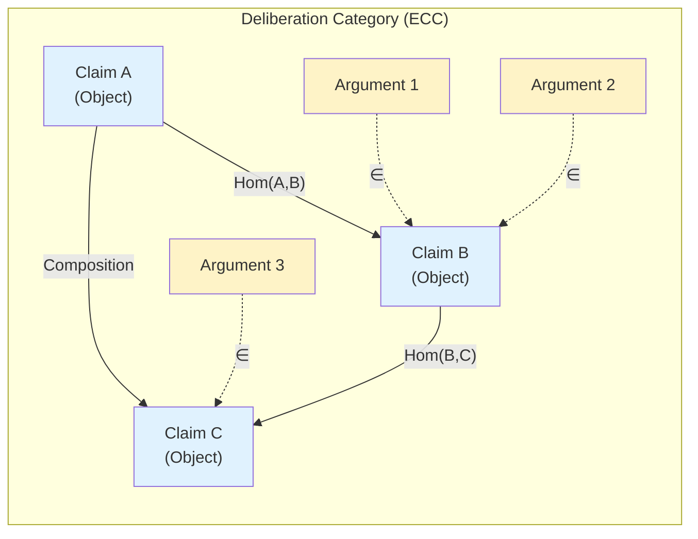
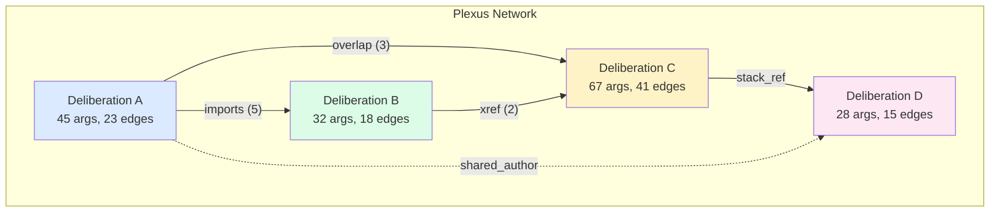
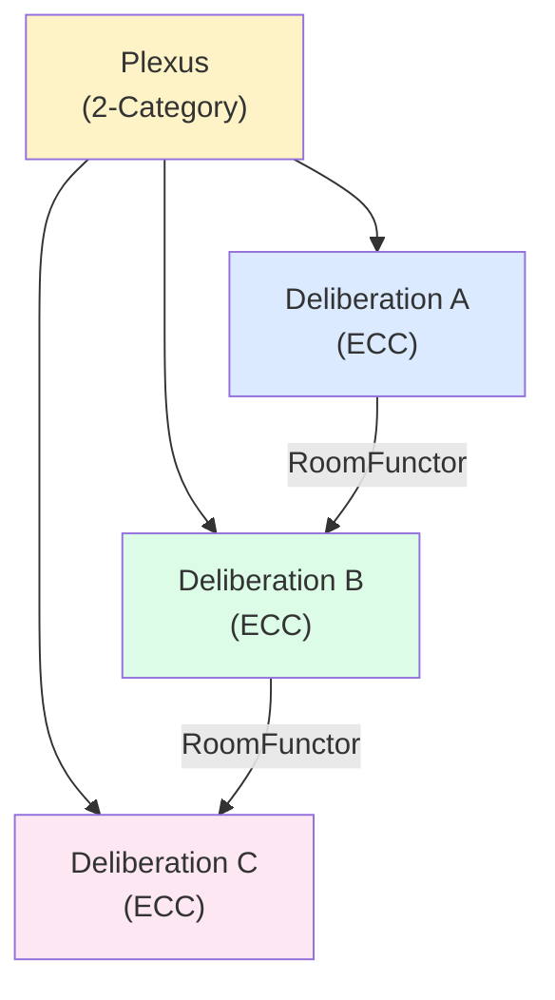
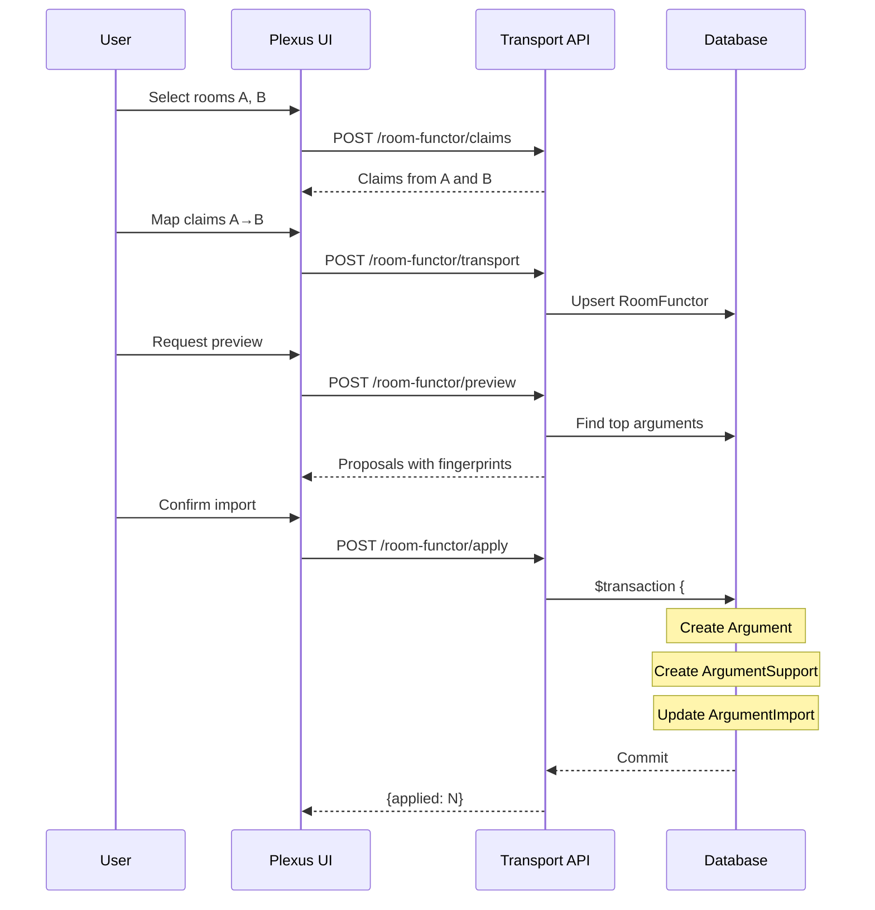
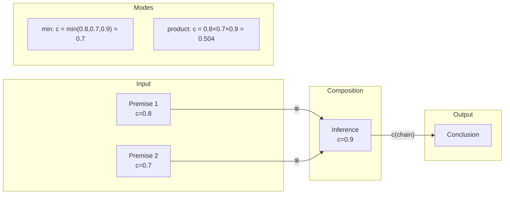

# Categorical Foundations Architecture: Deep Dive

**Version:** 1.0  
**Date:** December 12, 2025  
**Scope:** Category Theory, Evidential Semantics, Cross-Deliberation Transport, Confidence Measures  
**Prerequisite Reading:** AGORA_DELIBERATION_SYSTEM_ARCHITECTURE.md, AGORA_SUBSYSTEMS_ARCHITECTURE.md

---

## Table of Contents

1. [Executive Summary](#1-executive-summary)
2. [Theoretical Foundations: Ambler's Evidential Closed Category](#2-theoretical-foundations)
3. [Category-to-Implementation Mapping](#3-category-to-implementation-mapping)
4. [The Deliberation as Category](#4-the-deliberation-as-category)
5. [Morphisms and Hom-Sets](#5-morphisms-and-hom-sets)
6. [Confidence Measures](#6-confidence-measures)
7. [Plexus: Category of Categories](#7-plexus-category-of-categories)
8. [Transport Functors](#8-transport-functors)
9. [Argument Neighborhoods](#9-argument-neighborhoods)
10. [Debate Sheets and Graph Views](#10-debate-sheets-and-graph-views)
11. [DS Mode and Belief Mass](#11-ds-mode-and-belief-mass)
12. [Assumptions and Belief Revision](#12-assumptions-and-belief-revision)
13. [Implementation Status Matrix](#13-implementation-status-matrix)

---

## 1. Executive Summary

The Mesh/Agora system implements a sophisticated **categorical semantics for argumentation** based on Simon Ambler's work on "Evidential Closed Categories" (ECCs). This architecture provides:

- **Formal rigor**: Arguments as morphisms, claims as objects, with well-defined composition and aggregation
- **Quantified uncertainty**: Confidence measures that map to Dempster-Shafer belief theory
- **Cross-room intelligence**: Transport functors for importing arguments between deliberations
- **Multi-scale visualization**: From atomic Toulmin diagrams to molecular Plexus networks

```
┌─────────────────────────────────────────────────────────────────────────────┐
│                     CATEGORICAL HIERARCHY                                    │
├─────────────────────────────────────────────────────────────────────────────┤
│                                                                              │
│  ┌─────────────────────────────────────────────────────────────────────┐    │
│  │  L2: PLEXUS (Category of Categories)                                │    │
│  │  • Objects = Deliberations (each an ECC)                            │    │
│  │  • Morphisms = Transport Functors (RoomFunctor)                     │    │
│  │  • Edges = {xref, overlap, stack_ref, imports, shared_author}       │    │
│  └────────────────────────────────┬────────────────────────────────────┘    │
│                                   │                                          │
│                      ┌────────────┴────────────┐                            │
│                      ▼                         ▼                            │
│  ┌─────────────────────────────┐   ┌─────────────────────────────┐         │
│  │  L1: DELIBERATION (ECC)     │   │  L1: DELIBERATION (ECC)     │         │
│  │  • Objects = Claims         │   │  • Objects = Claims         │         │
│  │  • Morphisms = Arguments    │   │  • Morphisms = Arguments    │         │
│  │  • Hom-sets = SLat-enriched │   │  • Hom-sets = SLat-enriched │         │
│  └────────────────┬────────────┘   └────────────────┬────────────┘         │
│                   │                                  │                       │
│          ┌────────┴────────┐                ┌───────┴────────┐              │
│          ▼                 ▼                ▼                ▼              │
│  ┌─────────────┐   ┌─────────────┐  ┌─────────────┐  ┌─────────────┐       │
│  │ L0: ARGUMENT│   │ L0: ARGUMENT│  │ L0: ARGUMENT│  │ L0: ARGUMENT│       │
│  │ (Toulmin)   │   │ (Toulmin)   │  │ (Toulmin)   │  │ (Toulmin)   │       │
│  │ • Premises  │   │ • Premises  │  │ • Premises  │  │ • Premises  │       │
│  │ • Inference │   │ • Inference │  │ • Inference │  │ • Inference │       │
│  │ • Conclusion│   │ • Conclusion│  │ • Conclusion│  │ • Conclusion│       │
│  └─────────────┘   └─────────────┘  └─────────────┘  └─────────────┘       │
│                                                                              │
└─────────────────────────────────────────────────────────────────────────────┘
```

---

## 2. Theoretical Foundations

### 2.1 Ambler's Evidential Closed Category (ECC)

The system is grounded in Ambler's categorical approach to argumentation semantics:

| Concept | Mathematical Structure | Mesh Implementation |
|---------|----------------------|---------------------|
| **Objects** | Propositions | `Claim` model |
| **Morphisms (Arrows)** | Sets of λ-terms (arguments) | `Argument` + `ArgumentSupport` |
| **Hom-sets** | Join semilattices (SLat) | Union of arguments supporting A→B |
| **Zero morphism** | Empty set ∅ | No arguments from A to B |
| **Join (∨)** | Set union | Accrual of multiple supports |
| **Composition** | Sequential chaining | Premise → Inference → Conclusion |
| **Tensor (⊗)** | Conjunction of premises | `ArgumentPremise` collection |
| **Internal hom [A,B]** | Implication (warrant) | `Inference` with attackable warrant |
| **Comonoid (Δ, t)** | Copy/discard premises | Premise reuse across inferences |
| **Confidence measure** | Morphism → Monoid | `ArgumentSupport.base` + mode |

### 2.2 Key Categorical Properties

```
┌────────────────────────────────────────────────────────────────────────┐
│                     CATEGORICAL LAWS SATISFIED                          │
├────────────────────────────────────────────────────────────────────────┤
│                                                                         │
│  1. IDENTITY: For every claim A, id_A ∈ Hom(A, A)                      │
│     → A claim trivially supports itself (reflexivity)                   │
│                                                                         │
│  2. COMPOSITION: Given f: A→B, g: B→C, there exists g∘f: A→C           │
│     → Premise chains compose (transitive support)                       │
│                                                                         │
│  3. ASSOCIATIVITY: (h∘g)∘f = h∘(g∘f)                                   │
│     → Order of chaining doesn't affect result                           │
│                                                                         │
│  4. SLAT-ENRICHMENT: Hom(A,B) is a join-semilattice                    │
│     → Multiple arguments aggregate via ∨ (union)                        │
│     → ∀f,g: f∨f=f, f∨g=g∨f, (f∨g)∨h=f∨(g∨h)                           │
│                                                                         │
│  5. DISTRIBUTIVITY: h∘(f∨g) = (h∘f)∨(h∘g)                              │
│     → Composition distributes over aggregation                          │
│                                                                         │
│  6. CLOSURE: [X,Y] exists for all X,Y (internal hom)                   │
│     → Warrants are first-class objects that can be attacked            │
│                                                                         │
└────────────────────────────────────────────────────────────────────────┘
```

### 2.3 Theoretical Source Documents

| Document | Location | Purpose |
|----------|----------|---------|
| CategoryTheoryRoadmap.txt | `Agora_Reference_Documents/` | Primary implementation guide |
| CategoryTheoryDevRoadmap.txt | `Agora_Reference_Documents/` | Development checklist |
| Ambler1996.pdf | External reference | Original ECC theory |

---

## 3. Category-to-Implementation Mapping

### 3.1 Objects → Claims

```prisma
model Claim {
  id                String   @id @default(cuid())
  deliberationId    String
  text              String
  canonicalClaimId  String?  // For cross-room identity
  // ... additional fields
}
```

**Categorical Interpretation:**
- Each `Claim` is an **object** in the deliberation category
- `canonicalClaimId` provides **identity across categories** (deliberations)
- Claims form the "nodes" in the categorical graph

### 3.2 Morphisms → Arguments (Sets of Derivations)

```prisma
model Argument {
  id              String   @id @default(cuid())
  deliberationId  String
  claimId         String?  // Conclusion (target object)
  text            String
  schemeId        String?  // Links to ArgumentScheme
  // ...
}

model ArgumentSupport {
  id             String  @id @default(cuid())
  deliberationId String
  claimId        String  // Target claim (φ)
  argumentId     String  // Contributing argument
  base           Float?  // Confidence value [0,1]
  composed       Boolean @default(false)  // Is this from chaining?
  provenanceJson Json?   // Import tracking
  // ...
}
```

**Categorical Interpretation:**
- Each `Argument` is a **derivation** (single λ-term)
- `ArgumentSupport` materializes **hom-set membership** (argument a ∈ Hom(I, φ))
- Multiple `ArgumentSupport` rows for same `claimId` = hom-set with |Hom| > 1
- `base` field = confidence measure c(f) for this morphism

### 3.3 Composition → Premise Chains

```prisma
model ArgumentEdge {
  id              String   @id @default(cuid())
  deliberationId  String
  fromArgumentId  String   // Source morphism
  toArgumentId    String   // Target morphism
  type            EdgeType // support, rebut, undercut, concede
  // ...
}

model ArgumentPremise {
  id         String  @id @default(cuid())
  argumentId String
  claimId    String  // Premise claim
  isImplicit Boolean @default(false)
  // ...
}
```

**Categorical Interpretation:**
- `ArgumentEdge(type=support)` models **morphism composition** (f ; g = f composed with g)
- `ArgumentPremise` models the **tensor product** (A ⊗ B)
- Premises are "inputs" to the inference morphism

### 3.4 Visualization: Category Structure



---

## 4. The Deliberation as Category

### 4.1 Core Structure

Each `Deliberation` is modeled as a small **Evidential Closed Category**:

```
┌─────────────────────────────────────────────────────────────────┐
│                     DELIBERATION 𝒟                               │
├─────────────────────────────────────────────────────────────────┤
│  Objects:    Ob(𝒟) = { Claims in this deliberation }           │
│  Morphisms:  Mor(𝒟) = { Arguments supporting claims }          │
│  Hom-sets:   𝒟(A,B) = { args deriving B from A }  (join-SLat)  │
│  Terminal:   I = "ground truth" (no premises needed)            │
│  Tensor:     A ⊗ B = conjunction of claims                      │
│  Internal:   [A,B] = warrant (attackable implication)           │
│  Conf:       c: Mor → [0,1] (confidence measure)                │
└─────────────────────────────────────────────────────────────────┘
```

### 4.2 The Evidential API

**File:** `app/api/deliberations/[id]/evidential/route.ts`

This API exposes the categorical structure:

```typescript
// Response shape
{
  ok: true,
  deliberationId: string,
  mode: "product" | "min" | "ds",
  support: { [claimId: string]: number },      // S(φ) = sup c(I→φ)
  dsSupport?: { [claimId: string]: { bel: number; pl: number } },
  hom: { [pair: string]: { args: string[] } }, // Hom-set membership
  nodes: EvNode[],                             // Claims with scores
  arguments: ArgumentMeta[],                    // Morphism metadata
  meta: { claims, supports, edges, conclusions }
}
```

**Key Operations Implemented:**

| Operation | Mathematical | Code Location |
|-----------|--------------|---------------|
| `compose(xs, mode)` | Chain confidence (∘) | Line 12 |
| `join(xs, mode)` | Aggregate supports (∨) | Line 13 |
| Support S(φ) | sup{c(f) : f ∈ Hom(I,φ)} | Lines 200-237 |
| Hom-set extraction | 𝒟(I, φ) | Lines 240-241 |

```typescript
// Composition (sequential chaining)
const compose = (xs: number[], mode: Mode) => 
  !xs.length ? 0 : (mode === 'min' ? Math.min(...xs) : xs.reduce((a,b) => a*b, 1));

// Join (parallel aggregation via noisy-OR)
const join = (xs: number[], mode: Mode) => 
  !xs.length ? 0 : (mode === 'min' ? Math.max(...xs) : 1 - xs.reduce((a,s) => a*(1-s), 1));
```

---

## 5. Morphisms and Hom-Sets

### 5.1 Hom-Set Structure

In categorical terms, **Hom(A, B)** is the set of all morphisms from A to B. In Mesh:

```
Hom(A, B) = { arguments supporting claim B given claim A }
```

For the special case of support from "nothing":
```
Hom(I, φ) = { arguments for claim φ with no premises }
       ≈ { all arguments concluding φ }
```

### 5.2 ArgumentSupport Model

**File:** `lib/models/schema.prisma` (lines 6039-6061)

```prisma
model ArgumentSupport {
  id             String  @id @default(cuid())
  deliberationId String
  claimId        String  // The claim being supported (φ)
  argumentId     String  // The supporting argument

  mode      String  @default("product")  // Scoring mode snapshot
  strength  Float   @default(0.6)        // Computed confidence [0,1]
  composed  Boolean @default(false)      // Derived via composition?
  base      Float?                       // Raw confidence value

  provenanceJson Json?  // For imported arguments: {kind, fingerprint, from...}

  @@unique([claimId, argumentId, mode])
  @@index([deliberationId, claimId])
  @@index([argumentId])
}
```

**Categorical Interpretation:**
- Each row = one element of a hom-set
- `claimId` = target object B
- `argumentId` = the morphism f: I → B
- `base` = confidence c(f)
- `composed` = true if f = g ∘ h (derived via transitivity)

### 5.3 HomSetConfidencePanel Component

**File:** `components/agora/HomSetConfidencePanel.tsx`

This UI component displays hom-set analysis:

```typescript
interface HomSetConfidenceResult {
  homSetSize: number;           // |Hom(A, B)|
  aggregateConfidence: number;  // Weighted average
  minConfidence: number;        // min{c(f) : f ∈ Hom}
  maxConfidence: number;        // max{c(f) : f ∈ Hom}
  uncertainty: number;          // Variance-based
  weightedConfidence: number;   // Edge-type weighted
  compositionalPaths?: CompositionalPath[];
  edgeTypeDistribution: Record<string, number>;
}
```

**Features:**
- Individual morphism (edge) confidences
- Aggregate hom-set metrics
- Uncertainty visualization
- Compositional path breakdown

### 5.4 MorphismCard Component

**File:** `components/agora/MorphismCard.tsx`

Displays single morphisms with edge-type styling:

```typescript
const edgeStyles: Record<string, { Icon, color, label }> = {
  support:  { Icon: Shield,    color: "green",  label: "Support" },
  rebut:    { Icon: Slash,     color: "red",    label: "Rebut" },
  undercut: { Icon: ThumbsDown, color: "orange", label: "Undercut" },
  concede:  { Icon: Handshake, color: "sky",    label: "Concede" },
};
```

---

## 6. Confidence Measures

### 6.1 Mathematical Definition

A **confidence measure** c is a morphism:
```
c: Hom(A, B) → ℳ
```

where ℳ is a commutative monoid with:
- Identity T (maximum confidence)
- Binary operation • (combination)

Properties:
- c is a semilattice homomorphism: c(f ∨ g) = c(f) ⊕ c(g)
- c(id_A) = T (identities have max confidence)
- c(g ∘ f) ≥ c(g) • c(f) (composition is submultiplicative)

### 6.2 Implemented Modes

**File:** `app/api/deliberations/[id]/evidential/route.ts`

| Mode | Composition | Join | Use Case |
|------|-------------|------|----------|
| **min** | min(xs) | max(xs) | Skeptical/cautious (weakest link) |
| **product** | Π(xs) | 1 - Π(1-xs) | Probabilistic/independent |
| **ds** | DS rule | Orthogonal sum | Dempster-Shafer intervals |

```typescript
type Mode = 'product' | 'min' | 'ds';

// Composition: sequential chaining (premise → inference → conclusion)
const compose = (xs: number[], mode: Mode) => 
  !xs.length ? 0 : 
  (mode === 'min' ? Math.min(...xs) : xs.reduce((a, b) => a * b, 1));

// Join: parallel aggregation (multiple arguments for same claim)
const join = (xs: number[], mode: Mode) => 
  !xs.length ? 0 : 
  (mode === 'min' ? Math.max(...xs) : 1 - xs.reduce((a, s) => a * (1 - s), 1));
```

### 6.3 Edge-Type Weights

**File:** `lib/agora/homSetConfidence.ts`

```typescript
export const EDGE_TYPE_WEIGHTS: Partial<Record<EdgeType, number>> = {
  support:  1.0,   // Full weight
  rebut:    0.9,   // Slightly less (attacks conclusion)
  undercut: 0.85,  // Less (attacks inference)
  concede:  0.7,   // Lower (partial agreement)
};
```

### 6.4 Visualization: Confidence Propagation

```
┌─────────────────────────────────────────────────────────────────────────┐
│                     CONFIDENCE FLOW                                      │
├─────────────────────────────────────────────────────────────────────────┤
│                                                                          │
│   Premise A (0.8) ──┐                                                   │
│                     ├──▶ Inference (0.9) ──▶ Conclusion C               │
│   Premise B (0.7) ──┘                                                   │
│                                                                          │
│   Product mode:  c(C) = 0.8 × 0.7 × 0.9 = 0.504                        │
│   Min mode:      c(C) = min(0.8, 0.7, 0.9) = 0.7                        │
│                                                                          │
│   If another argument also supports C with c = 0.6:                     │
│   Product join: S(C) = 1 - (1-0.504)(1-0.6) = 0.802                    │
│   Min join:     S(C) = max(0.7, 0.6) = 0.7                              │
│                                                                          │
└─────────────────────────────────────────────────────────────────────────┘
```

---

## 7. Plexus: Category of Categories

### 7.1 Meta-Level Structure

The **Plexus** is the "category of deliberation categories":

```
┌─────────────────────────────────────────────────────────────────────────┐
│                     PLEXUS (2-CATEGORY)                                  │
├─────────────────────────────────────────────────────────────────────────┤
│  Objects:     Deliberations (each an ECC)                                │
│  1-Morphisms: Transport Functors (RoomFunctor)                          │
│  2-Morphisms: Natural transformations (future)                          │
│  Edges:       Meta-relationships {xref, overlap, stack_ref,             │
│               imports, shared_author}                                    │
└─────────────────────────────────────────────────────────────────────────┘
```

### 7.2 Network API

**File:** `app/api/agora/network/route.ts`

```typescript
// Edge kinds representing inter-category relationships
type EdgeKind = 'xref' | 'overlap' | 'stack_ref' | 'imports' | 'shared_author';

// Response structure
{
  scope: 'public' | 'following',
  version: number,
  rooms: RoomNode[],
  edges: MetaEdge[]  // { from, to, kind, weight }
}
```

### 7.3 Five Edge Types

| Edge Kind | Model/Source | Meaning |
|-----------|--------------|---------|
| **xref** | `XRef` table | Explicit cross-reference between rooms |
| **overlap** | `Claim.canonicalClaimId` | Same canonical claim in multiple rooms |
| **stack_ref** | `StackReference` | Knowledge stack reference |
| **imports** | `ArgumentImport` | Argument transported from another room |
| **shared_author** | `SharedAuthorRoomEdge` | Common contributors |

### 7.4 Plexus Components

**File:** `components/agora/Plexus.tsx` (~1000 lines)

```typescript
// Edge colors in UI
const EDGE_COLORS: Record<EdgeKind, string> = {
  xref:          '#6366f1',  // Indigo
  overlap:       '#ef4444',  // Red
  stack_ref:     '#f59e0b',  // Amber
  imports:       '#14b8a6',  // Teal
  shared_author: '#64748b',  // Slate
};
```

**Features:**
- Force-directed graph layout
- Zoom/pan with minimap
- Room hover cards with metrics
- Link sketch mode for creating edges
- Tag-based filtering
- Confidence gating (τ threshold)

**File:** `components/agora/PlexusBoard.tsx` (~960 lines)

Alternative board-style view with:
- Grid layout
- Donut charts for acceptance distribution
- Drag-and-drop link creation
- Context menus

### 7.5 Visualization: Plexus Network



---

## 8. Transport Functors

### 8.1 Mathematical Foundation

A **functor** F: 𝒞 → 𝒟 between categories must:
- Map objects: F(A) ∈ Ob(𝒟) for each A ∈ Ob(𝒞)
- Map morphisms: F(f) ∈ Hom_𝒟(F(A), F(B)) for each f ∈ Hom_𝒞(A, B)
- Preserve identity: F(id_A) = id_{F(A)}
- Preserve composition: F(g ∘ f) = F(g) ∘ F(f)

In Mesh, **Transport Functors** map between deliberation categories:

```
F: Deliberation_A → Deliberation_B
   F(Claim_A)     → Claim_B           (via claimMap)
   F(Argument_A)  → Argument_B        (via ArgumentImport)
```

### 8.2 RoomFunctor Model

**File:** `lib/models/schema.prisma` (lines 6133-6144)

```prisma
model RoomFunctor {
  id           String   @id @default(cuid())
  fromRoomId   String   // Source deliberation
  toRoomId     String   // Target deliberation
  claimMapJson Json     // { "<fromClaimId>": "<toClaimId>", ... }
  notes        String?
  createdById  String?
  createdAt    DateTime @default(now())

  @@unique([fromRoomId, toRoomId])
  @@index([fromRoomId, toRoomId])
}
```

**Key Property:** `claimMapJson` defines the **object-level mapping** (which claims in A correspond to which claims in B).

### 8.3 Transport API Endpoints

| Endpoint | Method | Purpose |
|----------|--------|---------|
| `/api/room-functor/map` | GET | Fetch existing claim mapping |
| `/api/room-functor/transport` | POST | Save/update claim mapping |
| `/api/room-functor/claims` | GET | List claims for mapping UI |
| `/api/room-functor/preview` | POST | Generate import proposals |
| `/api/room-functor/apply` | POST | Materialize imports |

### 8.4 Preview API

**File:** `app/api/room-functor/preview/route.ts`

```typescript
// Request
{
  fromId: string,           // Source deliberation
  toId: string,             // Target deliberation
  claimMap?: Record<string, string>,  // Optional explicit mapping
  topK?: number,            // Max proposals per claim (default 5)
  depth?: number            // Premise recursion (1-3)
}

// Response
{
  ok: true,
  proposals: [{
    fingerprint: string,     // SHA-1 hash for idempotent import
    fromArgumentId: string,
    fromClaimId: string,
    toClaimId: string,
    base: number,            // Confidence to import
    previewText: string,
    premiseCount?: number,   // If depth > 1
    premiseChain?: string[]
  }],
  depth: number
}
```

**Fingerprint Computation:**
```typescript
const fingerprint = crypto.createHash("sha1")
  .update(`${fromId}|${toId}|${fromClaimId}|${toClaimId}|${item.argumentId}`)
  .digest("hex");
```

### 8.5 Apply API (Materialization)

**File:** `app/api/room-functor/apply/route.ts`

This endpoint **materializes** virtual imports:

```typescript
// For each proposal, in a transaction:
1. Check if fingerprint exists (idempotent)
2. If exists with toArgumentId → skip (already materialized)
3. If exists without toArgumentId → materialize virtual import
4. Otherwise → create new ArgumentImport + Argument + ArgumentSupport

// Transaction ensures atomicity
await prisma.$transaction(async (tx) => {
  const toArg = await tx.argument.create({ ... });
  await tx.argumentSupport.create({ 
    provenanceJson: {
      kind: 'import',
      fingerprint,
      fromDeliberationId,
      fromArgumentId,
      fromClaimId
    }
  });
  await tx.argumentImport.update({ toArgumentId: toArg.id });
});
```

### 8.6 ArgumentImport Model

**File:** `lib/models/schema.prisma` (lines 5856-5917)

```prisma
model ArgumentImport {
  id                 String  @id @default(cuid())
  fromDeliberationId String
  toDeliberationId   String
  fromArgumentId     String?
  toArgumentId       String?  // NULL = virtual import
  kind               String?  // 'import' | 'restatement' | 'quote'

  fromClaimId  String?  // Snapshot at import time
  toClaimId    String?
  baseAtImport Float?   // Confidence snapshot

  fingerprint String @unique  // SHA-1 for idempotency

  // Relations with cascade semantics
  fromDeliberation Deliberation @relation(onDelete: Cascade)
  toDeliberation   Deliberation @relation(onDelete: Cascade)
  fromArgument     Argument?    @relation(onDelete: SetNull)
  toArgument       Argument?    @relation(onDelete: SetNull)

  @@index([fromDeliberationId, toDeliberationId])
}
```

### 8.7 Import Modes in Evidential API

The evidential API supports four import modes:

| Mode | Description | Virtual IDs |
|------|-------------|-------------|
| **off** | Local arguments only | — |
| **materialized** | Include copied arguments | Real IDs |
| **virtual** | Read-only references | `virt:{fingerprint}` |
| **all** | Both materialized + virtual | Mixed |

```typescript
// Virtual import handling
if (imports === 'virtual' || imports === 'all') {
  const imps = await prisma.argumentImport.findMany({
    where: { toDeliberationId, toClaimId: { in: claimIds } }
  });
  virtualAdds = imps
    .filter(i => !i.toArgumentId)  // Not yet materialized
    .map(i => ({
      claimId: i.toClaimId!,
      argumentId: `virt:${i.fingerprint}`,  // Synthetic ID
      base: clamp01(i.baseAtImport ?? 0.55),
    }));
}
```

### 8.8 Transport UI Components

**File:** `components/kb/TransportComposer.tsx`

```typescript
export function TransportComposer({ open, onClose, onCreate }) {
  const [a, setA] = React.useState<string|null>(null);  // From room
  const [b, setB] = React.useState<string|null>(null);  // To room
  // ... EntityPicker for room selection
}
```

---

## 9. Argument Neighborhoods

### 9.1 AIF Neighborhood Expansion

**File:** `lib/arguments/diagram-neighborhoods.ts`

The **neighborhood** of an argument is its local categorical context:

```typescript
export async function buildAifNeighborhood(
  argumentId: string,
  depth: number = 2,
  options: {
    includeSupporting?: boolean;   // Include support morphisms
    includeOpposing?: boolean;     // Include attack morphisms
    includePreferences?: boolean;  // Include preference relations
    maxNodes?: number;             // Stop at limit
  }
): Promise<AifSubgraph | null>
```

### 9.2 AIF Node Types

```typescript
// Helper ID generators
const I = (claimId: string) => `I:${claimId}`;    // Information node
const RA = (argId: string) => `RA:${argId}`;       // Rule of Argument
const CA = (caId: string) => `CA:${caId}`;         // Conflict Application
const PA = (paId: string) => `PA:${paId}`;         // Preference Application
```

| Node Type | Prefix | Meaning |
|-----------|--------|---------|
| **I-node** | `I:` | Information (Claim) |
| **RA-node** | `RA:` | Rule Application (Argument) |
| **CA-node** | `CA:` | Conflict Application |
| **PA-node** | `PA:` | Preference Application |

### 9.3 Neighborhood API

**File:** `app/api/arguments/[id]/aif-neighborhood/route.ts`

```typescript
// Query parameters
depth: number;           // 0-5 hops
summaryOnly?: boolean;   // Just counts, not full graph
includeSupporting?: boolean;
includeOpposing?: boolean;
includePreferences?: boolean;

// Response
{
  ok: true,
  aif: AifSubgraph | null,
  summary?: NeighborhoodSummary
}
```

### 9.4 Visualization: Neighborhood Graph

```
┌─────────────────────────────────────────────────────────────────────────┐
│                     ARGUMENT NEIGHBORHOOD (depth=2)                      │
├─────────────────────────────────────────────────────────────────────────┤
│                                                                          │
│                    ┌──────────────┐                                     │
│                    │  I:claim_1   │                                     │
│                    │  (Premise A) │                                     │
│                    └──────┬───────┘                                     │
│                           │ premise                                      │
│                           ▼                                              │
│   ┌──────────────┐   ┌──────────────┐   ┌──────────────┐               │
│   │  I:claim_2   │   │  RA:arg_1   │◀──│  CA:confl_1  │               │
│   │  (Premise B) │──▶│  (ARGUMENT) │   │  (Conflict)  │               │
│   └──────────────┘   └──────┬───────┘   └──────────────┘               │
│                           │ conclusion                                   │
│                           ▼                                              │
│                    ┌──────────────┐                                     │
│                    │  I:claim_3   │                                     │
│                    │ (Conclusion) │                                     │
│                    └──────────────┘                                     │
│                                                                          │
└─────────────────────────────────────────────────────────────────────────┘
```

---

## 10. Debate Sheets and Graph Views

### 10.1 Two-Level Diagram Architecture

From the theoretical foundation:

> "A debate must be represented on two levels: a **debate graph** (nodes are whole arguments, edges are support/objection) and **argument diagrams** (internal premise-conclusion structure), with a 'pop-out' or 'expand/collapse' interaction between them."

| Level | View Type | Nodes | Edges |
|-------|-----------|-------|-------|
| **Molecular** | Debate Sheet | Arguments (as cards) | supports, rebuts, objects |
| **Atomic** | Toulmin Diagram | Statements | Inferences |

### 10.2 DebateSheetReader Component

**File:** `components/agora/DebateSheetReader.tsx` (~532 lines)

```typescript
export default function DebateSheetReader({ 
  sheetId,        // Legacy: "delib:xxx" synthetic sheets
  deliberationId  // Direct deliberation ID
})
```

**Key Features:**
- Unified data fetching (AIF + evidential)
- Import mode selector (`off`, `materialized`, `virtual`, `all`)
- Pagination (15 items/page)
- Filters: scheme, open CQs, attacked arguments
- AIF neighborhood preview modal
- Support bars per claim

### 10.3 ClaimsPane Component

**File:** `components/agora/DebateSheetReader.tsx` (lines 52-89)

```typescript
export function ClaimsPane({ 
  deliberationId, 
  claims 
}: { 
  deliberationId: string; 
  claims: { id: string; text: string }[] 
}) {
  const { mode, tau } = useConfidence();
  const { data: scores } = useSWR(
    () => claims?.length 
      ? ['scores', deliberationId, mode, tau, claims.map(c=>c.id).join(',')] 
      : null,
    async () => fetchClaimScores({ deliberationId, mode, tau, claimIds: ... }),
  );
  // Sort by score, render with support bars
}
```

### 10.4 Debate Sheet Data Model

```prisma
model DebateSheet {
  id             String       @id @default(cuid())
  deliberationId String
  title          String?
  nodes          Json         // DebateNode[] 
  edges          Json         // DebateEdge[]
  acceptance     Json?        // { semantics, labels }
  unresolved     Json?        // Unresolved issues
  loci           Json?        // Positions/stances

  deliberation   Deliberation @relation(onDelete: Cascade)
  room           AgoraRoom?   @relation("RoomSheets")
}
```

**Synthetic Sheets:** Many rooms use `sheetId = "delib:${deliberationId}"` which synthesizes the sheet from argument data dynamically.

---

## 11. DS Mode and Belief Mass

### 11.1 Dempster-Shafer Theory Connection

The **ds** (Dempster-Shafer) mode implements belief intervals:

| Metric | Definition | Range |
|--------|------------|-------|
| **Bel(φ)** | Belief (confirmed support) | [0, 1] |
| **Pl(φ)** | Plausibility (max possible support) | [0, 1] |
| **Uncertainty** | Pl(φ) - Bel(φ) | [0, 1] |

Invariant: `Bel(φ) ≤ Pl(φ)` always.

### 11.2 Implementation

**File:** `app/api/deliberations/[id]/evidential/route.ts` (lines 200-230)

```typescript
if (mode === "ds") {
  const bel = support[c.id];
  let conflictMass = 0;
  
  // Find negated claims via NegationMap
  const negatedIds = negationMappings.get(c.id) ?? [];
  if (negatedIds.length > 0) {
    const negContribs: number[] = [];
    for (const negId of negatedIds) {
      const negSupports = contributionsByClaim.get(negId) ?? [];
      const negScore = join(negSupports.map(x => x.score), mode);
      negContribs.push(negScore);
    }
    // Conflict mass = join of all negation supports
    conflictMass = join(negContribs, mode);
  }
  
  // Uncertainty mass (uncommitted belief)
  const uncertaintyMass = Math.max(0, 1 - bel - conflictMass);
  
  // Plausibility = bel + uncertainty
  const pl = Math.min(1, bel + uncertaintyMass);
  
  dsSupport[c.id] = { bel: +bel.toFixed(4), pl: +pl.toFixed(4) };
}
```

### 11.3 NegationMap Model

**File:** `lib/models/schema.prisma` (lines 5977-6018)

```prisma
/// Required for Dempster-Shafer conflict mass computation
model NegationMap {
  id             String @id @default(cuid())
  deliberationId String
  claimId        String      // The positive claim φ
  negatedClaimId String      // The negated claim ¬φ
  confidence     Float?      // Optional: strength of negation relationship
  metaJson       Json?

  @@unique([claimId, negatedClaimId, deliberationId])
}
```

### 11.4 DS Visualization

```
┌─────────────────────────────────────────────────────────────────────────┐
│                     DS BELIEF INTERVAL                                   │
├─────────────────────────────────────────────────────────────────────────┤
│                                                                          │
│  Claim: "Universal Basic Income is viable"                              │
│                                                                          │
│  Support for φ:     0.65 (from 3 arguments)                             │
│  Support for ¬φ:    0.20 (from 1 counter-argument)                      │
│  Uncommitted:       0.15                                                 │
│                                                                          │
│  Bel(φ) = 0.65                                                          │
│  Pl(φ)  = 0.65 + 0.15 = 0.80                                           │
│  Uncertainty = 0.15                                                      │
│                                                                          │
│  [================|=====|    ]                                          │
│   0        Bel    │     Pl   1                                          │
│                   └─ Uncertainty                                         │
│                                                                          │
└─────────────────────────────────────────────────────────────────────────┘
```

---

## 12. Assumptions and Belief Revision

### 12.1 Theoretical Basis

In Ambler's framework:
- **Closed λ-terms** = proofs (max confidence, indefeasible)
- **Open λ-terms** = arguments with assumptions (defeasible)

Assumptions are the "free variables" that make an argument defeasible. **Belief revision** = retracting assumptions to eliminate unwanted conclusions.

### 12.2 AssumptionUse Model

**File:** `lib/models/schema.prisma` (lines 6063-6098)

```prisma
model AssumptionUse {
  id                String @id @default(cuid())
  deliberationId    String
  argumentId        String?             // Optional: standalone assumptions
  assumptionClaimId String?             // FK to Claim.id
  assumptionText    String?             // Or freeform text

  role       String @default("premise")  // 'premise'|'warrant'|'value'
  weight     Float?                      // Confidence in assumption [0,1]
  confidence Float?

  status          AssumptionStatus @default(PROPOSED)
  statusChangedAt DateTime         @default(now())
  statusChangedBy String?
  challengeReason String?          @db.Text
}

enum AssumptionStatus {
  PROPOSED    // Initial state
  ACCEPTED    // Valid assumption
  RETRACTED   // Withdrawn
  CHALLENGED  // Under dispute
}
```

### 12.3 DerivationAssumption Model (Per-Derivation Tracking)

**File:** `lib/models/schema.prisma` (lines 6100-6118)

```prisma
model DerivationAssumption {
  id           String @id @default(cuid())
  derivationId String  // FK to ArgumentSupport.id
  assumptionId String  // FK to AssumptionUse.id

  weight       Float  @default(1.0)  // Contribution multiplier [0,1]
  inferredFrom String?               // Parent derivation (for compose())

  @@unique([derivationId, assumptionId])
  @@index([inferredFrom])  // Fast transitive queries
}
```

### 12.4 Assumption Handling in Evidential API

```typescript
// Per-derivation assumption tracking:
const derivIds = derivByArg.get(s.argumentId) ?? [];
const derivAssumps: number[] = [];
for (const dId of derivIds) {
  const weights = assumpByDeriv.get(dId) ?? [];
  if (weights.length) derivAssumps.push(...weights);
}

// Fallback to legacy argument-level if no per-derivation data
aBases = derivAssumps.length ? derivAssumps : (legacyAssump.get(s.argumentId) ?? []);

const assumpFactor = aBases.length ? compose(aBases, mode) : 1;
const score = clamp01(compose([b, premFactor], mode) * assumpFactor);
```

### 12.5 Belief Revision Flow

```
┌─────────────────────────────────────────────────────────────────────────┐
│                     BELIEF REVISION WORKFLOW                             │
├─────────────────────────────────────────────────────────────────────────┤
│                                                                          │
│  1. Claim φ is marked OUT (rejected) or fails WHY challenge             │
│                                                                          │
│  2. System finds strongest arguments for φ:                              │
│     Hom(I, φ) = {arg_1, arg_2, ...}                                     │
│                                                                          │
│  3. For each argument, extract culprit sets:                            │
│     CulpritSet(arg_i) = {assumptions used by arg_i}                     │
│                                                                          │
│  4. Rank culprit sets by:                                                │
│     a) How many bad conclusions they explain                            │
│     b) Minimal retraction cost (prefer small sets)                      │
│                                                                          │
│  5. Suggest retraction:                                                  │
│     RETRACT assumption_j → recompute all affected derivations           │
│                                                                          │
│  6. UI emits EnthymemeNudge for missing warrants                        │
│                                                                          │
└─────────────────────────────────────────────────────────────────────────┘
```

---

## 13. Implementation Status Matrix

### 13.1 Core Categorical Infrastructure

| Feature | Status | Location | Grade |
|---------|--------|----------|-------|
| Claims as Objects | ✅ Complete | `Claim` model | A |
| Arguments as Morphisms | ✅ Complete | `Argument` + `ArgumentSupport` | A |
| Hom-set Materialization | ✅ Complete | `ArgumentSupport` table | A |
| Composition (g∘f) | ✅ Complete | Premise chains, `composed` flag | A |
| Join (f∨g) | ✅ Complete | `join()` function | A |
| Zero Morphism (∅) | ✅ Complete | Empty hom-set | A |
| Internal Hom [A,B] | ✅ Complete | `Inference` + undercut attacks | A |
| Tensor Product (⊗) | ✅ Complete | `ArgumentPremise` collection | A |
| Comonoid (Δ, t) | ⚠️ Implicit | Premise reuse allowed | B+ |

### 13.2 Confidence Measures

| Feature | Status | Location | Grade |
|---------|--------|----------|-------|
| Min mode (weakest link) | ✅ Complete | `compose()`, `join()` | A |
| Product mode (probabilistic) | ✅ Complete | `compose()`, `join()` | A |
| DS mode (intervals) | ✅ Complete | `dsSupport` computation | A |
| Edge-type weights | ✅ Complete | `EDGE_TYPE_WEIGHTS` | A |
| Per-derivation tracking | ✅ Complete | `DerivationAssumption` | A |
| Lazy recomputation | ✅ Complete | `batchLazyRecompute()` | A |

### 13.3 Cross-Deliberation (Plexus)

| Feature | Status | Location | Grade |
|---------|--------|----------|-------|
| RoomFunctor model | ✅ Complete | Schema, CRUD APIs | A |
| Claim mapping | ✅ Complete | `claimMapJson` | A |
| Preview proposals | ✅ Complete | `/preview` endpoint | A |
| Materialized imports | ✅ Complete | `/apply` endpoint | A |
| Virtual imports | ✅ Complete | `virt:{fingerprint}` IDs | A |
| Fingerprint idempotency | ✅ Complete | SHA-1 hash | A |
| Provenance tracking | ✅ Complete | `provenanceJson` | A |
| Plexus 5-edge network | ✅ Complete | Network API | A |
| Edge visualization | ✅ Complete | Colored arrows | A |
| Transport UI | ✅ Complete | `TransportComposer` | B+ |
| Functor composition (A→B→C) | ❌ Missing | — | — |

### 13.4 Neighborhoods and Views

| Feature | Status | Location | Grade |
|---------|--------|----------|-------|
| AIF neighborhood expansion | ✅ Complete | `buildAifNeighborhood()` | A |
| Depth-limited traversal | ✅ Complete | `depth` parameter | A |
| I/RA/CA/PA node types | ✅ Complete | AIF node prefixes | A |
| DebateSheet reader | ✅ Complete | `DebateSheetReader` | A |
| Synthetic sheets | ✅ Complete | `delib:` prefix | A |
| HomSet confidence panel | ✅ Complete | `HomSetConfidencePanel` | A |
| Morphism cards | ✅ Complete | `MorphismCard` | A |

### 13.5 Gaps and Future Work

| Gap | Priority | Description |
|-----|----------|-------------|
| Functor composition | Medium | Chain A→B→C mappings |
| Semantic identity resolution | Medium | Beyond fingerprint matching |
| Plexus evolution timeline | Low | Track edge appearance over time |
| Visual import distinction | Medium | Badge imported args in UI |
| Provenance in ArgumentPopout | Medium | Show source deliberation |
| AF projection overlay | Low | Skeptical/credulous labels on DebateSheet |

---

## Appendix A: File Location Quick Reference

| Category | File |
|----------|------|
| **Schema** | `lib/models/schema.prisma` |
| **Evidential API** | `app/api/deliberations/[id]/evidential/route.ts` |
| **Network API** | `app/api/agora/network/route.ts` |
| **Transport APIs** | `app/api/room-functor/*.ts` |
| **Neighborhood Builder** | `lib/arguments/diagram-neighborhoods.ts` |
| **HomSet Confidence** | `lib/agora/homSetConfidence.ts` |
| **Plexus UI** | `components/agora/Plexus.tsx` |
| **PlexusBoard UI** | `components/agora/PlexusBoard.tsx` |
| **DebateSheet UI** | `components/agora/DebateSheetReader.tsx` |
| **HomSet Panel** | `components/agora/HomSetConfidencePanel.tsx` |
| **Morphism Card** | `components/agora/MorphismCard.tsx` |
| **Transport Composer** | `components/kb/TransportComposer.tsx` |
| **Category Theory Docs** | `Agora_Reference_Documents/CategoryTheoryRoadmap.txt` |

---

## Appendix B: Categorical Glossary

| Term | Definition | Mesh Equivalent |
|------|------------|-----------------|
| **Object** | Element of a category | `Claim` |
| **Morphism** | Arrow between objects | `Argument` + `ArgumentSupport` |
| **Hom-set** | Collection of morphisms A→B | ArgumentSupport rows for claimId |
| **Composition** | Sequential chaining (g∘f) | Premise chain, `composed=true` |
| **Join (∨)** | Aggregation of parallel morphisms | `join()` function |
| **Identity** | id_A: A→A | Trivial self-support |
| **Terminal** | Object I with unique morphism from all | "Ground truth" (no premises) |
| **Tensor (⊗)** | Monoidal product | `ArgumentPremise` conjunction |
| **Internal hom [A,B]** | Implication object | `Inference` (attackable warrant) |
| **Comonoid** | Copy/discard structure | Premise reuse |
| **Functor** | Structure-preserving map | `RoomFunctor` |
| **Natural transformation** | Morphism between functors | (Future work) |
| **Enrichment** | Hom-sets with extra structure | SLat (join-semilattice) |
| **Confidence measure** | Morphism → Monoid | `base` field + mode |

---

## Appendix C: Mermaid Diagrams Summary

### C.1 Category Hierarchy


### C.2 Import Flow


### C.3 Confidence Computation


---

*Document generated by GitHub Copilot on December 12, 2025*
