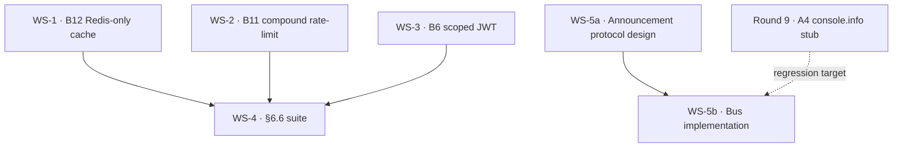

# LUDICS v2 Sprint Plan — Phase 2f (Production Readiness) + A1–A4 Announcement Bus

**Sprint scope:** OQ-4, OQ-5, OQ-6b, OQ-7 from [LUDICS_SESSIONS_1_2_SPEC_REVIEW.md](LUDICS_SESSIONS_1_2_SPEC_REVIEW.md#§7), driven by §6 of [LUDICS_SESSION_2_DEV_SPEC.md](LUDICS_SESSION_2_DEV_SPEC.md#§6).

**Entry state (Sessions 1+2, Round 9 close):** Substrate proper is closed — Inc(B) decomposition, ∨_⊥⊥ Reading A, R1–R5 fingerprint rules, fossil lifecycle, witness rescission, OQ-JSL proof pass — all green at 19 suites · 352 tests. Shared Redis/ratelimit landing point shipped: [lib/upstash.ts](../../../../lib/upstash.ts), [lib/rateLimit.ts](../../../../lib/rateLimit.ts).

**Exit criteria:** all five workstreams below at "done" per their acceptance gate; aggregate test count ≥ 352 + ~25 (Phase 2f surface) + announcement-bus suite; zero regressions on §1–§5 invariants; deployment doc updated with env vars.

---

## Sprint workstreams

| # | ID | Title | Size | Order |
| - | -- | ----- | ---- | ----- |
| 1 | B12 | Redis-only fingerprint cache | M | 1 |
| 2 | B11 | Compound rate-limit key | S | 2 |
| 3 | B6  | Scoped session tokens (JWT) | M | 3 |
| 4 | §6.6 | Production-readiness invariant suite | M | 4 (gates 1–3) |
| 5 | A1–A4 | Announcement bus subsystem | L | 5 (parallelizable after protocol design) |

Ordering is dependency-driven: B12 lands the Postgres model the cache rewrite needs, B11 reuses the rate-limit adapter already drafted, B6 retires the shared bearer token (used by every Phase 2c/2d route), §6.6 integration-tests the perimeter once 1–3 land, and A1–A4 is the only workstream that needs its own protocol-design pre-step.

---

## WS-0 · Tenant-scope audit (COMPLETED 2026-05-22)

**Finding:** there is **no tenant axis** in this repo.

- Auth = Firebase via `next-firebase-auth-edge` ([lib/serverutils.ts](../../../../lib/serverutils.ts) L75); tokens carry no tenant/workspace claim.
- [User](../../../../lib/models/schema.prisma) (L15), [Deliberation](../../../../lib/models/schema.prisma) (L4489), and [WitnessRecord](../../../../lib/models/schema.prisma) (L10281) have **no** `tenantId` / `workspaceId` columns.
- The `Deliberation` scope unit is `(hostType, hostId)` where `hostType` ∈ `{ article, post, room_thread, library_stack, site, discussion, free, inbox_thread, work }` (L3457). One user spans many hosts.
- `WorkspaceSettings` (L1101) exists as an orphan settings table with no `Workspace` parent and no user FK — vestigial, not a tenant model.
- No membership table maps users → tenants; per-feature membership tables exist for rooms, stacks, drifts.

**Decision: use `deliberationId` as the scope unit for v2.**

The v2 spec originally assumed `(tenant, participant) + (tenant, IP)` compound keys. Since no tenant axis exists and adding one is a major migration (out of v2 scope), the compound rate-limit and the scoped JWT both key off `deliberationId` — the natural scope unit the substrate already operates over.

**Spec adjustments applied to WS-2 and WS-3 below.** Future-compat: if a real `Workspace` model is ever added, the compound key extends naturally to `(workspaceId, deliberationId, participantId) + (workspaceId, IP)` — additive, not breaking.

Full audit notes: `/memories/repo/tenant-scope-audit-2026-05-22.md`.

---

## WS-1 · B12 — Redis-only fingerprint cache (OQ-6b)

**Spec authority:** [LUDICS_SESSION_2_DEV_SPEC.md §6.5 [CORRECTED post-review]](LUDICS_SESSION_2_DEV_SPEC.md#§6.5).

**Problem today:** [lib/ludics/briefingFingerprint.ts](../../../../lib/ludics/briefingFingerprint.ts) holds a module-level `Map<hash, CacheEntry>` (L1) and `Map<deliberationId, history[]>` (L2). On horizontal scale, L1 coherence breaks (A13.5).

**Deliverables:**

| File | Change |
| ---- | ------ |
| [prisma/schema.prisma](../../../../prisma/schema.prisma) | NEW model `BriefingFingerprintHistory { id, deliberationId @@index, fingerprint, materialChangeSummary Json, computedAt @@index, supersededAt? }` — append-only |
| `prisma/migrations/<ts>_briefing_fingerprint_history/` | `npx prisma db push` (per repo convention) |
| [lib/ludics/briefingFingerprint.ts](../../../../lib/ludics/briefingFingerprint.ts) | Delete both `Map` caches; read-through via `lib/rateLimit.ts` → `getUpstashRedis()`; key `fp:<deliberationId>`; TTL 300 s; on miss query `BriefingFingerprintHistory` ordered by `computedAt desc limit N` |
| NEW [lib/ludics/fingerprintCache.ts](../../../../lib/ludics/fingerprintCache.ts) | Thin read-through helper `getFingerprintHistory(deliberationId, n)` + `recordFingerprint(...)` (writes Postgres + invalidates Redis key) |

**Test deltas:**
- Update [__tests__/invariants/phase2e-fingerprint-rules.test.ts](../../../../__tests__/invariants/phase2e-fingerprint-rules.test.ts) — drop module-cache assertions, swap to mocked Upstash via `jest.mock("@/lib/upstash", ...)`.
- ~4 new tests in §6.6 (see WS-4): cold-read populates Redis; stale Redis is overridden on `recordFingerprint`; cross-process simulation (two clients, single Postgres truth).

**Acceptance gate:** all existing 2e tests green; `Map` references in `briefingFingerprint.ts` = 0; horizontal-scale simulation test (two `prismaclient` instances) confirms convergence.

---

## WS-2 · B11 — Compound rate-limit key (OQ-5)

**Spec authority:** [LUDICS_SESSION_2_DEV_SPEC.md §6.1 v2 TODO](LUDICS_SESSION_2_DEV_SPEC.md#§6.1).

**Adapter is ready:** [lib/rateLimit.ts](../../../../lib/rateLimit.ts) `compoundRateLimit({ scopeId, participantId, ip, action }, { perParticipant, perIp })` is shipped. WS-2 is the call-site wiring + `BindError` widening. (Per WS-0, `scopeId = deliberationId`; the field was renamed from the original `tenantId` after the audit confirmed no tenant axis exists.)

**Deliverables:**

| File | Change |
| ---- | ------ |
| [server/ludics/bindParticipantToDesign.ts](../../../../server/ludics/bindParticipantToDesign.ts) | Widen `BindErrorCode` with `"RATE_LIMITED"`; widen `BindError.status` to `409 \| 422 \| 429`; add optional `ip?: string \| null` to `BindInput` (`deliberationId` is reachable via `LudicMove.deliberationId` — no new field needed); uncomment compound-limit call per inline comment, passing `scopeId: ludicMove.deliberationId` |
| [app/api/v3/ludics/bind-witness/route.ts](../../../../app/api/v3/ludics/bind-witness/route.ts) | Extract `ip` from `x-forwarded-for`; thread into `bindParticipantToDesign`; map `RATE_LIMITED` BindError → 429 + `Retry-After` |
| [app/api/v3/ludics/propose-synthesis/route.ts](../../../../app/api/v3/ludics/propose-synthesis/route.ts) | Uncomment `compoundRateLimit` block per inline comment |
| [app/api/v3/ludics/retract-witness/route.ts](../../../../app/api/v3/ludics/retract-witness/route.ts) | Same compound limit, `action: "retract_witness"`, `perParticipant: { max: 5, window: "1 m" }` |

**Limits (initial):**
- `bind`: participant 10/m, IP 30/m
- `propose_synthesis`: participant 10/m, IP 30/m
- `retract_witness`: participant 5/m, IP 15/m

**Scope resolution:** ✅ resolved by WS-0 — `scopeId = deliberationId`, already on `LudicMove` and route bodies. No new helper needed.

**Acceptance gate:** 6 new tests in §6.6 — participant alone exceeds → 429; IP alone exceeds across two participants in same deliberation → 429; cross-deliberation isolation (deliberation A exhausts IP bucket, deliberation B unaffected); `Retry-After` header parses to a sane integer; window-rollover unblocks; missing IP gracefully skips IP bucket.

---

## WS-3 · B6 — Scoped session tokens (OQ-7)

**Spec authority:** [LUDICS_SESSION_2_DEV_SPEC.md §6.4](LUDICS_SESSION_2_DEV_SPEC.md#§6.4).

**Problem today:** every Phase 2c/2d route does:
```ts
const m = auth.match(/^Bearer\s+(.+)$/i);
if (m && m[1] === process.env.MCP_API_TOKEN) return process.env.MCP_AUTHOR_USER_ID ?? "mcp-system";
```
Shared bearer → no audit trail, no per-deliberation scoping, no revocation.

**Deliverables:**

| File | Change |
| ---- | ------ |
| `package.json` | Add `jose` (preferred over `jsonwebtoken` — Edge-runtime safe) |
| NEW [server/ludics/auth.ts](../../../../server/ludics/auth.ts) | `issueScopedToken({ deliberationId, participantId, ttlSeconds })` → JWT; `verifyScopedToken(jwt, { requireDeliberationId? })` → `{ participantId, deliberationId }` or throws; signing key from `LUDICS_JWT_SIGNING_KEY` env (HS256 v1; ES256 v2 if multi-issuer). No `tenantId` claim per WS-0. |
| All Phase 2c/2d routes | Replace inline `resolveCallerUserId` with `verifyScopedToken` + fallback to session cookie; reject if `deliberationId` in body ≠ JWT scope |
| NEW `scripts/mintMcpToken.ts` | CLI for ops: `npx tsx scripts/mintMcpToken.ts --deliberation <id> --participant <id> --ttl 3600` |

**Env additions:** `LUDICS_JWT_SIGNING_KEY` (required), `LUDICS_JWT_ISSUER` (default `"mesh-ludics"`).

**Migration plan:**
1. Ship `verifyScopedToken` with backward-compat path: if JWT verify fails AND `MCP_API_TOKEN` matches AND `LUDICS_LEGACY_BEARER=1` env is set, log a deprecation warning and accept. Default off in prod.
2. Issue replacement tokens to existing MCP agents.
3. Remove the legacy path in the following sprint.

**Acceptance gate:** 5 new tests in §6.6 — valid token for matching deliberation 200; valid token + wrong `deliberationId` body 403; expired token 401; legacy bearer path off → 401; legacy bearer path on + deprecation log emitted.

---

## WS-4 · §6.6 — Production-readiness invariant suite

**Spec authority:** [LUDICS_SESSION_2_DEV_SPEC.md §6.6](LUDICS_SESSION_2_DEV_SPEC.md#§6.6) + §6.7 deliverables table.

**Deliverable:** NEW [__tests__/invariants/phase2f-production-readiness.test.ts](../../../../__tests__/invariants/phase2f-production-readiness.test.ts), ~17 tests grouped:

| Group | Tests | Source workstream |
| ----- | ----- | ----------------- |
| T1–T4   Fingerprint cache (B12)        | cold-miss writes Redis; warm-hit skips Postgres; `recordFingerprint` invalidates; horizontal-scale convergence | WS-1 |
| T5–T10  Compound rate-limit (B11)      | per-participant cap; per-IP cap across participants; cross-deliberation isolation (scopeId-based); `Retry-After` math; window rollover; missing IP skip | WS-2 |
| T11–T15 Scoped JWT (B6)                | valid happy path; scope mismatch 403; expired 401; legacy bearer off; legacy bearer on + deprecation log | WS-3 |
| T16     Cache warming                  | `WARM_LUDICS_CACHE_JOB` populates both fingerprint + readout caches (§6.2) | — |
| T17     OQ-5b concurrent rule firing   | deterministic R1→R5 ordering; `secondaryRules: string[]` column populated when ≥2 rules fire on same write (§6.5 L920) | WS-1 follow-up |

**Test infra notes:**
- Mock `@upstash/redis` and `@upstash/ratelimit` per the established pattern in [tests/explain_api.test.ts](../../../../tests/explain_api.test.ts).
- Cross-instance B12 test uses two `PrismaClient` instances against one DB to simulate horizontal scale; Redis client is shared (single mock).

**Acceptance gate:** all 17 tests green; total suite count = 19 + 1 = 20 suites; total tests ≥ 352 + 17 = 369.

---

## WS-5 · A1–A4 announcement bus (OQ-4)

**Spec authority:** [LUDICS_SESSION_2_DEV_SPEC.md §4.5](LUDICS_SESSION_2_DEV_SPEC.md#§4.5) (current `console.info` v1 stub) + axioms A1–A4 in [LUDICS_GENERATIVE_SUBSTRATE.md](LUDICS_GENERATIVE_SUBSTRATE.md).

**This is the only workstream needing protocol design first.** Treat it as 2 sub-phases:

### WS-5a · Protocol design (must precede code)

**Output:** NEW `LUDICS_ANNOUNCEMENT_BUS_PROTOCOL.md` in this folder. Must specify:

1. **Event taxonomy** — exhaustive list mapping A1–A4 onto event types:
   - A1 *commit* → `witness_committed` (already implicit in bind-witness 200)
   - A2 *reveal* → `design_revealed` (new, on first published synthesis)
   - A3 *contest* → `witness_contested` (new, on counter-witness bind)
   - A4 *retract* → `witness_rescinded` (already shipped Round 9 as console.info)
2. **Event envelope schema** — Zod schema with `eventId`, `eventType`, `tenantId`, `deliberationId`, `actorParticipantId`, `subjectId`, `occurredAt`, `payload`, `version`.
3. **Delivery semantics** — at-least-once; idempotency key = `(eventType, subjectId, occurredAt)`; subscribers must dedupe.
4. **Transport choice** — three options to evaluate:
   - (a) Postgres `LISTEN/NOTIFY` (simplest; same-region only)
   - (b) Redis Streams via existing Upstash (cross-region; matches infra)
   - (c) BullMQ pub-sub (reuses worker infra; ordering caveats)
   - Pick one with explicit trade-off note.
5. **Subscriber model** — who consumes: dialectical-layer UI, MCP push, audit log, external webhooks. Per-subscriber retry + DLQ policy.
6. **Persistence** — new Prisma model `SubstrateAnnouncement { id, eventType, tenantId, deliberationId, actorParticipantId, subjectId, payload Json, occurredAt @@index, deliveredAt? }` for replay + audit.

### WS-5b · Implementation

**Deliverables (post protocol-design sign-off):**

| File | Change |
| ---- | ------ |
| `prisma/schema.prisma` | NEW `SubstrateAnnouncement` model + indexes |
| NEW [lib/ludics/announcementBus.ts](../../../../lib/ludics/announcementBus.ts) | `publish(event)` (writes Postgres → emits to chosen transport); `subscribe(eventTypes, handler)` |
| NEW [workers/ludics/announcementDispatcher.ts](../../../../workers/ludics/announcementDispatcher.ts) | BullMQ worker: reads `SubstrateAnnouncement` undelivered rows, fan-out to registered subscribers, marks `deliveredAt` |
| [app/api/v3/ludics/retract-witness/route.ts](../../../../app/api/v3/ludics/retract-witness/route.ts) | Replace `console.info({ event: "witness_rescinded", … })` with `publish({ eventType: "witness_rescinded", … })` |
| [server/ludics/bindParticipantToDesign.ts](../../../../server/ludics/bindParticipantToDesign.ts) | After successful `witnessRecord.create`, `publish({ eventType: "witness_committed", … })` |
| [server/ludics/synthesisProposalAgent.ts](../../../../server/ludics/synthesisProposalAgent.ts) | On `same-cone-join` result, `publish({ eventType: "design_revealed", … })` |
| NEW [__tests__/invariants/phase2g-announcement-bus.test.ts](../../../../__tests__/invariants/phase2g-announcement-bus.test.ts) | ~12 tests: envelope shape, idempotency, replay-from-Postgres, dispatcher retries, DLQ, A4 emit unchanged (regression on Round 9 shipping) |

**Acceptance gate:** A4 retract route emits via bus instead of `console.info` AND its existing T13/T13b assertions still pass (regression-proof refactor); all 4 event types covered by happy-path + idempotency tests; protocol doc merged before any code lands.

---

## Dependency graph



WS-1 / WS-2 / WS-3 are independent of each other and can be done in parallel by separate engineers; WS-4 gates on all three. WS-5a / WS-5b are independent of 1–3 and can run on a parallel track once the protocol doc lands.

---

## Phasing (suggested calendar slicing — adjust to team velocity)

| Phase | Workstreams | Gate |
| ----- | ----------- | ---- |
| **v2.0 Setup** | Tenant-id plumbing prereq (WS-2 prereq); WS-5a protocol design draft | Tenant helper in `serverutils.ts`; protocol doc in review |
| **v2.1 Perimeter** | WS-1 + WS-2 in parallel | Both lands; horizontal-scale test green; rate-limit headers correct |
| **v2.2 Auth** | WS-3 with legacy-bearer compat path | Token mint script works; legacy path defaults off |
| **v2.3 Coverage** | WS-4 (gates v2.1 + v2.2) | 17 tests green; aggregate ≥ 369 |
| **v2.4 Bus** | WS-5b (after v2.0 protocol-doc merge) | A4 regression-proof; 12 tests green; dispatcher idempotent |
| **v2.5 Cutover** | Remove `LUDICS_LEGACY_BEARER` path; deprecate any leftover `console.info` events | Bearer-token rotation completed; bus is sole emit channel |

---

## Risk register

| Risk | Likelihood | Impact | Mitigation |
| ---- | ---------- | ------ | ---------- |
| ~~`tenantId` not currently in auth context — blocks WS-2~~ | — | — | ✅ Resolved by WS-0 audit. Repo has no tenant axis; `scopeId = deliberationId` adopted for compound key. Future Workspace model is additive. |
| Upstash latency from EKS pods spikes under WS-1 load | Low | Med | Add p99 latency dashboard before WS-1 cutover; migration trigger to ElastiCache documented in earlier Redis cost analysis |
| Announcement-bus transport choice (WS-5a) blocks subsequent work | Med | High | Time-box protocol doc to 1 week; default to Redis Streams (matches existing Upstash) if undecided |
| Legacy `MCP_API_TOKEN` deletion breaks an unknown integration | Med | High | Grep external repos for `MCP_API_TOKEN` references before v2.5; require 2-week deprecation window with the legacy-on env var |
| Prisma migration on `BriefingFingerprintHistory` collides with concurrent feature branches | Low | Low | Coordinate via `prisma/migrations` mtime check; use `npx prisma db push` per repo convention (not `migrate dev`) |
| `BindErrorCode` widening triggers exhaustiveness errors in unrelated switch statements | Med | Low | Grep `BindErrorCode` usages before WS-2; add `default:` arms where needed |

---

## Env-var deltas required for v2

| Var | Workstream | Required | Default |
| --- | ---------- | -------- | ------- |
| `UPSTASH_REDIS_REST_URL` | WS-1, WS-2 | ✅ already set | — |
| `UPSTASH_REDIS_REST_TOKEN` | WS-1, WS-2 | ✅ already set | — |
| `LUDICS_JWT_SIGNING_KEY` | WS-3 | NEW required | — |
| `LUDICS_JWT_ISSUER` | WS-3 | NEW optional | `"mesh-ludics"` |
| `LUDICS_LEGACY_BEARER` | WS-3 transition | NEW optional | `0` (off) |
| `MCP_API_TOKEN` | WS-3 | deprecated after v2.5 | — |

Update [.env.example](../../../../.env.example) with the three new entries in v2.0.

---

## Out-of-scope (explicitly deferred past v2)

These appear in OQ-tracking but do **not** belong to v2:

- **OQ-2c-scheme** — `"synthesis"` in the scheme catalog. Deliberation-design question, not production-readiness.
- **MCP `IncarnationSetManifest.cones?` slot** — A9.4 re-entry trigger. Forward-compat only; not wired by any consumer.
- **OQ-2 cross-tenant ACL** — handled at the Mesh app layer, not the substrate.
- **Multi-region active-active** — would change transport choice in WS-5a but is post-v2.

---

## Sprint exit checklist

- [x] All five workstreams at "done" per their acceptance gate _(WS-1…WS-5 closed 2026-05-22 → 2026-05-23)_
- [x] `npx jest __tests__/invariants __tests__/eval` green at ≥ 369 tests across ≥ 21 suites _(22 suites · 390 tests + 1 todo at v2.5 cutover; was 393 + 1 todo at Round 10, dropped 3 with T15 removal in `phase2f-production-readiness` and `phase2f-ws3-scoped-jwt`)_
- [x] `npm run lint` clean _(v2.5 touched files clean; only pre-existing unrelated repo-wide warnings remain)_
- [x] [.env.example](../../../../.env.example) updated with v2 vars _(WS-3: `LUDICS_JWT_SIGNING_KEY`, `LUDICS_JWT_ISSUER`; `LUDICS_LEGACY_BEARER` added at v2 then removed at v2.5 cutover)_
- [x] [LUDICS_SESSIONS_1_2_SPEC_REVIEW.md §9](LUDICS_SESSIONS_1_2_SPEC_REVIEW.md#§9) closure rows added for B6, B11, B12, A1–A4 _(Round 10 block, 2026-05-23)_
- [x] `LUDICS_ANNOUNCEMENT_BUS_PROTOCOL.md` merged _(v0.2 Accepted; BullMQ transport)_
- [x] No remaining `console.info({ event: ... })` substrate emits (bus is sole channel) _(v2.5 cutover, 2026-05-24 — A4 retract `console.info` dual-emit removed from `app/api/v3/ludics/retract-witness/route.ts`; `phase2d` T13b + `phase2g` T12 migrated accordingly)_
- [x] `LUDICS_LEGACY_BEARER` removed; ludics legacy `MCP_API_TOKEN` bearer branch dropped from `server/ludics/auth.ts` _(v2.5 cutover, 2026-05-24. **Scoping note:** the `MCP_API_TOKEN` env var itself is NOT dropped — it remains in `.env.example` because non-ludics surfaces (`lib/citation/mcpAuth.ts`, isonomia MCP server) still consume it. Only the ludics legacy bearer fallback is removed.)_
- [ ] Upstash p99 latency dashboard live; migration-trigger threshold documented _(ops task — not code-side)_
