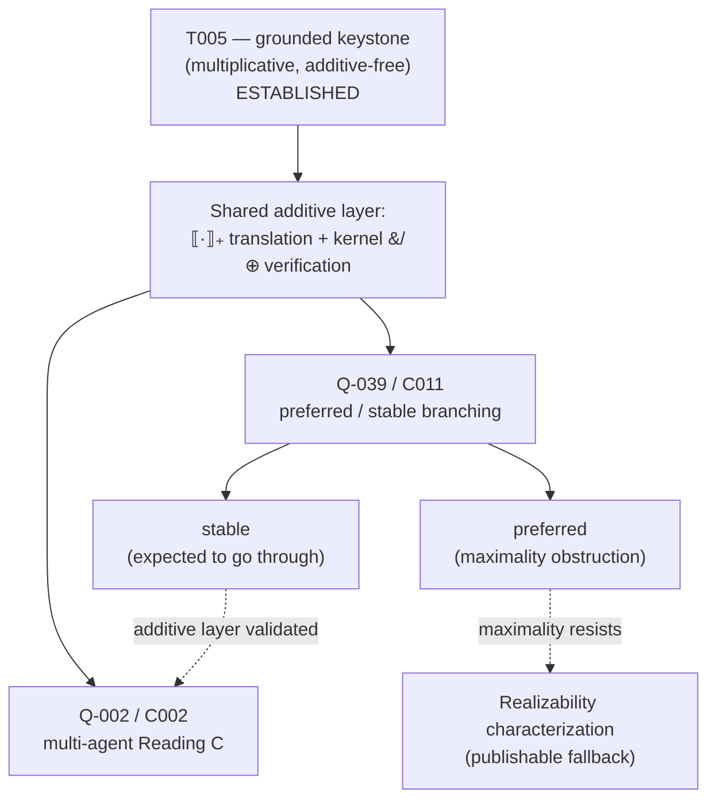

# Session 12 — The additive frontier: preferred/stable branching and multi-agent Reading C (Q-039 / C011 / Q-002)

**Date:** 2026-06-14
**Direction:** 1 — The foundational bridge (`09_FUTURE_DIRECTIONS_BRAINSTORM.md` §1), additive generalisations of the grounded keystone
**Status:** **Scoping — OPEN** (no kernel changed, no theorem proved, no translation written). This session names a previously-unnamed cluster — *the additive frontier* — unifying three open items under one piece of Ludics machinery (the additive connectives `&`/`⊕`), grades each component, and fixes a build order. It does **not** discharge any obligation.
**Purpose:** [T005](../02_THEOREMS_AND_PROOFS/T005-grounded-ludics-keystone.md) closed the grounded bridge *inside the multiplicative, additive-free fragment* because the grounded game is **single-line** and **bilateral**. Two independent generalisations push past that boundary and both require additives: the **semantics** axis (grounded → preferred/stable, [Q-039](../01_OPEN_QUESTIONS_REGISTRY.md#q-039) / [C011](../03_CONJECTURES/C011-additive-preferred-games-bridge.md)) and the **participant** axis (bilateral Reading A → multi-agent Reading C, [Q-002](../01_OPEN_QUESTIONS_REGISTRY.md#q-002) / [C002](../03_CONJECTURES/C002-reading-c-conservative.md)). The single load-bearing claim of this session is that **both branchings are the same `&`/`⊕` structure**, so one additive treatment of the engine + translation services both — and the right move is to build that shared layer once.

> Reading order: [T005](../02_THEOREMS_AND_PROOFS/T005-grounded-ludics-keystone.md)
> (the grounded, additive-free base case — read its Lemma A, where the additive-free
> reduction is made explicit, and its §Scope), [C011](../03_CONJECTURES/C011-additive-preferred-games-bridge.md)
> (the preferred/stable conjecture + its deferred Phase-4 settlement path — the spine of
> the semantics axis), [session 02 §1 + §2 Phase 5](02-foundational-bridge-dung-ludics-2026-06-02.md)
> (the pre-registered *maximality* obstruction and the realizability fallback),
> [C002](../03_CONJECTURES/C002-reading-c-conservative.md) (the multi-agent conservativity
> conjecture — the spine of the participant axis), and the translation spec
> [session 02b](02b-translation-spec-af-to-designs-2026-06-02.md) (the encoding decisions
> `·₊` must extend, especially decision #3 — distinct subaddresses — which is exactly
> what additives relax).

---

## 0. The problem in one sentence

T005 holds on the additive-free fragment because grounded disputes are single-line and
bilateral; **every** way of generalising the bridge — to preferred/stable semantics, or to
three-or-more participants — introduces *choice/branching/multiplicity*, which on the Ludics
side is precisely the additive connectives `&`/`⊕`. The additive frontier is the cluster of
results that live on the far side of that one boundary.

## 1. Why these three items are one cluster

The unifying observation: **`&`/`⊕` is the Ludics device for representing choice.** T005's
proof (Lemma A) closes the grounded case *by avoiding* choice — encoding decision #3
([session 02b](02b-translation-spec-af-to-designs-2026-06-02.md)) gives every advanced
argument a **distinct subaddress**, so no two PRO ramifications collide, so no additive
superposition, directory collision, or consensus-draw can arise, and canonical orthogonality
reduces to a plain alternating walk. Two independent forces reintroduce choice:

- **Vertical (semantics axis) — Q-039 / C011.** The preferred and stable discussion games
  (Modgil–Caminada 2009; Vreeswijk–Prakken 2000) are **branching**: the credulous proponent
  defends against an opponent who *chooses* among multiple attack lines (`&`, external
  choice), and chooses among multiple defences (`⊕`, internal choice). The grounded game's
  single-line determinism — deterministic descent along strictly-decreasing argument rank —
  is exactly what made it additive-free.
- **Horizontal (participant axis) — Q-002 / C002.** Three-or-more-participant Reading C is a
  **superposition of opponents**: the Opponent role borne by `σ(D_P)^⊥` is a `&`-superposition
  of the individually-witnessed designs from `W`, and the proponent's response across
  witnesses is `⊕`-structured. "Which witness is active" is an additive directory choice; the
  mid-interaction *polarity-shift* C002 must handle (the active witness changing) is an
  additive-choice event, not a multiplicative one.

**The bet (conjecture, not premise):** these are the *same* `&`/`⊕` algebra. If so, one
additive extension `·₊` of [`buildDisputeDesign`](../../lib/bridge/dispute.ts) plus one
verification of the kernel's additive path services both axes. The bet's failure mode is
that participant-multiplicity and defence-line-multiplicity need *different* additive
disciplines (e.g. Reading C's nesting is genuinely non-associative where the preferred game's
branching is associative) — in which case the cluster splits and each axis carries its own
translation. Recording the bet as falsifiable is the point.

## 2. What already exists (the shared assets)

The frontier is unusually well-supported on the engine and Dung sides; the gap is the
**translation**, not the machinery:

- **Grounded base case proven + cross-checked.** [T005](../02_THEOREMS_AND_PROOFS/T005-grounded-ludics-keystone.md)
  (established 2026-06-03), with the additive-free boundary confirmed *load-bearing* rather
  than incidental — so the frontier is a real boundary, not a proof artefact.
- **The Dung side is exact and labelling-based.** `groundedLabelling`, exact `preferred`/
  `stable`/`semi-stable` ([`labelling.ts`](../../lib/argumentation/labelling.ts),
  [`semantics.ts`](../../lib/argumentation/semantics.ts)); the unsound random/greedy preferred
  fallbacks are deleted (ARGUMENTATION_SEMANTICS_CONSOLIDATION_ROADMAP fully implemented). So
  any differential test for the additive axis has a **trustworthy left-hand side** — the only
  unknown is the Ludics predicate + `·₊`, exactly as in the grounded Phase 2.
- **The kernel already carries the additive path.** `isAdditive`, and the divergence taxonomy
  `additive-violation` / `dir-collision` / `consensus-draw`, are implemented in
  [`stepCore.ts`](../../packages/ludics-engine/stepCore.ts) (B-only relative to the pure
  `interact` walk — [session 02 §0b](02-foundational-bridge-dung-ludics-2026-06-02.md)). The
  engine is **ready to be exercised** on additive designs; it has never been driven by a
  translation that emits them.
- **A reusable test harness.** The `allAFs(n)` exhaustive + randomised differential harness
  from T005 ([`tests/bridge/`](../../tests/bridge/)) extends directly to the additive
  quantifier.

## 3. Per-component scope

### 3.1 Q-039 / C011 — additives capture preferred/stable branching (the *vertical* axis)

**Claim.** `&` = the opponent's external choice of which test to run; `⊕` = the proponent's
internal choice of which defence to commit. An additive `·₊` sends alternative defences to
a `⊕`-superposition of Proponent designs and alternative attack lines to a `&`-superposition
of Opponent tests; the Modgil–Caminada preferred (resp. stable) discussion game is then
strategy-preservingly isomorphic to interaction of the additively-translated designs, for the
appropriate design-space quantifier over canonical orthogonality.

**Grade: tractable for stable, genuinely open (with a named obstruction) for preferred.**

- **Stable — expected to go through.** A stable extension is a complete, conflict-free,
  all-attacking labelling. On the bridge this is a *quantifier change* (the design must
  realize a labelling that attacks everything outside it), not fundamentally a branching
  change; it reuses Lemmas A–B of T005 with the conflict-free / all-attacking constraint
  bolted on. Attack it first as the additive-translation shakedown.
- **Preferred — the pre-registered obstruction.** Preferred carries a **maximality** condition
  with *no obvious interactive counterpart* (session 02 §1, §2 Phase 5; brainstorm §1). The
  credulous-acceptance reading ("some `⊕`-branch is orthogonal to every `&`-branch") has a
  natural additive shape, but maximality ("the admissible set is `⊆`-maximal") is a global,
  non-interactive property — the same global-fixpoint-vs-local-interaction tension that makes
  the whole bridge hard, now concentrated in one condition. **Per programme discipline, if
  maximality resists, the deliverable flips** to a *realizability characterization*: which
  Dung semantics are interactively realizable over additive orthogonality and which are not.
  That is itself the publishable result (brainstorm §1: "either outcome is a real paper") and
  feeds Direction 6's symmetry axiom.

> **Ratified-subgraph sensitivity (note, 2026-06-14).** The bridge is parametric in the AF
> `F`, so [session 13](13-attack-ratification-layer-2026-06-14.md)'s attack-ratification layer
> (which runs the bridge on the *ratified* attack subgraph `F_rat ⊆ F_full`) composes cleanly
> with the grounded case — `grounded(F_rat)` is just another grounded extension. **Preferred /
> stable do not inherit that benignity:** they are sensitive to *which* attack edges are
> present (removing an edge can merge or split preferred extensions), and session 13's
> *ratification debt* (§3.3 — a partial subgraph where a reinstating attack is still pending)
> is exactly such a partial `F`. This does not threaten C011 (still parametric in `F`), but the
> preferred-axis settlement must be explicit about *which* subgraph it realizes over, and it
> sharpens the realizability fallback with a **governance dimension**: realizable over the full
> attack graph or the ratified one. Start the lift aware of this; it is a scoping obligation,
> not an obstruction.

**Settlement path (C011 §"Settlement path", deferred Phase 4 — restated here):**
1. Formalise the Modgil–Caminada **preferred** game over the existing `AF`/`attackersOf`
   substrate in [`dispute.ts`](../../lib/bridge/dispute.ts) (the grounded `G`-game is already
   there; this adds the branching variant).
2. Specify `·₊` on the additive fragment; read the `&`/`⊕` placement off the game's branch
   points. The encoding must *relax* decision #3 (distinct subaddresses) precisely where the
   game branches — that relaxation is the entire additive content.
3. Differential-test the additive quantifier against the consolidated preferred/stable engine
   over `allAFs(n)` (reuse the T005 harness, exact LHS).
4. Attempt the keystone-style isomorphism lemma; on maximality resistance, *characterize the
   obstruction* rather than forcing it.

### 3.2 Q-002 / C002 — multi-agent Reading C is conservative over bilateral Reading A (the *horizontal* axis)

**Claim.** For every Reading-C deliberation `(D_P, W, B)`, the convergence verdict (existence
and locus of the daimon) agrees with *every* faithful bilateralisation into pairwise Reading-A
interactions — including the `|W| ≥ 3` case (the bilateral tradition nests pairwise dialogues;
the nesting choice must not affect the verdict) and the mid-interaction polarity-shift case
(the active witness changing).

**Why it is on the additive frontier.** `|W| ≥ 3` is a superposition of opponents; "which
witness is active" is an additive directory choice; "nesting doesn't change the verdict" is,
on the Ludics side, an **associativity / coherence property of additive superposition** — the
same `&`/`⊕` algebra as Q-039, applied to participants rather than defence lines. The
polarity-shift C002 must absorb is an additive-choice event.

**Grade: open, least mature — no base-case theorem, no harness yet.** Q-039 has T005 as its
grounded base case and the T005 harness; Q-002/C002 has neither. It depends on T002 and C001
and currently exists only as a conjecture + settlement template.

**Settlement path (C002 — restated):** a translation lemma (Reading C → set of bilateral
interactions) + a fidelity-of-verdicts theorem handling the `|W| ≥ 3` nesting and the
polarity-shift; **or** a concrete `|W| ≥ 3` counterexample exhibiting a daimon under Reading C
and none under any bilateralisation (or vice versa), **presentable in the substrate's JSON
wire format** so the runtime can load it as a regression test. Before the general theorem,
the analogue of T005 is wanted: a smallest-non-trivial three-agent base case with an
exhaustive differential check, mirroring the grounded keystone's Phase-2-before-Phase-3
discipline.

> **Housekeeping (resolved 2026-06-14).** C002's planned target filename was
> `T004-reading-c-conservative.md`, which **collided** with the established
> JSL-fragment-bridge [T004](../02_THEOREMS_AND_PROOFS/T004-jsl-fragment-bridge.md).
> [C002](../03_CONJECTURES/C002-reading-c-conservative.md) has been renumbered to
> promote as **`T012-reading-c-conservative.md`** (the next free theorem id —
> highest current is [T011](../02_THEOREMS_AND_PROOFS/T011-possibilistic-cohomology-iso-monodromy.md)).
> Recorded here so the collision history is visible at the cluster's home.

## 4. Dependency / sequencing structure

**Recommended order** (consistent with the standing decision grounded → stable → preferred,
[session 02 §3 decision 4](02-foundational-bridge-dung-ludics-2026-06-02.md)):

1. **Build the shared additive layer first** — `·₊` + a differential harness that actually
   drives the kernel's existing additive path. Common prerequisite for both axes; de-risks
   both at once and is the cheapest way to discover whether the bet of §1 holds.
2. **Stable** (vertical, low-risk) — validates `·₊` on a semantics expected to go through.
3. **Preferred** (vertical, the obstruction) — the maximality test; the realizability fallback
   is pre-registered, so a negative result is still a deliverable.
4. **Q-002** (horizontal) — reuses the additive superposition machinery; attack the `|W| ≥ 3`
   nesting-coherence question, ideally with a T005-style three-agent base case before the
   general theorem.

## 5. What the cluster entails, in one paragraph

Define the additive extension `·₊` of the dispute translation and verify the `&`/`⊕`
structure of the (already additive-capable) interaction kernel, then **spend that machinery
twice** — once on the semantics axis (stable, then preferred, with maximality as the
pre-registered publishable obstruction) and once on the participant axis (multi-agent Reading
C ≡ nested bilateral, as an additive-coherence theorem). Deliverables: (a) `·₊` + a passing
additive differential harness; (b) a stable-semantics keystone lemma; (c) either a preferred
keystone lemma or a realizability characterization; (d) a Reading-C conservativity theorem or
a JSON-encodable counterexample. The shared risk is whether one additive treatment really
covers both branchings; the shared asset is that the kernel already implements the additive
divergence taxonomy and the Dung side is exact.

## 6. Decisions recorded (folder discipline: conjecture / resolved / parked)

- **conjecture** — *The additive-frontier unification:* the game-branching of preferred/stable
  and the participant-superposition of multi-agent Reading C are the **same** `&`/`⊕`
  structure, so one `·₊` + kernel verification services both. Falsifiable: if the two need
  different additive disciplines (notably if Reading-C nesting is non-associative where the
  preferred game branching is associative), the cluster splits. Not promoted to a premise.
- **resolved (sequencing)** — Build the shared additive layer first; then stable → preferred
  (vertical) → Q-002 (horizontal). Consistent with the standing grounded → stable → preferred
  order; Q-002 follows because it reuses the additive superposition machinery.
- **resolved (obstruction posture)** — Preferred's maximality is pre-registered as an
  acceptable *negative* outcome: a realizability characterization is a deliverable, not a
  failure. No forcing.
- **parked** — The full preferred isomorphism lemma and the Reading-C fidelity theorem are
  deferred (C011 is explicitly a Phase-4 / post-Direction-2 item; C002 depends on T002/C001).
  This session schedules and grades them; it does not attempt them.
- **filed (housekeeping)** — C002's promotion filename must avoid the `T004` collision (see
  §3.2). No registry header existed for this cluster before today; this file is it.

## 7. Next concrete step

When the cluster is taken up: implement `·₊` as an additive extension of
[`buildDisputeDesign`](../../lib/bridge/dispute.ts) that relaxes encoding decision #3 at game
branch points only, and stand up `tests/bridge/preferred-stable-additive.property.test.ts`
against the exact `preferred`/`stable` engine over `allAFs(n)`. Land the **stable** differential
first — it is the additive translation's shakedown and the precondition for trusting any
preferred-axis result.
