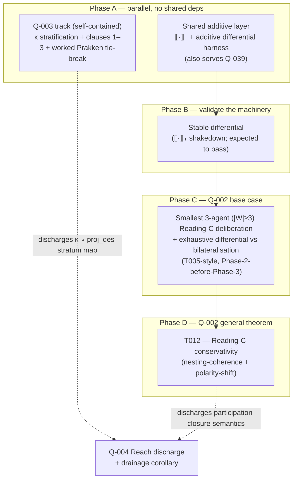

# Session 15 — Sequencing the next actions on Q-002 and Q-003

**Date:** 2026-06-16
**Direction:** 1 — Foundational bridge (Q-002, additive frontier) ∥ inner-ring exposure-map stratification (Q-003)
**Status:** **Scoping — sequencing only.** No theorem proved, no conjecture promoted, no kernel changed, no translation written. This session orders the existing next-actions on two open questions and records why the order is optimal. It supersedes nothing; it schedules.
**Purpose:** [Q-004](../01_OPEN_QUESTIONS_REGISTRY.md#q-004)'s remaining work (discharge the `Reach` hypothesis record; prove the drainage corollary) rides on **Q-002** and **Q-003**. This session scopes the optimal order of operations across that pair, having just updated Q-004's status to *partially-resolved* (closure/Galois half mechanised evidence-only, [`mechanisation/agda/C004/C004.agda`](../mechanisation/agda/C004/C004.agda)).

> Reading order: [Q-002](../01_OPEN_QUESTIONS_REGISTRY.md#q-002) / [C002](../03_CONJECTURES/C002-reading-c-conservative.md)
> (the participant axis — multi-agent Reading C conservativity), [Q-003](../01_OPEN_QUESTIONS_REGISTRY.md#q-003) /
> [C003](../03_CONJECTURES/C003-exposure-map-refines-prakken.md) (the exposure-map stratification),
> [session 12](12-additive-frontier-preferred-stable-multiagent-2026-06-14.md) (the additive frontier — Q-002's
> build order and the shared `·₊` layer it inherits), and [Q-004](../01_OPEN_QUESTIONS_REGISTRY.md#q-004)
> (the downstream beneficiary of both).

---

## 0. The problem in one sentence

Q-002 and Q-003 are both open, both feed Q-004's `Reach` discharge, and have **no shared
dependency and no shared machinery** — so the only sequencing question worth answering is how
to parallelise the cheap, self-contained one (Q-003) against the expensive, build-once one
(Q-002) so that Q-004's two residual fronts unblock as early as possible.

## 1. The two questions are structurally different

| | **Q-003** — exposure-map refines Prakken | **Q-002** — Reading-C conservativity |
|---|---|---|
| ring / maturity | inner; [C003](../03_CONJECTURES/C003-exposure-map-refines-prakken.md) written, proof not started | core; least mature on the additive frontier — no base-case theorem, no harness |
| depends-on | **—** (nothing) | Q-001 (C001b′ — propositional fragment closed), [T002](../02_THEOREMS_AND_PROOFS/T002-design-set-antichain.md) (established), C001 |
| machinery needed | none — pen-and-paper + existing argument-graph schema | the **shared additive layer** (`·₊` + kernel `&`/`⊕` verification), shared with [Q-039](../01_OPEN_QUESTIONS_REGISTRY.md#q-039) |
| engine work | none | yes — drives the additive path in [`stepCore.ts`](../../packages/ludics-engine/stepCore.ts) via a new translation |
| failure mode | clause 2 vacuous (stratification adds no discriminating power over `μ_P`) | the §1 additive bet fails (participant-multiplicity needs a different additive discipline than defence-line multiplicity) |

The decisive fact: **Q-003 and the Q-002 prerequisite share neither a dependency nor any
machinery**, so they parallelise with zero contention. Q-003 is the cheaper, self-contained
win; Q-002 is gated behind a build-once layer that pays off twice (it also serves Q-039).

## 2. Optimal order of operations

### Phase A — start both strands at once (no coupling)

1. **Q-003 track (self-contained, pen-and-paper).** Settle the §Positive-settlement content of
   [C003](../03_CONJECTURES/C003-exposure-map-refines-prakken.md):
   - (a) define `κ : E(F) → {walked, witnessable, latent}` from the live deliberation's
     witness-record set;
   - (b) construct the lexicographic `μ_S : E(F) → ℕ³`;
   - (c) prove **clause 1** (refinement: `μ_S(e) ≤ μ_S(e′) ⇒ μ_P(e) ≤ μ_P(e′)`), **clause 2**
     (strict refinement on ≥1 pair — a Prakken-tie broken by the stratification), **clause 3**
     (monotonicity under expansion-extension `⊑`);
   - (d) encode the worked tie-break example in the existing argument-graph schema (no new tables).

   Lowest risk in the programme right now — `depends-on: —`, no engine, no new tables. Its payoff
   reaches past Q-003: settling it discharges the `κ ∘ proj_des` stratum map that
   [Q-004](../01_OPEN_QUESTIONS_REGISTRY.md#q-004)'s **drainage corollary** quantifies over.

2. **Shared additive layer (Q-002's true prerequisite).** Build `·₊` as an additive extension of
   [`buildDisputeDesign`](../../lib/bridge/dispute.ts) that relaxes encoding decision #3 (distinct
   subaddresses, [session 02b](02b-translation-spec-af-to-designs-2026-06-02.md)) at game/branch
   points only, plus a differential harness over `allAFs(n)` against the exact `labelling.ts`
   engine. Build once; de-risks both Q-002 and Q-039. Per [session 12](12-additive-frontier-preferred-stable-multiagent-2026-06-14.md)
   this is the common prerequisite of the whole additive frontier.

### Phase B — validate before betting

3. **Land the stable differential first.** Per [session 12 §3.1](12-additive-frontier-preferred-stable-multiagent-2026-06-14.md),
   stable is the `·₊` shakedown — expected to pass, and a passing stable harness is the
   precondition for trusting *any* additive result, including a Reading-C one. Nominally Q-039
   work, but it sits on Q-002's critical path as its validation gate: never debug the translation
   and the conservativity claim simultaneously.

### Phase C — Q-002 base case (Phase-2-before-Phase-3 discipline)

4. **Smallest-non-trivial `|W| ≥ 3` Reading-C deliberation + exhaustive differential** against its
   bilateralisations, mirroring [T005](../02_THEOREMS_AND_PROOFS/T005-grounded-ludics-keystone.md)'s
   discipline (corroborate exhaustively before attempting the general theorem). Scope it to the
   **propositional / MALL fragment** where Q-002's dependencies (C001b′, [T002](../02_THEOREMS_AND_PROOFS/T002-design-set-antichain.md))
   are settled — exactly as T005 lived on the additive-free fragment. Deliverable is either a
   passing three-agent differential or a JSON-encodable counterexample (a daimon under Reading C
   and none under any bilateralisation, presentable in the substrate's wire format as a regression
   fixture).

### Phase D — Q-002 general theorem

5. **T012 — Reading-C conservativity.** The translation lemma (Reading C → set of bilateral
   interactions) + the fidelity-of-verdicts theorem, handling the `|W| ≥ 3` **nesting-coherence**
   (nesting = additive-superposition associativity) and the mid-interaction **polarity-shift**
   (active witness changing). Promotes [C002](../03_CONJECTURES/C002-reading-c-conservative.md) as
   `T012-reading-c-conservative.md` (the `T004` collision was resolved 2026-06-14).

## 3. Why this order is optimal

- **Maximises early parallelism** — the only two strands with zero coupling (Q-003 ∥ additive-layer
  build) run first and contend for nothing.
- **Front-loads the cheap, dependency-free win** (Q-003) that *also* unblocks part of Q-004.
- **Builds the expensive shared asset once** and validates it (stable) before betting Q-002 on it —
  avoids debugging a translation and a conservativity claim at the same time.
- **Both endpoints converge on Q-004.** Q-003 supplies the drainage `κ`; Q-002 supplies the
  participation-closure semantics for `Reach`. So finishing this pair is also the critical path to
  discharging Q-004's last two fronts — the registry dependency `Q-004 depends-on Q-002, Q-003` is
  honoured exactly by this sequencing.

## 4. Decisions recorded (conjecture / resolved / parked)

- **resolved (sequencing)** — Phase A (Q-003 ∥ shared additive layer) → Phase B (stable
  differential) → Phase C (Q-002 three-agent base case) → Phase D (T012 general theorem). Q-003
  and the additive-layer build start concurrently; the stable shakedown gates everything
  downstream of the layer.
- **resolved (scope discipline)** — Q-002's base case is scoped to the propositional / MALL
  fragment where C001b′ and T002 hold, mirroring T005's additive-free confinement.
- **conjecture (inherited, not introduced here)** — the [session 12](12-additive-frontier-preferred-stable-multiagent-2026-06-14.md)
  §1 bet that participant-superposition (Q-002) and defence-line branching (Q-039) are the *same*
  `&`/`⊕` algebra. This sequencing assumes it (one shared layer); its failure splits the cluster
  and gives Q-002 its own translation. Not promoted to a premise.
- **parked** — the Q-002 polarity-shift handling and the general nesting-coherence theorem (Phase
  D) are deferred behind the base case; Q-039's preferred-axis maximality obstruction is out of
  scope for this pair (tracked at session 12).

## 5. Registry actions taken alongside this session

- [Q-004](../01_OPEN_QUESTIONS_REGISTRY.md#q-004) status updated `open → partially-resolved`;
  `next-action` rewritten to the two residual fronts (discharge `Reach`; mechanise/prove the
  drainage corollary), with the C004 mechanisation recorded as evidence-only.
- [Q-003](../01_OPEN_QUESTIONS_REGISTRY.md#q-003) stale `next-action` ("write C003 conjecture
  file") corrected — C003 already exists; the line now points at the §Positive-settlement content
  and at this session for the sequencing.

## 6. Next concrete step

Open the two Phase-A strands in parallel: (1) a Q-003 working session that defines `κ` and `μ_S`
and attempts clause 1; (2) the additive-layer implementation — `·₊` extending
[`buildDisputeDesign`](../../lib/bridge/dispute.ts) plus
`tests/bridge/preferred-stable-additive.property.test.ts` against the exact `preferred`/`stable`
engine over `allAFs(n)`, landing the **stable** differential first.
