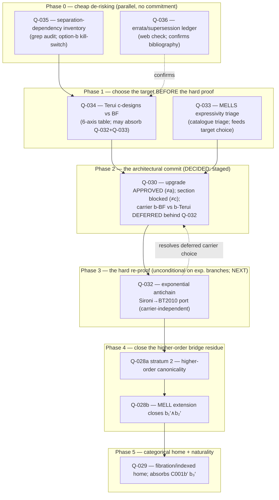

# Session 16 — Sequencing the Ambler-bridge / MELL-upgrade cluster (Q-027 – Q-036)

**Date:** 2026-06-16
**Direction:** core ring — the Ambler–Ludics bridge remainder ([C001b′](../03_CONJECTURES/C001b-prime-ambler-remainder.md)) and the MALL→MELL substrate-upgrade cluster it spawned
**Status:** **Scoping — sequencing only.** No theorem proved, no conjecture promoted, no substrate doc edited, no code touched. This session orders the *open* work across Q-027 → Q-036 and records why the order is optimal. It supersedes nothing; it schedules.
**Purpose:** the Ambler bridge is closed on the **propositional (MALL) fragment** (Q-028b positive, Q-031 positive, Q-037 positive) but the **higher-order (MELL) residue** is spread across a nine-question cluster with one architectural decision ([Q-030](../01_OPEN_QUESTIONS_REGISTRY.md#q-030)) at its centre. This session sequences the cluster so the cheap kill-switches run first, the *target* is chosen before the expensive re-proof, and the architectural commit happens only once feasibility is known.

> Reading order: [Q-030](../01_OPEN_QUESTIONS_REGISTRY.md#q-030) (the architectural decision + its Phase-1 lit audit
> [`MALL→MELL Incarnation Upgrade`](../../Development%20and%20Ideation%20Documents/ARCHITECTURE/MALL%E2%86%92MELL%20Incarnation%20Upgrade%20for%20the%20Isonomia%20Ludics%20Substrate.md)),
> [Q-028b](../01_OPEN_QUESTIONS_REGISTRY.md#q-028b) (the settlement whose MELL extension is open),
> [C001b′](../03_CONJECTURES/C001b-prime-ambler-remainder.md) (the bridge conjecture this all serves),
> and the [Q-028b freeness audit](../audits/q028b-freeness-argument-2026-05-29.md) (the side-data taxonomy).

---

## 0. The problem in one sentence

Nine of the ten questions Q-027 – Q-036 are about **one decision** — whether to upgrade the
substrate's base design notion from FQ-linear-incarnation to BF-incarnation-with-repetitions so the
Ambler bridge extends past the propositional fragment — and the only sequencing question worth
answering is how to run the **cheap feasibility kill-switches** and the **target-selection
evaluation** *before* sinking effort into the BF-specific hard re-proof that a different target
choice could make unnecessary.

## 1. What is already closed (the ground this stands on)

| Q | status | what it settled |
|---|--------|-----------------|
| [Q-027](../01_OPEN_QUESTIONS_REGISTRY.md#q-027) | resolved-negative-with-redirect | bridge target moves up a level: per-cone `Cᵢ` → free JSL `𝒫_fin(Inc(B))`; supersedes C001b → C001b′ |
| [Q-028a](../01_OPEN_QUESTIONS_REGISTRY.md#q-028a) stratum 1 | discovery-positive | the generator-level bijection is **uniquely forced** at `|Inc(B)| = 3` (all-6-bijections sweep) |
| [Q-028b](../01_OPEN_QUESTIONS_REGISTRY.md#q-028b) | **positive on MALL** | `b₁′ ∧ b₂′` close **uniformly** on the propositional fragment; reduction is **choice-free** |
| [Q-031](../01_OPEN_QUESTIONS_REGISTRY.md#q-031) | **positive on MALL** | iterated defeat forces **no** fixpoint in the design logic; only a finite Dung acceptability fixpoint one level up |
| [Q-037](../01_OPEN_QUESTIONS_REGISTRY.md#q-037) | **positive on the full propositional fragment** | runtime `δ₂` provably presents semantic `δ₁` on `Inc(B)`; side-data item 4 dissolves |

**Net:** the bridge is done at the propositional layer. Everything open below is the **higher-order
(`!`-translated MELL) residue** — *not* a defeat-encoding or fixpoint gap, but a generator-set
canonicality gap that rides entirely on the substrate's base design notion.

## 2. The open cluster is one decision with satellites

| Q | role in the cluster | cost | gating? |
|---|---|---|---|
| [Q-036](../01_OPEN_QUESTIONS_REGISTRY.md#q-036) | errata/supersession ledger check | trivial (web check) | sanity only — confirms the bibliography the rest builds on |
| [Q-035](../01_OPEN_QUESTIONS_REGISTRY.md#q-035) | separation-dependency inventory | cheap (grep audit + write-up) | **feasibility kill-switch** for option (b) |
| [Q-033](../01_OPEN_QUESTIONS_REGISTRY.md#q-033) | MELLS expressivity triage | cheap (catalogue triage) | **gates the commit** — decides if BF's constant-only fragment suffices |
| [Q-034](../01_OPEN_QUESTIONS_REGISTRY.md#q-034) | Terui c-designs vs BF target eval | medium (lit read + 6-axis table) | **target selection** — a positive could absorb Q-032 + Q-033 |
| [Q-030](../01_OPEN_QUESTIONS_REGISTRY.md#q-030) | **the architectural decision** (a/b/c) | the commit | the hinge — everything else feeds it |
| [Q-032](../01_OPEN_QUESTIONS_REGISTRY.md#q-032) | re-establish T002 antichain under BF materiality | **expensive** (the hard re-proof) | the principal Phase-3 obligation **iff** BF chosen |
| [Q-028a](../01_OPEN_QUESTIONS_REGISTRY.md#q-028a) stratum 2 | higher-order canonicality | medium | blocked on Q-032 + Q-030 |
| [Q-029](../01_OPEN_QUESTIONS_REGISTRY.md#q-029) | categorical home for side-data parameterisation | medium | downstream; absorbs C001b′ b₃′ |

The decisive facts:
- **Q-030 is the hinge** and must not be committed before feasibility (Q-035) and target (Q-034/Q-033) are known.
- **Q-032 is the single most expensive item** and was *believed* BF-specific and possibly absorbable by a Terui win. **Phase 1 falsified that** — Q-032 is net-new and **target-independent** (the minimality theorem is missing from BF materiality *and* BT2010 alike). So Q-032 is unavoidable on every exponential branch; it does **not** discriminate between carriers, which is *why* the Phase-2 carrier choice can be deferred behind it.
- **Q-035 is a kill-switch:** if BF's dropped separation is load-bearing in ≥3 substrate components with no replacement, option (b) is off the table regardless of everything else. *(Fired green.)*

## 3. Optimal order of operations

### Phase 0 — cheap de-risking (parallel, no commitment)

1. **Q-036 — errata ledger check.** A quick check of LMCS errata pages, arXiv revision histories,
   and the Faggian/Quatrini homepages for the load-bearing theorems (BF Thms 11.16/11.17,
   Defs 7.2/11.5; FQ Props 5.2/5.3/5.9), plus confirming the substrate cites the **2015 revised** FQ
   republication and following up BF Remark 11.12's flagged loose-end. **Off the critical path but do
   it first** — it is nearly free and every downstream question builds on these exact theorem
   statements. Deliverable: a one-paragraph note appended to the Q-030 Phase-1 audit.

2. **Q-035 — separation-dependency inventory.** `grep` the substrate for "separat" / "distinguish"
   in the Ludics-technical sense; for each occurrence (the `⪯` order, defeat-encoding uniqueness,
   Phase 2e Cross-Cone Incompatibility, Daimon Lock, any T-series step treating designs as determined
   by behaviour), classify as survives-unchanged / survives-weakened / **breaks** under BF's dropped
   separation. **This is the option-(b) kill-switch:** ≤2 replaceable components → (b) proceeds;
   ≥3 load-bearing with no replacement → (b) is infeasible and Phase 1 retargets to (a)/(c)
   immediately. Deliverable: `audits/q035-separation-dependency-2026-XX-XX.md`.

   > **✅ RAN 2026-06-16 — kill-switch GREEN.** [audit](../audits/q035-separation-dependency-2026-06-16.md):
   > **LOW IMPACT, zero in-scope breakages, option (b) clears the separation axis.** The feared `⪯`
   > order is a non-dependency (the substrate uses chronicle-set inclusion `⊆`, having *rejected* the
   > approximation order `⊑`); the five flagged sites rest on set-inclusion, coherence comparability,
   > or **uniqueness of incarnation / minimality** — the last being the [Q-032](../01_OPEN_QUESTIONS_REGISTRY.md#q-032)
   > antichain gap, **not** separation. The only genuine Girard-separation user (Direction-2
   > [T005](../02_THEOREMS_AND_PROOFS/T005-grounded-ludics-keystone.md)–[T011](../02_THEOREMS_AND_PROOFS/T011-possibilistic-cohomology-iso-monodromy.md))
   > is out of the BF-migration scope (additive-free MALL, product feature, `stepCore` kernel). **The
   > separation worry collapses into the minimality worry — Q-032 is the real Phase-3 obstruction.**
   > One scope-conditional caveat: a future unification of the bridge + locus-of-disagreement design
   > notions onto BF would reopen the Direction-2 row.

   *Phase 0 strands share no machinery and run fully parallel.*

### Phase 1 — choose the target before the hard proof (Phase-1.5 of Q-030's workflow)

> **✅ RAN 2026-06-16 — [Q-034/Q-033 lit review](../../Development%20and%20Ideation%20Documents/ARCHITECTURE/Q034_Q033_MELL_TARGET_LITERATURE_REVIEW.md) (BF 2011 read in full, Appendix C verbatim-verifies every audit-anchored number).**
> **Q-034 = MIXED, and the cluster's shortcut hypothesis is FALSIFIED.** Terui-family wins the framework count
> (expressivity, minimality-as-framework, and *decisively* syntax — c-designs are λ-terms matching the Ambler
> λ-calculus ~1:1), but two BF-leaning facts block a wholesale retarget: (1) the *practical* reading of the
> minimality axis is a **draw at the exponential layer** — every Terui/Sironi minimality result is **affine**
> (Sironi defers exponentials to BF), and the exponential layer (BT2010) has no minimality theorem and fails
> separation, **the same gap as BF**; (2) retargeting to c-designs **loses the substrate's existing FQ
> visitable-path tooling** (locative lineage; c-design path-characterization is open, per Pavaux). **∴ the
> exponential antichain (Q-032) is net-new work whichever target is chosen — "positive Q-034 ⇒ Q-032 unnecessary"
> is false.** Also: BF §12 + BT2010 are explicit **companions** (each imports the other), so "Terui vs BF" is less
> a binary than a "use both" — the target choice reduces to *which design syntax sits on the bridge*.
> **Q-033 = SUFFICIENT-with-conditions** (more favourable than the brief assumed): ground Ambler atoms Skolemise
> into MELLS/LLP constants (no extension); additives are **importable, not net-new** (BT2010 Thm 2.17/3.8, Terui
> Thm 4.14 — BF's "straightforward" carried out next door); only genuine **propositional-variable polymorphism**
> is net-new, and it is **absent from all four candidates**, so it is a *scope* question, not a target one.

3. **Q-034 — Terui vs BF, six-axis comparison.** Read Terui 2011 *Computational Ludics* + Basaldella–
   Terui 2010 and compare against BF 2011 on expressivity, incarnation analogue, separation
   behaviour, cut-elimination, syntactic ergonomics, and library support. ~~A positive (Terui
   dominates) close can absorb both Q-032 and Q-033~~ **— this hoped-for absorption was tested and
   FALSIFIED (see callout): the Terui minimality machinery is affine, so it does *not* supply the
   exponential canonical generator Q-032 needs.** Deliverable: the side-by-side recommendation table
   (delivered — verdict MIXED).

4. **Q-033 — MELLS expressivity triage.** In parallel, triage the substrate's intended Ambler
   instances against BF's constant-only polarized MELLS. **Result: sufficient for ground atoms +
   importable additives; net-new only for propositional-variable polymorphism, which is a scope
   restriction, not a target choice.**

### Phase 2 — the architectural commit (Q-030 decision)

> **✅ DECIDED 2026-06-16 (staged) — see [Q-030 status](../01_OPEN_QUESTIONS_REGISTRY.md#q-030).**
> **(1) The exponential upgrade is APPROVED; option (a) MALL-restrict is OFF.** The programme owner confirmed
> the higher-order `!`-fragment is real and product-load-bearing — it **corresponds to the argument-chain
> feature** (chained schemes = scheme composition; cf. [Q-015](../01_OPEN_QUESTIONS_REGISTRY.md#q-015) and the
> `components/chain/*` editor). The substrate needs MELL beyond the closed propositional bridge.
> **(2) Option (c) stays OFF** (blocked: Maurel separation failure). **(3) The carrier choice (b-BF vs b-Terui)
> is DEFERRED, not committed** — the irreversible decision is held behind [Q-032](../01_OPEN_QUESTIONS_REGISTRY.md#q-032).
> Working posture: the **"BF-engine + BT2010-proof" hybrid** — keep the locative engine (lowest blast radius;
> preserves the closed MALL bridge + Agda mechanisation), and run the **Q-032 Sironi→exponential antichain port
> in the Terui/BT2010 lineage** (where the principal-set template natively lives), *regardless* of the eventual
> runtime carrier. Q-032's outcome is the proof-side evidence that decides whether a full Terui retarget is
> worth it. **Net: don't make the hard carrier commit yet; start the carrier-independent Q-032 next.**

5. **Q-030 — decide (a) / (b) / (c).** With feasibility (Q-035 green), target (Q-034 = mixed), and
   expressivity (Q-033 = sufficient-with-conditions) in hand, the architectural call was made as a
   **staged commit** (see callout): exponential upgrade approved (≠ a), section blocked (≠ c), carrier
   (b-BF vs b-Terui) **deferred behind Q-032**. **Q-034's mixed verdict reshaped the decision** from
   "BF vs Terui as rival foundations" to *which design syntax sits on the bridge* (BF and BT2010 are
   companions), and the gating fact — that the higher-order need is the **argument-chain feature** —
   confirmed the upgrade is warranted rather than speculative. The one hard-to-reverse choice (the
   runtime carrier) is held until Q-032 supplies proof-side evidence.

### Phase 3 — the hard re-proof (runs on EVERY exponential branch — b-BF and b-Terui; now the IMMEDIATE next action)

6. **Q-032 — re-establish T002 (antichain / canonical generator) at the exponential layer.**
   ~~The principal Phase-3 obligation, attempted only if Q-030 lands on (b) *and* Q-034 did not absorb
   it.~~ **Phase-1 confirmed Q-032 is net-new and target-INDEPENDENT** — it runs on *both* exponential
   branches (b-BF and b-Terui), since the minimality theorem is missing from BF materiality *and* from
   BT2010's nonlinear designs alike. **Per the Phase-2 staged decision it is now the IMMEDIATE next
   action** (the carrier commit is deferred behind it). Lead route (i): **port Sironi 2014 principal
   sets (Def 11)** from the affine fragment — where they are proved (Prop 3/6/7/10/11) — to the
   exponential layer **in the Terui/BT2010 lineage** (Sironi already lives there; this keeps the port
   carrier-independent), re-deriving the antichain at the `!`-layer; this port is the open step Sironi
   herself flags. Fall back to (ii) antichain-up-to-repetition-equivalence or (iii) minimal repetition
   profile. Test on the aspirin Q3 instance from the Q-027 audit. Deliverable: a target-side T002 or a
   documented obstruction (itself a sub-result) — **plus the evidence that resolves the deferred
   b-BF/b-Terui carrier choice.**

### Phase 4 — close the higher-order bridge residue

7. **Q-028a stratum 2 — higher-order canonicality.** Unblocked once Q-032 supplies the canonical
   generator object. Exhibit a small higher-order Ambler instance (a λ-abstraction / hypothetical-
   derivation rule) and show the exponential-behaviour generator presentation admits a canonical
   bijection to Ambler's λ-term generators.

8. **Q-028b — MELL extension.** With Q-028a stratum 2 positive and the canonical generator in place,
   the freeness argument extends past the propositional fragment, closing **C001b′ b₁′ ∧ b₂′** at
   higher order and promoting Q-028b from "positive on MALL" to fully closed-by-proof.

### Phase 5 — categorical home + naturality

9. **Q-029 — the categorical home for the side-data parameterisation.** Attempt option (a) of its
   method: a **fibration** with base `(Γ, δ)` and the per-choice bridge functor as fibre. A positive
   close **absorbs C001b′ b₃′** as the cleavage/transport law and gives the bridge a principled type
   (e.g. an `agda-categories` `Fibration` record). Runs after the Q-028b stress-tests have fixed which
   side-data items are substantive. This is also reachable from the option-(a)/(c) branch of Q-030 (it
   does not strictly need the BF re-proof), so it is the natural **last item on every path**.

## 4. Why this order is optimal

- **Front-loads the kill-switches.** Q-035 (feasibility) and Q-036 (bibliography) are nearly free and
  can *terminate* the expensive branch before any effort is sunk — if separation is load-bearing,
  option (b) and therefore Q-032 never start.
- **Chooses the target before the hard proof.** Q-034 sits *before* Q-032 deliberately: the plan was
  that a positive Terui evaluation could make the antichain re-proof unnecessary. **Phase 1 tested
  this and falsified it** — the Terui-family minimality machinery is affine, so Q-032 is net-new at
  the exponential layer on *every* target. The Q-034-before-Q-032 ordering still paid off: it
  converted Q-032 from "maybe absorbed" to "definitely required, target-independent," so the commit
  is now made without a false hope of skipping it.
- **Commits once, with full information.** Q-030 is the hinge and is scheduled *after* feasibility +
  target + expressivity are known, exactly matching its own workflow's "Phase 2 must address Q-031
  (done), Q-033, Q-035 before the architectural commit."
- **The expensive re-proof is a single phase, now known to be unconditional.** ~~Q-032 only runs on
  the (b) branch and only after Q-034 fails to absorb it~~ — Phase 1 showed Q-032 runs on **both**
  exponential branches (b-BF and b-Terui); only the MALL-restriction fallback (a) avoids it.
- **Both paths converge on Q-029.** Whether Q-030 picks (a)/(c) (bridge stays at the propositional
  layer) or (b) (bridge extends to MELL), the categorical home / naturality chase (Q-029, absorbing
  C001b′ b₃′) is the terminal item — so the cluster has a single, well-defined finish line:
  **C001b′ fully discharged, closing the last open content of Q-001.**

## 5. Dependency honoured

The registry's stated dependencies are honoured exactly by this sequencing:
`Q-030 depends-on Q-031 (done) / Q-035 / Q-033`; `Q-032 gates-on Q-030 option (b)`;
`Q-028a stratum 2 blocked-on Q-032 + Q-030`; `Q-028b MELL extension gates-on Q-030`;
`Q-029 absorbs C001b′ b₃′`. Finishing the cluster in this order is the critical path to promoting
[Q-028b](../01_OPEN_QUESTIONS_REGISTRY.md#q-028b) to fully closed-by-proof and discharging the last
remainder of [C001b′](../03_CONJECTURES/C001b-prime-ambler-remainder.md) / [Q-001](../01_OPEN_QUESTIONS_REGISTRY.md#q-001).

---

*No proof, no promotion, no code. Sequencing + rationale only. When Phase 0 runs, add its audit
pointers here and to the Q-030 / Q-035 registry entries.*

-------------
