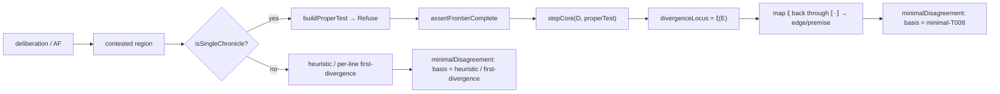

# Dev spec — verified minimal-disagreement extractor (operational gate for T008)

- **Date:** 2026-06-04
- **Direction:** 2 — Separation / locus of disagreement (operational follow-through of [T008](02_THEOREMS_AND_PROOFS/T008-minimal-separating-context-daimon-closed.md))
- **Status:** **SPEC — not yet implemented.** Scopes the smallest sound unblock of the contested-frontier "where you disagree" claim on the **linear single-dispute-line** path. R1 (kernel change) stays parked; branching (Q-041 O2) stays out.
- **Tracked in:** [`IMPLEMENTATION_TRACKS.md`](IMPLEMENTATION_TRACKS.md) → *Separation — minimal-disagreement operationalisation track* (spec MD).
- **Owner / tracking:** [Q-040](01_OPEN_QUESTIONS_REGISTRY.md#q-040) (operational sourcing), [Q-041](01_OPEN_QUESTIONS_REGISTRY.md#q-041) (the branching boundary this surfaces)
- **Depends on:** [T008](02_THEOREMS_AND_PROOFS/T008-minimal-separating-context-daimon-closed.md) (established — defines the *faithful region*), [T006](02_THEOREMS_AND_PROOFS/T006-first-divergence-locus-e0.md) (the `divergenceLocus` object), the bridge translation [`lib/bridge/dispute.ts`](../lib/bridge/dispute.ts), the kernel [`packages/ludics-engine/stepCore.ts`](../packages/ludics-engine/stepCore.ts), the order/reducer [`packages/ludics-engine/separation.ts`](../packages/ludics-engine/separation.ts).

---

## 0. One-paragraph statement

T008 proved that, against a **complete daimon-closed counter-design** (a *proper
test*) on a single realized dispute chronicle, the kernel's `divergenceLocus`
`ξ(E)` is the `⊑`-minimal separating context — and that `stepCore` is **faithful on
proper tests, unfaithful exactly on raw truncations**. The theorem therefore reduces
"can we soundly say *the minimal place you disagree*?" to a single engineering
obligation: **only ever feed `stepCore` frontier-complete (proper) tests, and only
claim minimality when the dispute is a single chronicle.** This spec builds the
*verified extractor* that does exactly that, surfaces `ξ` back onto the contested-
frontier surface as a **provably minimal** locus on the linear path, and **refuses /
degrades** (never lies) when the input falls outside T008's faithful region.

## 1. Goal and non-goals

**Goal.** A pure, verified pipeline `deliberation → (proper test) → ξ → argument-graph
locus` that lets the contested-frontier surface label one item "the minimal unshared
commitment" with a *theorem* behind it (T008), on the single-dispute-line path.

**Non-goals (explicit, to prevent scope creep).**
- **No kernel change (R1 parked).** The extractor must *not* modify `stepCore`,
  `stepInteraction`, or the orthogonality verdict. It works entirely by controlling
  the *inputs* (feeding proper tests), per T008 §Faithfulness.
- **No branching minimality (Q-041 O2).** Where a dispute has multiple `⊑`-incomparable
  open lines simultaneously, the extractor must **not** claim minimality; it degrades
  (see §6).
- **No additive / preferred-stable (Q-039).**
- **No replacement of the existing heuristic.** `loadBearingnessRanking` /
  `contestednessRanking` in [`lib/deliberation/frontier.ts`](../lib/deliberation/frontier.ts)
  stay as-is; the extractor adds an **additive, optional** field. Pre-existing
  consumers are untouched.

## 2. The contract the extractor must honor (T008, restated operationally)

From [T008 §Faithfulness](02_THEOREMS_AND_PROOFS/T008-minimal-separating-context-daimon-closed.md):

1. **Faithful region.** A test `T` is *frontier-complete for `D`* iff, along
   `⟨D ∣ T⟩`, at every step where it is `T`'s turn to play a positive, `T` carries an
   act — a proper attack **or** the daimon `†`. On such `T`, `stepCore`'s verdict
   equals the abstract normalization: `CONVERGENT` iff the net closes, `DIVERGENT`
   (`incoherent-move`) iff a genuine refusal at a carried locus.
2. **The unfaithfulness set.** Exactly the **non**-frontier-complete tests (raw
   truncations): silent at a reachable positive turn that is not the genuine anchor.
   There the kernel over-runs and reports a spurious `DIVERGENT` at a `⊑`-smaller
   locus.
3. **Minimality is relative to the disagreement `E`** and holds on a **single
   realized chronicle** only.

> **The extractor's prime invariant (must be enforced and tested):** every test
> handed to `stepCore` is frontier-complete by construction, and minimality is
> claimed only on a single chronicle. Violating either re-opens the exact defect
> T007's cross-check found.

## 3. Architecture — four pure components + one integration point

All of (3.1)–(3.4) are **pure** (zero I/O), mirroring `stepCore`/`separation.ts`, so
they are unit-testable without prisma and reusable by the Direction-5 Agda model.

### 3.1 Proper-test builder — `buildProperTest`

Given a dispute chronicle (a `⊑`-chain of loci with per-depth polarity) and the
opponent's intended refusal anchor, emit a **complete daimon-closed counter-design**:
carry the opponent's proper chronicle actions, and at every opponent positive turn
where it does *not* attack, place the daimon `†` (concede). This is the
`Concede_j` / `Refuse` construction of [T008 Definition 2](02_THEOREMS_AND_PROOFS/T008-minimal-separating-context-daimon-closed.md),
reusing the existing `†` encoding already in [`buildDisputeDesign`](../lib/bridge/dispute.ts)
(the CON-stuck rule appends `kind: "DAIMON"`) and `buildPlayDesigns` in the harnesses.

```ts
// packages/ludics-engine/properTest.ts  (new, pure)
import type { CoreAct } from "./stepCore";

export interface Chronicle {
  /** Loci d_0 ⊏ d_1 ⊏ … along the realized line (segment-wise ⊑-chain). */
  loci: string[];
  /** D plays positive at even depth, receives at odd depth (T008 scope). */
}

/** A complete daimon-closed counter-design of D on the chronicle's dual base. */
export function buildProperTest(
  chron: Chronicle,
  refusalDepth: number, // 2m for Refuse(ξ); or an odd j for Concede_j
): { acts: CoreAct[]; frontier: string };
```

### 3.2 Frontier-completeness guard — `assertFrontierComplete`

A predicate (and a throwing assert) that verifies a candidate test is
frontier-complete *for a given `D` along the chronicle* — i.e. it has an act at every
one of its positive turns up to the frontier. The builder guarantees this by
construction; the guard is the **defence-in-depth check** that fails loudly if any
future caller hands `stepCore` a partial design. This is the operational encoding of
T008's faithful-region boundary.

```ts
export function isFrontierComplete(D: CoreAct[], T: CoreAct[], chron: Chronicle): boolean;
export function assertFrontierComplete(D: CoreAct[], T: CoreAct[], chron: Chronicle): void; // throws otherwise
```

### 3.3 Linearity detector — `isSingleChronicle`

Decide whether the contested region of the dispute is a **single realized chronicle**
(loci in play form one `⊑`-chain) versus **branching** (two `⊑`-incomparable loci
simultaneously in play). Reuses `isPrefixLocus` / `comparableLoci` from
[`separation.ts`](../packages/ludics-engine/separation.ts). **This is the O2 gate**:
`false` ⇒ the extractor must not claim minimality.

```ts
export function isSingleChronicle(lociInPlay: string[]): boolean; // all pairwise ⊑-comparable
```

### 3.4 The extractor — `extractMinimalDisagreementLocus`

The composition: build `D` and the proper test `Refuse` for the disagreement, assert
frontier-completeness, run `stepCore`, read `divergenceLocus` (= `ξ(E)`, the
`⊑`-minimal separating context by T008), and map it back through `·` to the
argument-graph edge/premise it corresponds to.

```ts
export interface MinimalDisagreement {
  /** The ⊑-minimal separating locus ξ(E) (kernel path, e.g. "0.1.2"). */
  locus: string;
  /** Provenance the surface must respect (see §6). */
  basis: "minimal-T008" | "first-divergence-T006" | "heuristic-fallback";
  /** The argument-graph object ξ maps back to (edge/premise/CQ id). */
  target?: { kind: "edge" | "premise" | "cq"; id: string };
}

export function extractMinimalDisagreementLocus(
  chron: Chronicle,
  D: CoreAct[],
  refusal: { anchorDepth: number },
  lociInPlay: string[],
): MinimalDisagreement;
```

**Decision table (the only place "minimal" may be claimed):**

| Condition | `basis` | Surface label |
|---|---|---|
| single chronicle ∧ frontier-complete ∧ `DIVERGENT` | `minimal-T008` | "the minimal unshared commitment" |
| single chronicle ∧ `DIVERGENT` but not provably proper | `first-divergence-T006` | "the first point of divergence" |
| branching (¬`isSingleChronicle`) | `first-divergence-T006` *(per line)* or `heuristic-fallback` | "first divergence on this line" — **never** "minimal" |
| extraction unavailable / too large | `heuristic-fallback` | existing `loadBearingnessRanking` |

### 3.5 Integration point — additive frontier field

Extend [`ContestedFrontier`](../lib/deliberation/frontier.ts) with **one optional,
additive** field; do not touch existing fields or ordering.

```ts
export interface ContestedFrontier {
  // …existing fields unchanged…
  /**
   * The provably-minimal locus of disagreement (T008), when the dispute is a
   * single chronicle and the test is a proper test; else a first-divergence or
   * heuristic fallback. Additive — pre-existing consumers may ignore it.
   */
  minimalDisagreement?: MinimalDisagreement | null;
}
```

`computeContestedFrontier` calls the extractor only when the deliberation's contested
region is a single chronicle; otherwise it leaves `minimalDisagreement` null (or
per-line first-divergence) and the surface falls back to the heuristic. The route
[`app/api/v3/deliberations/[id]/frontier/route.ts`](../app/api/v3/deliberations/%5Bid%5D/frontier/route.ts)
needs no signature change (the field rides the existing JSON). The UI
[`components/deliberation/FrontierLane.tsx`](../components/deliberation/FrontierLane.tsx)
renders the `basis`-appropriate label and **must not** print "minimal" unless
`basis === "minimal-T008"`.

## 4. Data flow



## 5. Testing plan (test-then-ship, mirroring the programme)

1. **Reuse the daimon-closed harness as the oracle.** [`tests/bridge/separation-daimon-closed-harness.test.ts`](../tests/bridge/separation-daimon-closed-harness.test.ts)
   already proves, over `allAFs(n)`, that proper tests converge at shallower frontiers
   and the refusal diverges at `ξ(E)`. The extractor's `locus` on the same inputs must
   equal that `ξ(E)`.
2. **Prime-invariant test (the safety net).** A property test over `allAFs(n)` that
   **every** test the extractor constructs passes `isFrontierComplete` *before* it
   reaches `stepCore` — i.e. the extractor can never feed a partial design. Pair with a
   negative test: feeding a raw truncation makes `assertFrontierComplete` throw.
3. **Faithfulness contrast.** On the frozen length-5 witness, assert
   `extractMinimalDisagreementLocus` returns `ξ = 0.1.2.3.4` with `basis =
   "minimal-T008"`, while the *raw truncation* path (the contrast fixture in
   [`tests/bridge/separation-truncation-harness.test.ts`](../tests/bridge/separation-truncation-harness.test.ts),
   unmodified) would have diverged at `0.1.2` — documenting that the extractor sits in
   the faithful region.
4. **Branching gate test (surfaces O2).** A constructed branching dispute (two
   `⊑`-incomparable defended lines, à la C012 §Route (b)) must yield
   `isSingleChronicle === false` and a `basis ≠ "minimal-T008"` result — proving the
   extractor refuses to claim minimality off the linear path.
5. **No-regression.** Full bridge suite green, including the T005 discharge
   ([`tests/bridge/stepcore-differential.test.ts`](../tests/bridge/stepcore-differential.test.ts));
   `npx next lint` clean; the two existing separation harnesses unmodified.

## 6. Honesty / safety requirements (load-bearing, not optional)

- **Never label "minimal" outside `basis === "minimal-T008"`.** The UI copy is gated
  on `basis`. On branching or fallback the surface says "first point of divergence"
  or keeps the heuristic wording — this is the anti-overclaim guard that mirrors the
  programme's "conjecture, not premise" discipline at the product layer.
- **Fail closed.** Any failure in build/assert/extract degrades to
  `heuristic-fallback`, never throws into the route (which already handles prisma
  errors); the frontier endpoint must keep returning the existing payload.
- **The guard is mandatory, not advisory.** `assertFrontierComplete` runs on every
  extraction in non-production builds (and at least `isFrontierComplete` as a branch
  in production), so a future refactor that accidentally feeds a partial test is
  caught by a failing test, not by a silent wrong answer on the surface.

## 7. Acceptance criteria

- [ ] `buildProperTest`, `isFrontierComplete`/`assertFrontierComplete`,
      `isSingleChronicle`, `extractMinimalDisagreementLocus` land as pure modules with
      unit tests.
- [ ] Extractor `locus` ≡ daimon-closed harness `ξ(E)` over `allAFs(n)`, `n ≤ 3`.
- [ ] Prime-invariant property test passes (no partial test ever reaches `stepCore`);
      negative test confirms `assertFrontierComplete` throws on a truncation.
- [ ] Branching gate test confirms `basis ≠ "minimal-T008"` off the linear path.
- [ ] `ContestedFrontier.minimalDisagreement` is additive; existing fields, route, and
      consumers unchanged; full bridge suite + lint green.
- [ ] `FrontierLane.tsx` renders "minimal" copy **only** for `basis === "minimal-T008"`.

## 8. Risks and how this de-risks the next step

- **Branching is more common than the linear path in real deliberations.** If so, the
  `minimal-T008` label fires rarely and the feature is thin until O2 (Q-041) lands.
  *This is a feature of the spec, not a bug:* the branching-gate counter in (5.4) is
  the **empirical measurement of how load-bearing O2 is**, which is precisely the
  input the [session-04](10_IDEATION_SESSIONS/04-separating-context-predicate-decision-2026-06-04.md)
  fork wanted before committing Direction-5/R1 effort.
- **Mapping `ξ` (a locus path) back to an argument-graph edge** depends on `·`'s
  locus assignment being invertible on the chronicle; it is, because the translation
  assigns distinct subaddresses per advanced argument ([session 02b §1](10_IDEATION_SESSIONS/02b-translation-spec-af-to-designs-2026-06-02.md)).
  Verify with a round-trip test (`locusOf(edge)` then `edgeOf(locus)`).
- **No kernel risk:** by construction the extractor only *reads* `stepCore`; T005 and
  the integration witnesses cannot regress.

## 9. Out of scope (tracked elsewhere)

- Branching minimality / O2 → [Q-041](01_OPEN_QUESTIONS_REGISTRY.md#q-041).
- Kernel verdict change / R1 → parked ([session 04 §6](10_IDEATION_SESSIONS/04-separating-context-predicate-decision-2026-06-04.md#6-decisions-recorded)).
- Additive / preferred-stable → [Q-039](01_OPEN_QUESTIONS_REGISTRY.md#q-039).
- Agda mechanization of T008 → Direction 5 (`mechanisation/agda/T008/`), parallel track.

## 10. References

- Theorem: [T008](02_THEOREMS_AND_PROOFS/T008-minimal-separating-context-daimon-closed.md)
  (faithful region, proper tests), [T006](02_THEOREMS_AND_PROOFS/T006-first-divergence-locus-e0.md)
  (`divergenceLocus`), [T007](02_THEOREMS_AND_PROOFS/T007-minimal-separating-locus.md)
  (the narrowed base + why raw truncations fail).
- Code: [`packages/ludics-engine/stepCore.ts`](../packages/ludics-engine/stepCore.ts),
  [`packages/ludics-engine/separation.ts`](../packages/ludics-engine/separation.ts),
  [`lib/bridge/dispute.ts`](../lib/bridge/dispute.ts),
  [`lib/deliberation/frontier.ts`](../lib/deliberation/frontier.ts),
  [`app/api/v3/deliberations/[id]/frontier/route.ts`](../app/api/v3/deliberations/%5Bid%5D/frontier/route.ts),
  [`components/deliberation/FrontierLane.tsx`](../components/deliberation/FrontierLane.tsx).
- Harnesses: [`tests/bridge/separation-daimon-closed-harness.test.ts`](../tests/bridge/separation-daimon-closed-harness.test.ts),
  [`tests/bridge/separation-truncation-harness.test.ts`](../tests/bridge/separation-truncation-harness.test.ts).
