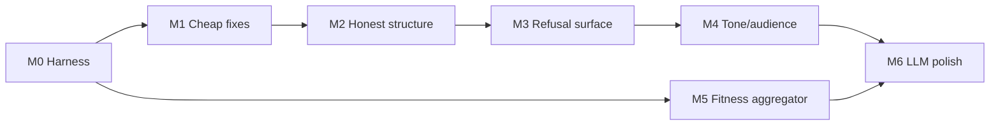

# Chain Essay / Prose Generator — Dev Roadmap

Companion to [Chain Essay Prose Generator refinement backlog.md](Chain%20Essay%20Prose%20Generator%20refinement%20backlog.md). Sequences the 15 backlog items into shippable milestones, with file targets, exit criteria, and test fixtures.

## Source files (single source of truth)
- Generator: [lib/chains/proseGenerator.ts](../lib/chains/proseGenerator.ts)
- Essay variant: [lib/chains/essayGenerator.ts](../lib/chains/essayGenerator.ts)
- Narrative variant: [lib/chains/narrativeGenerator.ts](../lib/chains/narrativeGenerator.ts)
- Markdown wrapper: [lib/chains/markdownFormatter.ts](../lib/chains/markdownFormatter.ts)
- Views: [components/chains/ChainEssayView.tsx](../components/chains/ChainEssayView.tsx), [components/chains/ChainProseView.tsx](../components/chains/ChainProseView.tsx)
- LLM polish ideation: [Development and Ideation Documents/CHAIN_FIRST_CLASS_IMPLEMENTATION/ESSAY_LLM_POLISH_IDEATION.md](../Development%20and%20Ideation%20Documents/CHAIN_FIRST_CLASS_IMPLEMENTATION/ESSAY_LLM_POLISH_IDEATION.md)
- Refusal surface (already cached): synthetic-readout `refusalSurface.cannotConcludeBecause`

## Guiding principles
1. **Honesty before fluency.** Items that fix overstated confidence (5, 11, 13, 14) block any LLM-polish work (10). A pretty essay with the wrong standing is worse than an ugly essay with the right one.
2. **Deterministic skeleton, LLM polish on top.** Rule-based generator stays the contract. LLM is a styling layer behind a flag with a per-`(chainId, tone, audience)` cache.
3. **No backend changes for M1–M3.** The chain GET endpoint already returns `epistemicStatus`, `dialecticalRole`, edge `edgeType` / `strength` / `description`. Synthetic-readout already exposes `refusalSurface`.
4. **Golden fixture from day one.** Hinge #1 (5 nodes / 4 edges) is the canonical snapshot.

---

## Milestone 0 — Test harness (prerequisite, ~½ day)
Establishes the regression net everything else lands on.

- [ ] Snapshot `/api/argument-chains/<hinge1-id>` to `__tests__/fixtures/chains/hinge1.json`.
- [ ] Add `__tests__/chains/proseGenerator.golden.test.ts` running the generator across the `{persuasive, deliberative, expository} × {novice, expert}` matrix, snapshotting to `__tests__/fixtures/chains/__snapshots__/`.
- [ ] Add a second fixture: a chain whose conclusion is in `refusalSurface.cannotConcludeBecause` (for M3 / item 13).
- [ ] Wire `npm run test -- proseGenerator` into the local loop.

**Exit:** snapshots committed; running `npm run test -- proseGenerator` is green.

---

## Milestone 1 — Cheap fixes (backlog items 1–4) — ~1 day
Pure-text bug fixes inside [proseGenerator.ts](../lib/chains/proseGenerator.ts). No new options, no data-shape changes. Each fix lands its own snapshot delta.

- [ ] **(1) Intro splice grammar.** Detect whether `chain.purpose` opens with a verb vs. a noun phrase; rewrite the lead-in per chain-type instead of one fixed splice. Add a `composeIntroLead(purpose, chainType)` helper, unit-tested on ~6 purpose strings.
- [ ] **(2) Premise case-folding.** Stop lowercasing the first token of premises that already start with a capital or look like a proper noun (token in title-case AND not in a small stoplist of sentence-starters like `It`, `The`, `A`). Keep the "First," / "Second," / "Third," ordinal prefix.
- [ ] **(3) Antithesis frame routes to wrong text.** Route by `dialecticalRole === "ANTITHESIS"` and pull `node.argument.conclusion.text`, not `chain.thesisClaimText`. Add a regression test asserting the antithesis paragraph contains the antithesis node's conclusion.
- [ ] **(4) CQ rendering for expert audience.** Exclude any CQ with a `CqStatus` row marking it answered. Reframe remaining open CQs as parentheticals ("the author addresses whether …") rather than a bullet list of raw questions joined by "and".

**Exit:** Hinge #1 essay reads grammatically; antithesis paragraph names B's claim; CQ section is either empty or parenthetical for expert audience.

---

## Milestone 2 — Honest structure (items 5, 6, 7, 11) — ~3 days
The "make it tell the standings story" milestone. This is the highest-leverage block and explicitly gates the LLM polish path (per external review).

### 2a. Per-node `epistemicStatus` language (item 5)
- [ ] Add `ProseOptions.respectEpistemicStatus` (default `true`).
- [ ] Implement a `statusModulator(text, status)` that wraps a node's rendered conclusion per status:
  - `ASSERTED` → declarative.
  - `QUESTIONED` → hedged ("plausibly", "on the available evidence").
  - `SUSPENDED` → counterfactual ("setting aside …").
  - `DENIED` → past-tense retired ("did not survive").
- [ ] Apply at paragraph composition (not as a post-hoc string transform) so transitions match.

### 2b. `dialecticalRole`-driven paragraph templates (item 6)
- [ ] Replace the linear-walk template with a role-keyed dispatcher: `THESIS | ANTITHESIS | SYNTHESIS | RESPONSE | CONCESSION` → distinct opener + discourse markers.
- [ ] Pull edge weights so a `CONCESSION` node that is itself rebutted reads as a concession the author then withdraws.

### 2c. Edge narrative as transitions (item 7)
- [ ] Replace the single "Flow" sentence with inline transitions between paragraphs.
- [ ] Transition template per `edgeType`: `REBUTS → "B counters that …"`, `UNDERCUTS → "Even granting the premise, …"`, `QUALIFIES → "More precisely, …"`, `SUPPORTS → "This is reinforced by …"`.
- [ ] Weight inclusion by `edge.strength`: drop edges below a configurable threshold (default 0.3); promote edges with `description` set by adding the description as a relative clause.

### 2d. Conclusion synthesis (item 11)
- [ ] Replace the "restate thesis" conclusion with a three-part synthesis:
  1. Which premises survived (count + names).
  2. Which objections fell and why (one clause per fallen objection, sourced from edge + node standings).
  3. The residual contested band (anything still `QUESTIONED` / `SUSPENDED` or any open CQ).
- [ ] Add `conclusionSynthesisInputs(chain)` returning the structured data the renderer needs, so the same inputs feed Brief view (item 14).

**Exit:** Hinge #1 essay (a) hedges QUESTIONED nodes, (b) treats B's paragraph as antithesis with REBUTS transitions, (c) conclusion names the surviving premises and the fallen objections; golden snapshot updated and reviewed.

---

## Milestone 3 — Refusal-surface honesty (items 13, 14) — ~1 day
External-review blocker: views currently render conclusions as if the chain closes even when the deliberation says it doesn't.

- [ ] In [ChainEssayView.tsx](../components/chains/ChainEssayView.tsx) and [ChainProseView.tsx](../components/chains/ChainProseView.tsx), fetch `/api/v3/deliberations/<id>/synthetic-readout`, filter `refusalSurface.cannotConcludeBecause` by `chain.rootClaim`.
- [ ] If non-empty, render a banner at the top of both views:
  > "This chain's conclusion is currently blocked by N unanswered objections; the weakest link is X."
  Link the blocker count to the relevant node.
- [ ] **Brief view dialectical outcomes (item 14):** for each argument in Brief, render its `standingState` badge (`tested-survived` / `tested-undermined` / `untested-default`), and if undermined, the one-line summary of the surviving objection (reuse `conclusionSynthesisInputs` from 2d).
- [ ] When refusal surface is non-empty, the conclusion paragraph from 2d MUST end with the honesty caveat (no positive closer). Add an assertion test.

**Exit:** the M0 second fixture (blocked-conclusion chain) renders the banner and a hedged conclusion; Brief view shows per-argument standings.

---

## Milestone 4 — Tone & audience are actually distinct (items 8, 9) — ~2 days
- [ ] Define a `ToneStrategy` interface:
  ```
  { openingVerbs: string[]; hedgeLevel: "none"|"low"|"med"|"high";
    person: "first"|"third"; antithesisTreatment: "steelman"|"dismiss";
    conclusionStrength: "assertive"|"qualified"|"open"; }
  ```
  with concrete objects for `persuasive`, `deliberative`, `expository`.
- [ ] Replace shared template strings (e.g. "Several factors converge…") with tone-keyed lookups; add a lint test that asserts no two tones produce identical opening sentences for the fixture.
- [ ] **Audience-driven premise rendering (item 9):**
  - `novice`: expand jargon via a small glossary map; paraphrase scheme premises into plain English.
  - `expert`: trust the reader; render author + year; preserve technical terms; surface CQs only as "addressed objections" parentheticals (already true after M1.4).

**Exit:** the `{tone × audience}` snapshot matrix shows clearly distinct prose per cell; no duplicate openers across tones.

---

## Milestone 5 — Standings-aware chain fitness (item 15) — ~½ day
Orthogonal to prose but listed in the backlog because the headline number is published via MCP and currently overstates fragility.

- [ ] Locate the chain-fitness aggregator (likely a method on the chain projection used by [DeliberationStateCard.tsx](../components/deliberation/DeliberationStateCard.tsx) and the `get_argument_chains` MCP tool — its description already promises "inbound attacks weighted by attacker standing" so verify the implementation matches the contract).
- [ ] If not yet implemented: weight each inbound attack by `1 - attackerSurvivalFactor` (refuted attacker → ≈0; unanswered → full −0.7).
- [ ] Add a unit test on Hinge #1 / Chain 3 asserting the new aggregate is materially less negative than the flat count.
- [ ] Bump `FINGERPRINT_VERSION` in `lib/deliberation/fingerprint.ts` to evict the readout cache.

**Exit:** Chain 3 fitness on Hinge #1 fixture moves from −7.0 toward a value that reflects the refuted attackers; MCP `get_argument_chains` returns the new breakdown.

---

## Milestone 6 — LLM polish pass (item 10, item 12) — ~3 days, behind a flag
Blocked on M2 + M3 + M5. Per the backlog: *"If the LLM polish pass is defined as 'make this read better,' it'll produce fluent versions of the same structural errors."*

- [ ] Implement per the [ESSAY_LLM_POLISH_IDEATION.md](../Development%20and%20Ideation%20Documents/CHAIN_FIRST_CLASS_IMPLEMENTATION/ESSAY_LLM_POLISH_IDEATION.md) doc:
  - Input: `{ chain, deterministicProse, tone, audience, standingsSummary }`.
  - Constraint prompt: "rewrite for fluency; do not introduce facts, citations, or claims not present in `deterministicProse`; preserve every hedge."
  - Fact-preservation guard: a post-pass diff that flags any new proper noun / numeric / citation token absent in the input prose — if any, fall back to deterministic output.
- [ ] Feature flag `CHAIN_ESSAY_LLM_POLISH` (env + per-deliberation override).
- [ ] Cache key: `(chainId, contentHash, tone, audience, modelId)` → polished text, in Redis with the same TTL as synthetic-readout.
- [ ] **(item 12) Weave purpose into intro.** Pass `chain.purpose` into the polish prompt as the standings narrative; the rule-based intro continues to use it via M1.1, but the polished version is permitted to elaborate.

**Exit:** with the flag on, Hinge #1 polished essay (a) reads materially better, (b) passes the fact-preservation guard, (c) still carries the M3 banner and M2 hedges; with the flag off, behaviour is byte-identical to M4.

---

## Cross-cutting test plan
- **Golden snapshots** at every milestone (added in M0, extended in each).
- **Contract tests**:
  - Antithesis paragraphs reference antithesis-node text (M1.3).
  - DENIED nodes never produce assertive language (M2a).
  - Conclusion paragraph never asserts a claim listed in `refusalSurface` (M3).
  - LLM polish output passes fact-preservation guard (M6).
- **Manual review gate**: after M2 and after M6, re-run Hinge #1 against the Claude Desktop feedback from the backlog and verify each cited quote no longer applies.

## Suggested execution order (sequencing summary)


## Backlog → milestone mapping
| Backlog item | Milestone |
| --- | --- |
| 1 Intro splice grammar | M1 |
| 2 Premise case-folding | M1 |
| 3 Antithesis frame text | M1 |
| 4 CQ rendering | M1 |
| 5 EpistemicStatus language | M2a |
| 6 DialecticalRole templates | M2b |
| 7 Edge transitions | M2c |
| 8 Tone presets distinct | M4 |
| 9 Audience premise rendering | M4 |
| 10 LLM polish pass | M6 |
| 11 Conclusion synthesis | M2d |
| 12 Purpose in intro | M1 (rule path) + M6 (polished path) |
| 13 Refusal-surface banner | M3 |
| 14 Brief view standings | M3 |
| 15 Chain fitness weighting | M5 |
