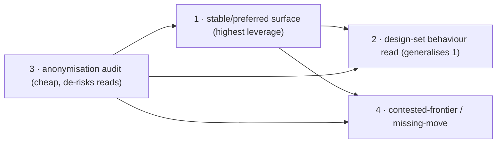

# Reading-C realizability — dev roadmap (items 1–4)

> **Status:** roadmap (this round). Scopes the four production work items that the
> additive-frontier / Reading-C theory now licenses (Q-002 → [T012](../RESEARCH_PROGRAMME/02_THEOREMS_AND_PROOFS/T012-reading-c-conservative.md);
> Q-039/C011 → [T015](../RESEARCH_PROGRAMME/02_THEOREMS_AND_PROOFS/T015-additive-realizability-keystone.md);
> Q-004 front (a) discharged). Each item is fleshed into a full dev spec in a
> following round — this doc fixes goals, surfaces, dependencies, sequencing, and
> acceptance so the specs drop into a settled frame.
>
> **Framing.** The theory shipped no production code. The exact engines already
> exist ([`lib/argumentation/semantics.ts`](../lib/argumentation/semantics.ts),
> [`lib/argumentation/labelling.ts`](../lib/argumentation/labelling.ts),
> [`packages/ludics-engine/`](../packages/ludics-engine/)). The work is **surfacing
> + policy**, and **every product-facing change is a gated decision**, not an
> automatic consequence of the proofs. The `lib/bridge/` additive prototype is the
> measurement instrument and is **not** productionised.

## 0. Warrant → work map

| Item | Warrant | One-line goal |
|------|---------|---------------|
| 1 | T015 (realizability trichotomy) | Surface **stable + preferred** acceptability through the deliberation path, not just grounded |
| 2 | T012 (nesting-invariant `⋀`-fold) | A **design-set (behaviour)** acceptability read, computed as an order-independent fold over pairwise interactions |
| 3 | T012 (verdict = position-property) | Enforce **participant-anonymisation** on default Ludics reads |
| 4 | Q-004 front (a) discharged | The **contested-frontier / missing-move** (latent-stratum) read |

Sequencing (details in §6): **3 → 1 → 2 → 4** (3 is a cheap audit that de-risks 1/2; 1 is highest-leverage; 2 generalises 1's read surface; 4 consumes the closure 1/3 settle).

---

## 1. Surface stable + preferred acceptability (T015)

**Goal.** The deliberation acceptability surface returns grounded **and**
stable/preferred credulous+skeptical membership, with the T015 discipline:
admissibility/stable/preferred-defence read off the engine, **maximality applied as
a separate constraint pass** (it is not an interaction verdict).

**Today.** [`app/api/aspic/evaluate/route.ts`](../app/api/aspic/evaluate/route.ts)
and [`app/api/aif/evaluate/route.ts`](../app/api/aif/evaluate/route.ts) return only
`groundedExtension`. `stableExtensions` / `preferredExtensions` /
`completeExtensions` already exist in
[`lib/argumentation/semantics.ts`](../lib/argumentation/semantics.ts); a standalone
[`app/api/af/stable/route.ts`](../app/api/af/stable/route.ts) computes stable in
isolation but nothing threads it into the deliberation verdict.

**Scope.** (a) extend the evaluate route(s) to compute stable/preferred and expose
credulous (`∃E. a∈E`) + skeptical (`∀E. a∈E`, with the empty-stable convention
T015 fixes); (b) a shared acceptability helper so AIF/ASPIC/AF paths agree; (c)
consumers/UI that render the richer verdict (read-only first).

**Affected.** `app/api/aspic/evaluate/route.ts`, `app/api/aif/evaluate/route.ts`,
`lib/aspic/deliberationEvaluation.ts`, a new `lib/argumentation/acceptability.ts`
(membership facade), downstream UI badges.

**Dependencies.** none hard; reads cleaner after item 3. **Gated:** surfacing
multiple semantics is a product decision (which verdict is "the" standing?).

**Acceptance.** evaluate returns grounded/stable/preferred credulous+skeptical;
membership matches `lib/argumentation` oracles on fixtures; empty-stable handled;
no change to the existing grounded field's value (additive only).

---

## 2. Design-set (behaviour) acceptability read (T012)

**Goal.** A read that asks "is `D_P` acceptable against this **behaviour** (a *set*
of opposition designs)?", computed — per T012 — as the **conjunction-fold over the
pairwise interactions**, which is **order- and nesting-independent**, hence safe to
parallelise and cache.

**Today.** The runtime read surface is pair-oriented (`⟨D_P ∣ D_O⟩` via
[`stepCore`](../packages/ludics-engine/stepCore.ts) / `stepper` /
[`checkOrthogonal`](../packages/ludics-engine/checkOrthogonal.ts)); behaviour-level
acceptability lives in [`behaviourClosure.ts`](../packages/ludics-engine/behaviourClosure.ts)
but is not exposed as a multi-witness verdict read.

**Scope.** (a) a `acceptableAgainstBehaviour(D_P, W)` read = `⋀_{w∈W}` pairwise
orthogonality, with T012's invariance as the correctness contract (the fold may
reorder/parallelise/cache freely); (b) expose it on the read API; (c) document the
set-semantics in the engine README.

**Affected.** `packages/ludics-engine/` (new read fn + export), the acceptability
facade from item 1, the read API surface.

**Dependencies.** item 1 (the membership facade is the natural caller); item 3
(the fold reads anonymous designs).

**Acceptance.** the set-read equals the pairwise `⋀` on fixtures; a permuted/cached
fold yields identical verdicts (the T012 invariance, as a property test);
single-witness reduces to the existing pair read.

---

## 3. Participant-anonymisation on default reads (T012)

**Goal.** Default Ludics acceptability reads carry **no `participantId`** — the
verdict is a position-property (T012). The attributed identity stays in the
witnessing layer, never leaking into the dialectical read.

**Today.** [`stepCore`](../packages/ludics-engine/stepCore.ts) already makes
`posParticipantId`/`negParticipantId` **optional**; the work is auditing every
default read path to confirm anonymity and adding a guard/lint so attribution
cannot silently enter.

**Scope.** (a) audit `stepper` / `checkOrthogonal` / the evaluate routes for
`participantId` on default reads; (b) a single documented seam where attribution is
*deliberately* attached (witnessing layer only); (c) a regression test asserting
default reads are anonymous.

**Affected.** `packages/ludics-engine/stepper.ts`, `checkOrthogonal.ts`, the read
routes; a test under `tests/` or `packages/ludics-engine/__tests__`.

**Dependencies.** none — smallest item, do first. **Risk:** low (mostly audit);
flag any existing read that *relies* on attribution (would be a finding).

**Acceptance.** default acceptability reads provably omit `participantId`; the one
attributed seam is documented; regression test green.

---

## 4. Contested-frontier / missing-move report (Q-004 front (a))

**Goal.** Surface the latent-stratum "missing-move report" — the
walked/witnessable/**latent** stratification of the objection space — now that
participation-closure (`Reach`) is discharged on the abstract-AF fragment
([C004 §4](../RESEARCH_PROGRAMME/mechanisation/agda/C004/C004.agda)).

**Today.** Described in `docs/isonomia-overview-general.md` §IV; the latent stratum
is the exposure map `κ` ([T013](../RESEARCH_PROGRAMME/02_THEOREMS_AND_PROOFS/T013-exposure-map-stratified-strength.md))
and progress is its drainage ([T014](../RESEARCH_PROGRAMME/02_THEOREMS_AND_PROOFS/T014-exposure-map-drainage.md)).
Was gated on front (a); now unblocked.

**Scope.** (a) a read that returns, for a deliberation, the latent objections
(in-behaviour, reached by no current witness) and the drainage delta; (b) surface
as the "contested frontier / missing-move" panel. **Not** the *minimal*-separating-
context rewire — that stays gated on Q-041's verified extractor.

**Affected.** `packages/ludics-engine/` (latent-stratum read), the joint-saturation
path, the §IV UI surface.

**Dependencies.** items 1+3 (clean behaviour read + anonymity); Q-004 front (a)
(done). **Boundary:** keep the minimal-locus surface gated (Q-041).

**Acceptance.** the report lists latent moves and the per-step drainage; the
minimal-locus claim is **not** surfaced; matches T013/T014 strata on fixtures.

---

## 5. Cross-cutting

- **Gating.** Items 1 and 4 are product-facing — ship behind a flag / read-only
  first; the standing-verdict choice (grounded vs preferred-skeptical) is a
  governance decision, not a default.
- **No engine forks.** Reuse `lib/argumentation` + `packages/ludics-engine`; do not
  productionise `lib/bridge/`.
- **DB.** None expected for 1–4 (read/compute only). Item 5 (ratified-subgraph,
  out of this roadmap) composes with the existing `ratificationStatus` filter.
- **Tests.** Each item ships a property/fixture test tied to its `lib/argumentation`
  or T012/T013/T014 oracle.

## 6. Sequencing

## 7. Next rounds

Flesh out, one per round, in this order: **3** (audit + guard + test) → **1**
(acceptability facade + evaluate routes + UI) → **2** (behaviour read + invariance
property test) → **4** (latent-stratum read + §IV panel). Each round produces a full
dev spec (schema if any, exact diffs, test plan, deploy notes) in `docs/`, mirroring
[`ATTACK_RATIFICATION_DEV_SPEC.md`](ATTACK_RATIFICATION_DEV_SPEC.md). Item 5
(preferred/stable over ratified subgraphs; transport Q-006) is tracked separately.
