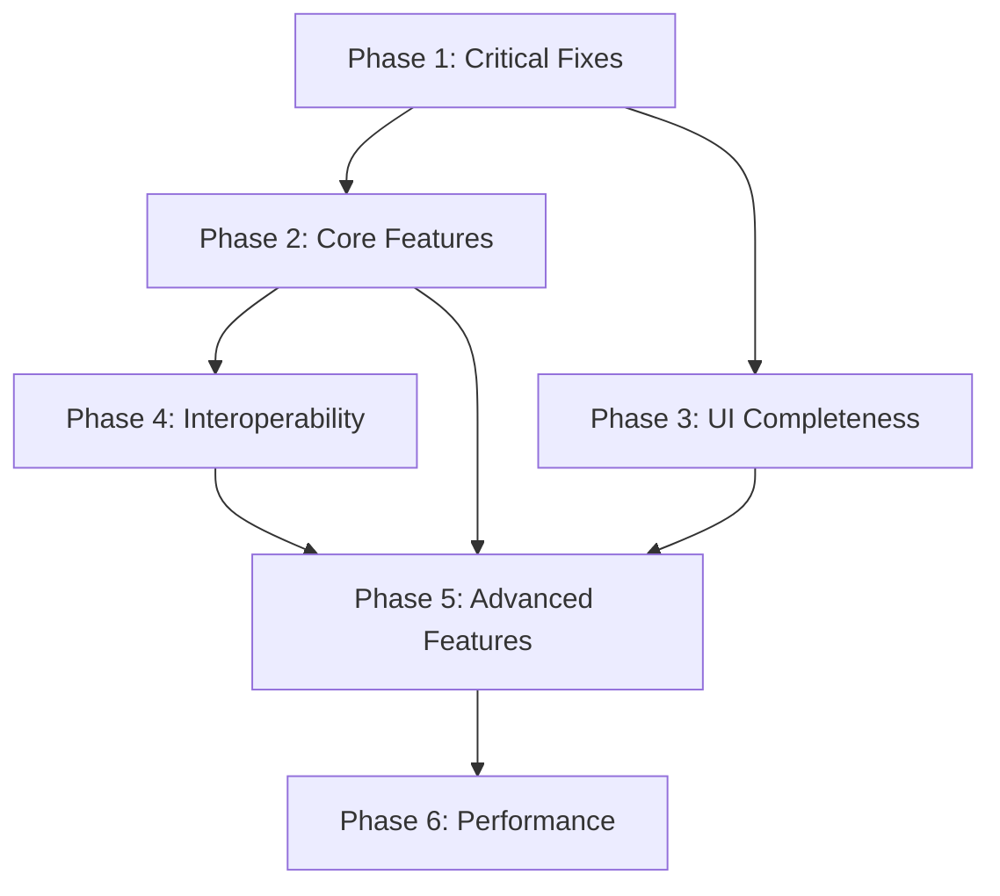

# Mesh Agora Development Roadmap

**Created:** October 28, 2025  
**Status:** Phase 1 In Progress  
**Overall System Grade:** A- (90%)

---

## 📊 Quick Status Dashboard

| Phase | Description | Tasks | Progress |
|-------|-------------|-------|----------|
| **Phase 1** | Critical Integration Fixes | 11 | 🟢 **11/11 (100%)** ✅ |
| **[Phase 2](./phase-2-core-features.md)** | Core Feature Completion | 6-8 weeks | 18 | ⏳ Not Started | 0/18 (0%) |
| **[Phase 3](./phase-3-ui-completeness.md)** | UI Completeness & Polish | 4-6 weeks | 15 | ⏳ Not Started | 0/15 (0%) |
| **[Phase 4](./phase-4-interoperability.md)** | Interoperability & Validation | 3-4 weeks | 12 | ⏳ Not Started | 0/12 (0%) |
| **[Phase 5](./phase-5-advanced-features.md)** | Advanced Features (DDF, Commitments) | 8-10 weeks | 22 | ⏳ Not Started | 0/22 (0%) |
| **[Phase 6](./phase-6-performance.md)** | Performance & Scale | 4-6 weeks | 16 | ⏳ Not Started | 0/16 (0%) |

**Overall Progress:** 11/94 tasks complete (12%)  
**Estimated Completion:** June 2026 (6-8 months from start)

---

## 🎯 Executive Summary

This roadmap consolidates findings from comprehensive architecture review (11 chunks across 6 phases) into actionable development stages. The Mesh Agora system demonstrates excellent theoretical foundations with strong implementation quality (A- / 90%), requiring targeted fixes in integration gaps, UI completeness, and external tool validation.

### System Status Overview

**Phase Grades:**
- Phase 1 (AIF Core): A+ (96%) - Excellent foundation
- Phase 2 (Evidential): A+ (95%) - Strong categorical implementation
- Phase 3 (Schemes & Dialogue): A (93%) - Research-grade features
- Phase 4 (UI Integration): A- (90%) - Comprehensive components
- Phase 5 (Plexus Network): A- (90%) - Sophisticated topology
- Phase 6 (KB & Export): B+ (85%) - Good architecture, needs polish

**Overall Average: A- (90%)**

### Research-Grade Innovations

1. **Proof Obligation Enforcement for CQs** ⭐⭐⭐⭐⭐  
   *First system requiring structural/semantic proof for CQ satisfaction*

2. **Ludics Integration** ⭐⭐⭐⭐⭐  
   *Unique: Automatic daimon closure detection in argumentation*

3. **τ-Gating Across Networks** ⭐⭐⭐⭐  
   *Threshold-based confidence filtering for multi-deliberation systems*

4. **Dual-Persistence Confidence** ⭐⭐⭐⭐  
   *Client + server confidence state management*

---

## 🗺️ Roadmap Phases

### [Phase 1: Critical Integration Fixes](./phase-1-critical-fixes.md)
**Duration:** 2-4 weeks | **Priority:** 🔴 Critical

Wire disconnected systems together. Connect CQ satisfaction to confidence, fix UI property bugs, establish round-trip import/export.

**Key Deliverables:**
- ✅ CQ penalty integrated into confidence calculation
- ✅ Scheme base confidence applied
- ✅ Room default mode wired through API
- ✅ Confidence explanation popover added
- ✅ Import preserves schemes and preferences
- ✅ Round-trip test suite in CI
- ✅ KB ↔ Deliberation bidirectional linking

**Success Metrics:**
- Round-trip test passes with <5% node loss
- Confidence explanation visible on 100% of SupportBars
- No console errors on DiagramViewer

---

### [Phase 2: Core Feature Completion](./phase-2-core-features.md)
**Duration:** 6-8 weeks | **Priority:** 🟠 High

Implement missing backend logic: dialogue state computation, temporal decay, AssumptionUse lifecycle, DS mode completion.

**Key Deliverables:**
- Dialogue state API (which attacks answered)
- Temporal confidence decay formula
- Complete Dempster-Shafer implementation
- AssumptionUse per-derivation tracking
- Response vote integration
- NLI threshold configurability

---

### [Phase 3: UI Completeness & Polish](./phase-3-ui-completeness.md)
**Duration:** 4-6 weeks | **Priority:** 🟡 Medium

Expose all backend capabilities in UI: AssumptionUse display, hom-set visualization, scheme taxonomy filters, commitment store UI.

**Key Deliverables:**
- AssumptionUse display on ArgumentCard
- Hom-set visualization component
- Scheme taxonomy filtering
- Dialogue state badges
- KB rich text editor (Lexical/TipTap)
- Drag-and-drop block reordering

---

### [Phase 4: Interoperability & Validation](./phase-4-interoperability.md)
**Duration:** 3-4 weeks | **Priority:** 🟡 Medium

Validate AIF exports with external tools, implement lossless import, add format validators.

**Key Deliverables:**
- Full AIF import (all 6 node types + metadata)
- JSON-LD validation with jsonld.js
- OVA+/AIFdb compatibility testing
- Carneades LKIF export
- AIF validator service
- KB → AIF-JSON-LD export

---

### [Phase 5: Advanced Features](./phase-5-advanced-features.md)
**Duration:** 8-10 weeks | **Priority:** 🟢 Low

Implement DDF protocol, commitment stores, sentence type ontology, advanced network features.

**Key Deliverables:**
- 8-stage DDF dialogue lifecycle
- Commitment store tracking
- Sentence type ontology (6 types)
- R6 incoherence checking
- Plexus clustering algorithm
- Network metrics dashboard
- Real-time collaboration (WebSockets)

---

### [Phase 6: Performance & Scale](./phase-6-performance.md)
**Duration:** 4-6 weeks | **Priority:** 🟢 Low

Optimize performance, add caching, implement batch operations, analytics integration.

**Key Deliverables:**
- Incremental ArgumentSupport updates
- Redis caching for confidence scores
- Batch transclude API optimization
- Query performance profiling
- Analytics integration
- Error boundaries and monitoring

---

## 📋 Phase Dependencies



**Critical Path:** Phase 1 → Phase 2 → Phase 5 (longest duration)

**Parallel Work Opportunities:**
- Phase 3 (UI) can start after Phase 1 completes
- Phase 4 (Interop) can run parallel to Phase 3
- Phase 6 (Performance) requires all features complete

---

## 🎯 Success Metrics

### Technical Metrics
- **Code Coverage:** >80% for new features
- **API Response Time:** <200ms (95th percentile)
- **Round-Trip Fidelity:** <5% node loss on export → import
- **Test Pass Rate:** 100% on main branch
- **Bundle Size:** <500KB additional JS

### User Experience Metrics
- **Confidence Explanation Usage:** 90%+ users interact with popover
- **Room Mode Adoption:** 95%+ rooms use custom confidence mode
- **KB Citation Rate:** 50%+ pages cite deliberations
- **Dialogue Move Success:** <10% validation failures
- **Page Load Time:** <2s on average network

### Quality Metrics
- **Critical Bugs:** 0 in production
- **Minor Bugs:** <3 per 10 PRs
- **Documentation Coverage:** 100% for public APIs
- **Lint Warnings:** 0 on main branch

---

## 🚦 Implementation Guidelines

### Development Workflow

1. **Branch Strategy:** Feature branches from `main` (e.g., `feat/phase-1-cq-integration`)
2. **Commit Convention:** Present-tense, double quotes ("Add CQ penalty calculation")
3. **PR Template:** Link to roadmap task, include acceptance criteria checklist
4. **Testing:** Run `npm run lint`, `npm run test` before PR
5. **Review:** All PRs require CI pass + 1 approval

### Common Patterns

**Prisma Transactions:**
```typescript
await prisma.$transaction(async (tx) => {
  const claim = await tx.claim.create({ data });
  await tx.debateCitation.create({ data: { ... } });
});
```

**SWR Caching:**
```typescript
const { data, mutate } = useSWR(
  `/api/evidential/score?id=${id}&explain=1`,
  fetcher,
  { revalidateOnFocus: false, dedupingInterval: 5000 }
);
```

**Zod Validation:**
```typescript
const schema = z.object({
  base: z.number().min(0).max(1),
  cqPenalty: z.number().min(0).max(1)
});
```

### Risk Mitigation

**Breaking Changes:**
- Use feature flags for major changes (`ENABLE_CQ_PENALTY=true`)
- Maintain backward compatibility for 2 versions
- Document deprecations with migration guides

**Data Migration:**
- Run migrations on staging first
- Create backfill scripts for historical data
- Monitor Sentry for migration errors

**Rollback Plan:**
- Keep feature flags in code for 1 sprint after launch
- Document rollback procedures per phase
- Tag releases for easy revert (`v1.0.0-phase-1`)

---

## 📚 Related Documents

### Architecture Review (Completed)
- [REVIEW_STATUS_SUMMARY.md](../REVIEW_STATUS_SUMMARY.md) - Overall assessment
- [CHUNK_1A_AIF_Core_Types_Translation.md](../CHUNK_1A_AIF_Core_Types_Translation.md) - AIF foundation
- [CHUNK_2A_Evidential_Category_Implementation.md](../CHUNK_2A_Evidential_Category_Implementation.md) - Confidence backend
- [CHUNK_3A_Scheme_System_Critical_Questions.md](../CHUNK_3A_Scheme_System_Critical_Questions.md) - Schemes & CQs
- [CHUNK_3B_Dialogue_Protocol_Legal_Moves.md](../CHUNK_3B_Dialogue_Protocol_Legal_Moves.md) - Dialogue rules
- [CHUNK_6B_AIF_Export_Seeding_Interop.md](../CHUNK_6B_AIF_Export_Seeding_Interop.md) - Export/import

### Research Foundations
- [FOUNDATIONAL_RESEARCH_SYNTHESIS.md](../FOUNDATIONAL_RESEARCH_SYNTHESIS.md) - Theoretical background
- See all 11 CHUNK files for detailed component analysis

---

## 📞 Contact & Support

**Questions about roadmap?** Open issue tagged `roadmap-question`  
**Found a bug in Phase X?** Open issue tagged `phase-X-bug`  
**Suggesting improvements?** Open PR against roadmap files with rationale

**Roadmap Maintainer:** AI Architecture Review Team  
**Last Updated:** October 28, 2025  
**Next Review:** After Phase 1 completion (estimated December 2025)

---

## 🔄 Version History

| Date | Version | Changes |
|------|---------|---------|
| Oct 28, 2025 | 1.0 | Initial roadmap creation with 6 phases, 94 tasks |
| TBD | 1.1 | Update after Phase 1 completion |

---

**Start Here:** [Phase 1: Critical Integration Fixes →](./phase-1-critical-fixes.md)
