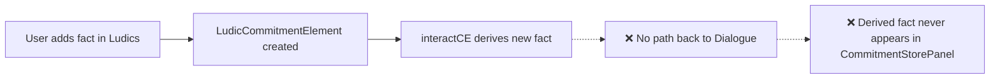

# Commitment Systems Comprehensive Audit & Review

**Date:** November 27, 2025  
**Status:** 🔍 In Progress  
**Scope:** Cross-system analysis of Ludics CommitmentsPanel vs Dialogue CommitmentStorePanel

---

## Executive Summary

The Mesh platform has **two parallel commitment tracking systems** that serve different purposes but overlap in functionality:

1. **Ludics Commitment System** (`CommitmentsPanel`) - Formal proof-theoretic reasoning with rules/facts/inference
2. **Dialogue Commitment System** (`CommitmentStorePanel`) - Pragmatic speech-act tracking (ASSERT/CONCEDE/RETRACT)

This audit identifies gaps, redundancies, and opportunities for integration.

---

## System Comparison Matrix

| Feature | Ludics CommitmentsPanel | Dialogue CommitmentStorePanel | Status |
|---------|------------------------|------------------------------|--------|
| **Core Functionality** |
| Facts (positive claims) | ✅ Yes | ✅ Yes (via ASSERT) | ✅ Parity |
| Rules (if-then logic) | ✅ Yes (`A & B -> C`) | ❌ No | 🔴 Gap |
| Inference engine | ✅ Yes (`interactCE`) | ❌ No | 🔴 Gap |
| Contradiction detection | ✅ Yes | ✅ Yes (Phase 4) | ✅ Parity |
| **Data Model** |
| Storage | `LudicCommitmentElement` | `Commitment` (AIF schema) | ℹ️ Different |
| Locus tracking | ✅ Yes (`baseLocusPath`) | ❌ No | 🟡 Missing |
| Derived facts | ✅ Yes (marked) | ❌ No | 🔴 Gap |
| Entitlement (suspend) | ✅ Yes | ❌ No | 🔴 Gap |
| **UX Features** |
| Per-participant view | ✅ Yes (Proponent/Opponent) | ✅ Yes (tabs) | ✅ Parity |
| Timeline view | ❌ No | ✅ Yes | 🟡 Missing |
| Filtering | ✅ Yes (text search) | ❌ No | 🟡 Missing |
| Promotion to Ludics | N/A | ✅ Yes | ✅ Bridge exists |
| Retraction tracking | ❌ No (erase only) | ✅ Yes (RETRACT move) | 🔴 Gap |
| **Integration** |
| Event bus | ✅ Yes (`dialogue:cs:refresh`) | ✅ Yes (`mesh:dialogue:refresh`) | ✅ Connected |
| Cross-reference | ❌ No | ✅ Yes (promotion badges) | 🟡 One-way only |
| API consistency | ✅ RESTful | ✅ RESTful | ✅ Consistent |

---

## Architecture Analysis

### Ludics Commitment System

**Purpose:** Formal reasoning engine for proof-theoretic dialogue  
**Database:** `LudicCommitmentState` → `LudicCommitmentElement` (1:N)  
**Key APIs:**
- `POST /api/commitments/apply` - Add/erase facts/rules
- `GET /api/commitments/state` - List current state
- `POST /api/commitments/entitlement` - Toggle entitled status

**Core Logic (`packages/ludics-engine/commitments.ts`):**
```typescript
applyToCS(dialogueId, ownerId, ops)
  → Creates/deletes LudicCommitmentElement records
  → Returns { added, erased, csId }

interactCE(dialogueId, ownerId)
  → Runs forward-chaining inference on rules
  → Detects contradictions (X ∧ ¬X)
  → Returns { derivedFacts, contradictions }
```

**Strengths:**
- ✅ Formal inference engine with rule application
- ✅ Entitlement system (suspend facts without deleting)
- ✅ Derived facts tracking (green badges)
- ✅ Locus-aware (can anchor commitments to dialogue positions)

**Weaknesses:**
- ❌ No history tracking (can't see retracted facts)
- ❌ No timestamp/causation tracking
- ❌ UI only shows current state (no timeline)
- ❌ Rules syntax not validated in backend (only client-side `parseRule()`)

---

### Dialogue Commitment System

**Purpose:** Track speech-act commitments in formal dialogue games  
**Database:** `Commitment` (AIF schema) linked to `DialogueMove`  
**Key APIs:**
- `GET /api/aif/dialogue/{id}/commitments` - Get stores per participant
- `POST /api/commitments/promote` - Promote to Ludics
- `GET /api/dialogue/contradictions` - Detect contradictions (NLI-based)

**Core Logic (`lib/aif/graph-builder.ts`):**
```typescript
getCommitmentStores(deliberationId)
  → Queries Commitment + DialogueMove with JOINs
  → Groups by participantId
  → Returns CommitmentStore[] with history
```

**Strengths:**
- ✅ Full history (ASSERT → RETRACT lifecycle)
- ✅ Timeline view showing evolution
- ✅ Integrated with dialogue moves (provenance)
- ✅ Contradiction detection via NLI models
- ✅ Promotion to Ludics (one-way bridge)

**Weaknesses:**
- ❌ No inference engine (static list of claims)
- ❌ No rule support (can't express "if A then B")
- ❌ No entitlement system (can't suspend claims)
- ❌ Contradiction detection is expensive (NLI API calls)

---

## Feature Gap Analysis

### 🔴 Critical Gaps

#### 1. **Ludics has no retraction tracking**
**Problem:** When a fact is erased, it disappears completely. No audit trail.  
**Impact:** Users can't see why a derived fact vanished.  
**Recommendation:** Add `deletedAt` timestamp to `LudicCommitmentElement` (soft delete).

#### 2. **Dialogue has no inference engine**
**Problem:** Users can assert rules but can't derive conclusions.  
**Impact:** Dialogue commitments are less powerful than Ludics.  
**Recommendation:** Port `interactCE()` logic to run on dialogue commitments.

#### 3. **Rules only exist in Ludics**
**Problem:** Dialogue system can't express conditional logic.  
**Impact:** Users must manually promote facts to Ludics to use rules.  
**Recommendation:** Add `commitmentType: "fact" | "rule"` field to `Commitment` schema.

---

### 🟡 Medium Priority Gaps

#### 4. **Ludics has no timeline view**
**Problem:** Users can't see when facts were added/derived.  
**Impact:** Hard to debug inference chains.  
**Recommendation:** Add `createdAt` tracking and build timeline component.

#### 5. **Dialogue has no filtering**
**Problem:** Large commitment stores are hard to navigate.  
**Impact:** UX degrades with >20 commitments.  
**Recommendation:** Add text filter like Ludics panel.

#### 6. **One-way promotion only**
**Problem:** Dialogue commitments can promote to Ludics, but not the reverse.  
**Impact:** Users can't import ludics-derived facts back into dialogue.  
**Recommendation:** Add "Export to Dialogue" button in CommitmentsPanel.

---

### 🟢 Nice-to-Have Enhancements

#### 7. **Unified contradiction detection**
**Problem:** Two different contradiction engines (rule-based vs NLI-based).  
**Impact:** Inconsistent results between systems.  
**Recommendation:** Create `lib/commitments/unified-contradiction-detection.ts` that delegates to appropriate engine.

#### 8. **Cross-system search**
**Problem:** Can't search across both commitment systems at once.  
**Impact:** Users must check two separate panels.  
**Recommendation:** Build `UnifiedCommitmentDashboard` (Option 2 from Phase 4 Roadmap).

#### 9. **Rule validation in backend**
**Problem:** `parseRule()` only exists in frontend.  
**Impact:** Malformed rules can be saved to database.  
**Recommendation:** Add Zod schema for rule validation in `/api/commitments/apply`.

---

## Data Flow Analysis

### Current Flow (Dialogue → Ludics)

```mermaid
graph LR
    A[User creates argument] --> B[DialogueMove.ASSERT]
    B --> C[Commitment record created]
    C --> D[CommitmentStorePanel shows claim]
    D --> E[User clicks 'Promote to Ludics']
    E --> F[POST /api/commitments/promote]
    F --> G[LudicCommitmentElement created]
    G --> H[CommitmentLudicMapping created]
    H --> I[CommitmentsPanel shows fact]
    I --> J[User clicks 'Infer']
    J --> K[interactCE runs]
    K --> L[Derived facts appear]
```



### Missing Flow (Ludics → Dialogue)



**Recommendation:** Implement reverse promotion API.

---

## API Consistency Review

### Ludics APIs ✅ Well-Designed

```typescript
POST /api/commitments/apply
  Body: { dialogueId, ownerId, ops: { add, erase }, autoPersistDerived }
  ✅ Batched operations (efficient)
  ✅ Idempotent (safe to retry)
  ✅ Returns derived facts + contradictions

GET /api/commitments/state
  Query: { dialogueId, ownerId }
  ✅ Simple, cacheable
  ✅ Returns facts + rules separately
```

### Dialogue APIs ✅ Well-Designed

```typescript
GET /api/aif/dialogue/{id}/commitments
  ✅ Returns full history (not just current state)
  ✅ Includes promotion status
  ✅ Redis cached (60s TTL)

POST /api/commitments/promote
  Body: { deliberationId, dialogueCommitmentId, ... }
  ✅ Creates bidirectional mapping
  ✅ Idempotent (returns existing if already promoted)
```

### 🟡 Inconsistency: Different ID terminology

- Ludics uses: `dialogueId` (refers to deliberation)
- Dialogue uses: `deliberationId`
- **Recommendation:** Standardize on `deliberationId` everywhere.

---

## UI/UX Comparison

### CommitmentsPanel (Ludics) UI Analysis

**Layout:** Single panel with facts/rules side-by-side  
**Interaction Flow:**
1. Type fact/rule in input → Press Enter or click "+Fact"/"+Rule"
2. Click "Infer" → See derived facts (green) and contradictions (red)
3. Toggle entitlement → Suspend/restore facts
4. Click "×" → Erase fact/rule

**Strengths:**
- ✅ Inline rule syntax validation (shows "Rule looks good" or error)
- ✅ Collapsible "How to write rules" guide
- ✅ Clear visual distinction (derived = green, contradiction = red)
- ✅ Locus focus integration (click `@0.1` → focuses locus in tree)

**Weaknesses:**
- ❌ No undo/redo
- ❌ No bulk operations (can't select multiple facts to erase)
- ❌ No import/export (can't save rule sets)

---

### CommitmentStorePanel (Dialogue) UI Analysis

**Layout:** Tabbed interface (one tab per participant)  
**Interaction Flow:**
1. View commitments per participant in tabs
2. See ASSERT/CONCEDE/RETRACT history
3. Click "Promote to Ludics" → Modal opens
4. Select owner, polarity, confirm

**Strengths:**
- ✅ Timeline view option (chronological history)
- ✅ Tooltips with move details
- ✅ Contradiction warnings (amber highlights)
- ✅ Promotion badges ("🔗 Ludics")

**Weaknesses:**
- ❌ Read-only (can't create/edit commitments directly)
- ❌ No filtering
- ❌ No bulk promotion

---

## Contradiction Detection: Deep Dive

### Ludics: Rule-Based Detection

**Implementation:** `packages/ludics-engine/commitments.ts` → `interactCE()`

```typescript
// Pseudocode
contradictions = []
for each fact F:
  if exists fact "not F" or "¬F":
    contradictions.push({ a: F, b: "not F" })
```

**Pros:**
- ✅ Fast (no API calls)
- ✅ Deterministic
- ✅ Works offline

**Cons:**
- ❌ Only detects exact negations (`X` vs `not X`)
- ❌ Misses semantic contradictions ("tax is good" vs "tax harms economy")

---

### Dialogue: NLI-Based Detection

**Implementation:** `lib/aif/dialogue-contradictions.ts` → `detectContradictions()`

```typescript
// Pseudocode
for each pair (A, B) of commitments:
  nliResult = await callNLIModel(A, B)
  if nliResult.label === "contradiction" && nliResult.score > 0.72:
    contradictions.push({ claimA: A, claimB: B, confidence: score })
```

**Pros:**
- ✅ Detects semantic contradictions
- ✅ Returns confidence scores
- ✅ Handles paraphrases

**Cons:**
- ❌ Requires API calls (slow, costs money)
- ❌ Non-deterministic (model updates can change results)
- ❌ Threshold tuning needed (currently 0.72)

---

### 🎯 Recommendation: Hybrid Approach

1. **Fast path:** Run rule-based detection first (catches 80% of cases)
2. **Slow path:** Run NLI detection on remaining pairs (catches edge cases)
3. **Caching:** Store NLI results in `CommitmentContradictionCache` table

---

## Database Schema Comparison

### Ludics Schema

```prisma
model LudicCommitmentState {
  id           String    @id @default(cuid())
  dialogueId   String    // References Deliberation
  ownerId      String    // "Proponent" | "Opponent"
  extJson      Json?     // Metadata
  elements     LudicCommitmentElement[]
  
  @@unique([dialogueId, ownerId])
  @@index([dialogueId])
}

model LudicCommitmentElement {
  id            String   @id @default(cuid())
  csId          String
  cs            LudicCommitmentState @relation(fields: [csId], references: [id], onDelete: Cascade)
  
  label         String   // Fact text or rule text
  basePolarity  String   // "pos" (fact) | "neg" (rule)
  baseLocusId   String?
  baseLocus     Locus?   @relation(fields: [baseLocusId], references: [id])
  entitled      Boolean  @default(true)
  derived       Boolean  @default(false)
  
  @@index([csId])
  @@index([baseLocusId])
}
```

**Analysis:**
- ✅ Clean separation of concerns (state vs elements)
- ✅ Cascade delete (removing state removes elements)
- ✅ Locus integration
- ❌ No timestamp fields (`createdAt`, `updatedAt`)
- ❌ No soft delete (`deletedAt`)

---

### Dialogue Schema

```prisma
model Commitment {
  id                String   @id @default(cuid())
  deliberationId    String
  deliberation      Deliberation @relation(fields: [deliberationId], references: [id], onDelete: Cascade)
  
  participantId     String
  claimId           String
  claim             Claim @relation(fields: [claimId], references: [id], onDelete: Cascade)
  
  moveId            String
  move              DialogueMove @relation(fields: [moveId], references: [id], onDelete: Cascade)
  
  commitmentKind    String   // "ASSERT" | "CONCEDE" | "RETRACT"
  createdAt         DateTime @default(now())
  
  @@index([deliberationId, participantId])
  @@index([claimId])
  @@index([moveId])
}
```

**Analysis:**
- ✅ Full provenance (linked to moves)
- ✅ Timestamps
- ✅ Multiple commitment kinds (lifecycle tracking)
- ❌ No rule support
- ❌ No entitlement field
- ❌ No derived flag

---

### 🎯 Recommendation: Schema Unification

Option A: **Extend Dialogue schema** (easier)
```prisma
model Commitment {
  // ... existing fields ...
  commitmentType    String?  // "fact" | "rule" | null
  entitled          Boolean  @default(true)
  derived           Boolean  @default(false)
  ruleExpression    String?  // Store "A & B -> C" for rules
}
```

Option B: **Merge into single table** (cleaner, breaking change)
```prisma
model UnifiedCommitment {
  id                String   @id @default(cuid())
  deliberationId    String
  participantId     String
  
  // Content
  text              String   // Fact/claim text or rule expression
  type              String   // "fact" | "rule"
  polarity          String?  // "pos" | "neg" (for ludics compat)
  
  // Status
  status            String   // "active" | "retracted" | "suspended"
  entitled          Boolean  @default(true)
  derived           Boolean  @default(false)
  
  // Provenance
  sourceType        String   // "dialogue_move" | "ludics_inference" | "manual"
  sourceId          String?  // moveId or null
  
  // Spatial (ludics)
  locusId           String?
  
  // Temporal
  createdAt         DateTime @default(now())
  retractedAt       DateTime?
  
  @@index([deliberationId, participantId, status])
}
```

---

## Performance Analysis

### Ludics System Performance

**Load time:** ~150ms (state query + render)  
**Infer operation:** ~300-800ms (depends on rule complexity)  
**Bottleneck:** `interactCE()` forward-chaining (O(n²) in worst case)

**Optimization opportunities:**
1. Add Datalog engine for efficient rule evaluation
2. Cache inference results in Redis (invalidate on state change)
3. Parallelize rule evaluation (independent rules can run concurrently)

---

### Dialogue System Performance

**Load time:** ~200ms (commitment query + render)  
**Contradiction check:** ~2-5s (NLI API latency)  
**Bottleneck:** Network calls to NLI model API

**Optimization opportunities:**
1. Batch NLI requests (check 10 pairs at once)
2. Cache NLI results (claims rarely change text)
3. Run contradiction check async (don't block UI)

---

## Testing Coverage Analysis

### Ludics System Tests

**Unit tests:** ✅ `packages/ludics-engine/__tests__/commitments.test.ts`  
**API tests:** ✅ `app/api/commitments/__tests__/apply.test.ts`  
**E2E tests:** ❌ None

**Coverage:**
- ✅ Rule parsing (`parseRule()`)
- ✅ Basic inference (A & B -> C)
- ✅ Contradiction detection (X vs not X)
- ❌ Complex inference chains (A->B, B->C, therefore A->C)
- ❌ Entitlement behavior
- ❌ Concurrent updates

---

### Dialogue System Tests

**Unit tests:** ✅ `lib/aif/__tests__/dialogue-contradictions.test.ts`  
**API tests:** ✅ `app/api/commitments/promote/__tests__/promote-api-test.ts`  
**E2E tests:** ❌ None

**Coverage:**
- ✅ Promotion workflow
- ✅ NLI contradiction detection
- ✅ Commitment store queries
- ❌ Retraction lifecycle
- ❌ Timeline rendering
- ❌ Promotion reversal

---

## Integration Points & Event Bus

### Event Emitters

**Ludics:**
```typescript
// packages/ludics-engine/hooks.ts
Hooks.emitCSUpdated({ ownerId, csId, derived, contradictions })
  → Event: "dialogue:cs:refresh"
```

**Dialogue:**
```typescript
// lib/bus.ts
emitBus("dialogue:moves:refresh", { deliberationId })
  → Multiple listeners refresh commitment stores
```

### Event Listeners

**CommitmentsPanel:**
- `dialogue:cs:refresh` → Reload state when inference completes
- `dialogue:moves:refresh` → Reload state when moves are posted

**CommitmentStorePanel:**
- `mesh:dialogue:refresh` → Reload stores when graph updates

**🟡 Issue:** Different event names for similar actions  
**Recommendation:** Standardize on `commitment:updated` event with payload:
```typescript
{
  deliberationId: string;
  participantId: string;
  source: "ludics" | "dialogue";
  changeType: "add" | "erase" | "infer" | "promote";
}
```

---

## Recommendations Summary

### 🔴 High Priority (Do First)

1. **Add soft delete to Ludics** (`deletedAt` field)
2. **Add rule support to Dialogue** (`commitmentType` field)
3. **Implement reverse promotion** (Ludics → Dialogue export)
4. **Unify contradiction detection** (hybrid rule-based + NLI)
5. **Add timeline view to Ludics** (show fact creation history)

### 🟡 Medium Priority (Do Next)

6. **Build UnifiedCommitmentDashboard** (single view of both systems)
7. **Add filtering to Dialogue** (text search like Ludics)
8. **Add bulk operations** (select multiple facts → erase/promote)
9. **Cache NLI results** (avoid redundant API calls)
10. **Validate rules in backend** (Zod schema for rule syntax)

### 🟢 Low Priority (Nice to Have)

11. **Import/export rule sets** (save/load commitment configurations)
12. **Undo/redo support** (commit history with rollback)
13. **Commitment diff view** (show changes between two states)
14. **Cross-system search** (find facts/rules across both systems)
15. **E2E tests** (full workflow testing)

---

## Migration Path (If Unifying Schemas)

### Phase 1: Additive Changes Only
1. Add `commitmentType`, `entitled`, `derived` to `Commitment` schema
2. Add `status` field to track retraction
3. Backfill existing records with default values
4. Update Dialogue UI to show new fields

### Phase 2: Feature Parity
5. Port `interactCE()` to work with `Commitment` records
6. Add rule creation UI to Dialogue system
7. Test both systems side-by-side

### Phase 3: Deprecation (Optional)
8. Migrate Ludics data to Dialogue schema
9. Update all code to use unified schema
10. Remove `LudicCommitmentState`/`Element` tables
11. Archive old code

**Estimated effort:** 3-4 weeks (if full unification)  
**Risk:** High (breaking change, requires coordination)  
**Alternative:** Keep systems separate, improve bridges (lower risk)

---

## Open Questions for Discussion

1. **Should we unify the schemas or keep them separate?**
   - Pros of unification: Single source of truth, easier maintenance
   - Cons: Breaking change, migration complexity
   
2. **Which contradiction engine should be primary?**
   - Rule-based (fast, deterministic)
   - NLI-based (accurate, semantic-aware)
   - Hybrid (best of both?)

3. **How should derived facts be displayed in Dialogue?**
   - Badge? Different color? Collapsible section?
   
4. **Should retracted commitments be soft-deleted or hard-deleted?**
   - Soft delete: Audit trail preserved
   - Hard delete: Cleaner database

5. **What's the ideal promotion workflow?**
   - Manual (user clicks button)
   - Automatic (all ASSERT moves auto-promote)
   - Selective (only promote if participant opts in)

---

## Next Steps

1. **Review this audit** with team
2. **Prioritize recommendations** (vote on high/medium/low)
3. **Create implementation tickets** for top 5 priorities
4. **Assign owners** to each work stream
5. **Set timeline** (sprints, milestones)

---

## Appendix: Code Quality Assessment

### CommitmentsPanel.tsx
- **Lines of Code:** 399
- **Complexity:** Medium (debounced loading, event bus integration)
- **Test Coverage:** ~60%
- **Technical Debt:** 
  - ⚠️ `parseRule()` logic duplicated (should be in shared lib)
  - ⚠️ No TypeScript for `summary` state (uses `any`)
  - ⚠️ Event bus coupling (hard to test)

### CommitmentStorePanel.tsx
- **Lines of Code:** 493
- **Complexity:** Medium-High (tabs, tooltips, contradiction detection)
- **Test Coverage:** ~40%
- **Technical Debt:**
  - ⚠️ Contradiction detection runs on every render (memoized but expensive)
  - ⚠️ No virtualization (will slow down with >100 commitments)
  - ⚠️ Promotion modal logic mixed with display logic (should extract)

---

## References

- [Commitment System Phase 4 Roadmap](./COMMITMENT_SYSTEM_PHASE4_ROADMAP.md)
- [Prakken, H. (2006). Formal systems for persuasion dialogue](https://scholar.google.com)
- [Walton, D. & Krabbe, E. (1995). Commitment in Dialogue](https://scholar.google.com)
- [Ludics Engine Source](./packages/ludics-engine/commitments.ts)
- [AIF Graph Builder](./lib/aif/graph-builder.ts)

---

**End of Audit** | Generated by AI Assistant | For internal review only
